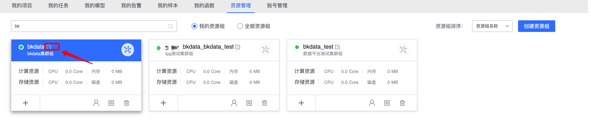

## Resource Management

In the platform, various tasks developed by users (data integration, data development, data query, etc.) require the use of resources (resources are collectively referred to as CPU, memory, network, disk, etc.).

​ **Resource Management** provides users with full-cycle management of resources such as **application for resources**, **authorization to manage resource groups**, and **resource usage analysis** in the platform.

### Resource Group

**Resource Group** is a logical resource pool for resource allocation and management in the platform. A **Resource Group** includes multiple **Computing Resources** and **Storage Resources**.

The structure of a resource group is as follows:

#### Resource group classification

Resource groups are mainly divided into two categories: private and public.

##### 1. Private resource group

​ Resource groups created by users belong to this type of resource group. Projects and tasks need to use this resource, and **require authorization from the resource group**.

##### 2. Public resource group

​ The resource group provided by the platform is a resource shared by all projects and tasks in the platform. Users do not need to authorize the application.

#### The difference between public resource groups and private resource groups

| Default Resource Group | Private Resource Group | Difference |
| :----------------------------------: | :-------------------------------: | :-----------------------------: |
| Computing resources are shared with other projects | You can apply for dedicated independent computing resources | **Do you need dedicated computing resources** |
| Storage resources are shared with other projects | You can apply for dedicated independent storage resources | **Do you need dedicated storage resources** |
| The maximum time of the data storage cycle is unified managed by the platform | The maximum time of the data storage cycle can be customized | **Do you need to customize the storage cycle** |

## Resource Group Overview

Resource management pulls all resource groups in **I manage** by default. Users can view, edit, delete the resource groups they participate in, and create new resource groups.

## Create resource group

In resource management, you can see the Create Resource Group button on the upper right side. Click the button to create a resource group.

**Official business:** The resource cost accounting belongs to.

**Resource group creation process:** Application -> Operation and Maintenance Approval -> Platform Approval.

## Find resource groups

Users can filter and search resource groups by resource group name, resource group ID, resource groups I manage, and all resource groups to quickly locate the resource group they need.

##Manage resource group

**Resource Groups I Manage** pulls the resource group list of **The current user is the resource group administrator** by default.

The resource group I manage displays the resource group ID, resource group name, computing resource statistics, and storage resource statistics. Each resource group also provides other quick management entrances:

> Edit resource group: edit current resource group information

> Apply for resources: Apply for computing resources, storage resources, etc. under the current resource group

> Member management: manage the administrators of the current resource group

> Authorization list: items, dataId, etc. authorized to be used by the current resource group

> Delete resource groups: Resource groups that have not been approved can be deleted, but resource groups that are in effect cannot be deleted.

## Edit resource group

Select the resource group to be edited with the mouse and click the edit button.

Modify the resource group name and resource group description on the system pop-up page. After editing, click Save to complete the editing.

## Apply for resources

The resource group just created does not have any computing resources or storage resources.

## Member Management

## Authorization list

Users can view the authorized projects, dataId, etc. of the resource group

## Project application to use resource group resources

Projects in the platform can only use the resources of the resource group after applying for authorization from the resource group. Note: No application is required for the public resource group.

**Project application to use resource group resource process**

Select the resource group button with the mouse and click it.

Select the resource group to apply for.

