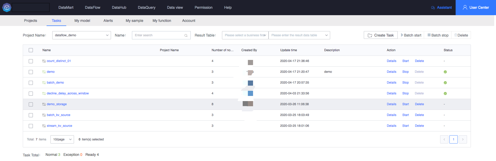
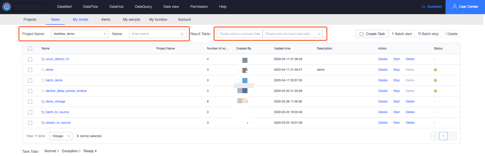
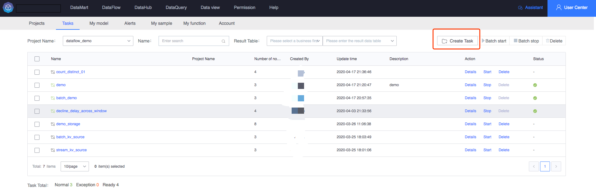
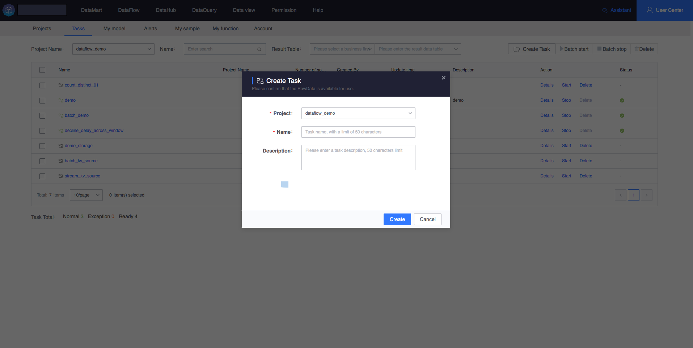
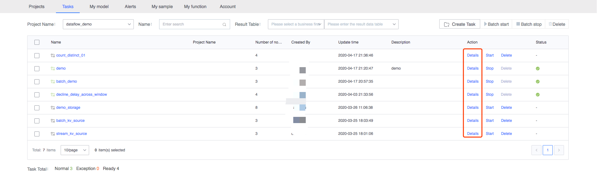
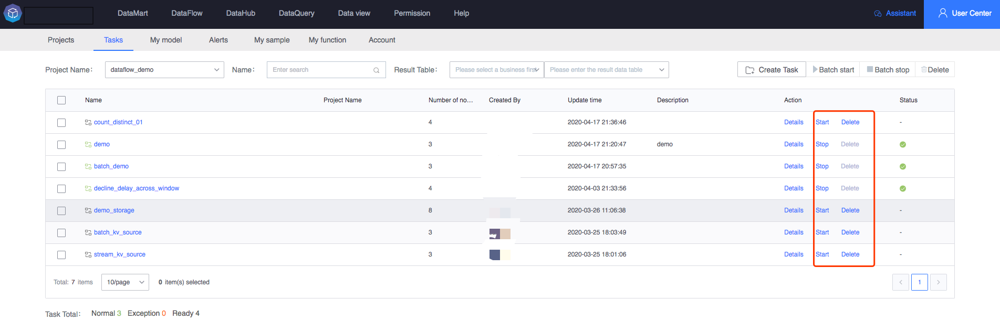
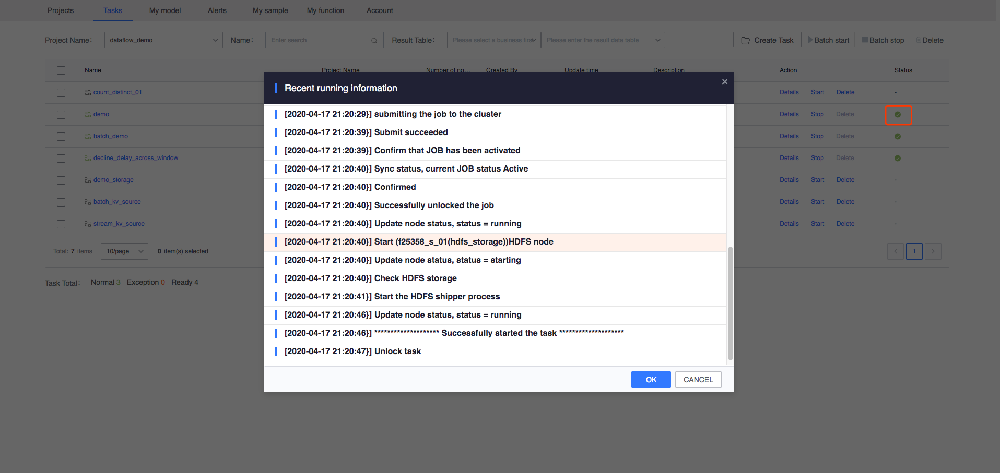
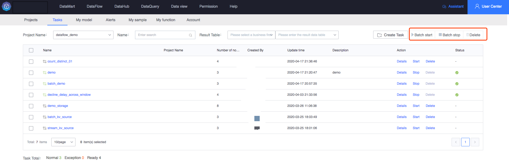

# My task

My task list displays all the tasks for which I have permission. I can view task details and operation status; it provides quick filtering, query, and health statistics of tasks, as well as the start and stop of single tasks, start and stop of batch tasks, deletion of single tasks, and batch tasks. Delete function.

### Task Overview

Enter the My Tasks system to automatically pull up all authorized task lists under the current user name. Users can view the basic information and running status statistics of all current tasks.

### Task filter query

The My Task interface provides the functions of filtering by the project to which the task belongs and filtering by task name. Users can choose to view the tasks under a single project or filter and view by task name, or filter and view based on the result data table.

### Create task

- 1. In my project, you can see the Create Task button on the upper right side. Click the button to create the task.
  

- 2. The system pops up a new task pop-up box.

   > Task item: required

   > Task name: limited to 50 characters, required

   >Task description: Describe the task information, optional

### Mission details

Select a single task and click on the task details to jump to the details editing page of the current task, where you can process the task in detail.

- 1. Click to view details

- 2. Jump to task details page

   For task editing, please refer to: [Canvas Workbench](../../user-guide/dataflow/ide/concepts.md)

### Start, stop and delete operations of a single task

For a single task, users can start, stop, and delete operations.

> Tasks that have been started are not allowed to be deleted. If you want to delete them, please stop the task first.

> When the task configuration node is 0, the startup operation is not allowed

### View single task operation status

Users can view the latest running status of running tasks

- Find the task you need to check the running status and click the operation status button on the far right of the list

- The system will pop up a page to pull the latest operation status information of the current task

### Task batch operations (start, stop, delete)

The My Tasks interface can perform batch operations on tasks, including batch start, batch stop, and batch deletion of multiple tasks.

> Batch start and batch stop must be tasks of the same project. Currently, cross-project batch start and stop are not supported.

> Batch deletion can select any number of tasks, not limited to the same project

> Batch operations are for all tasks selected on the current page, and content not on the current page is unselected.

