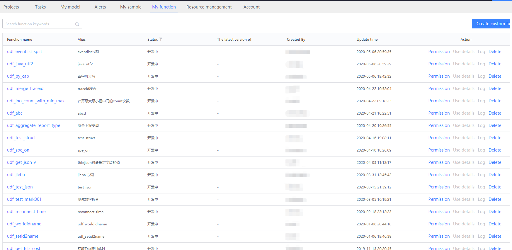
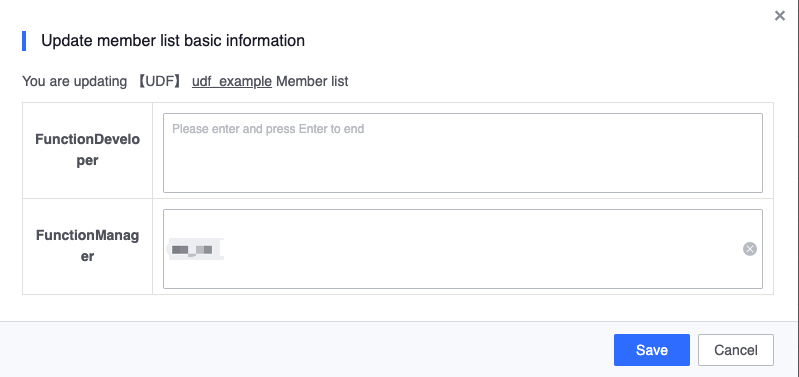
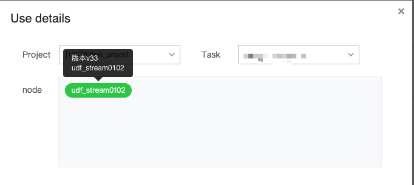
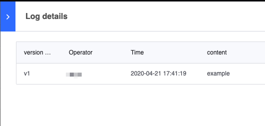

## My function

My function displays user-defined functions (UDF) and provides an entry point for writing UDF and some basic management operations.

## Function list

You can see functions where the user is a function administrator or developer. It mainly displays the function name, Chinese name, latest version, creator, update time and other information. It also includes function editing, permission management, usage details, viewing release logs and deleting functions.

## Basic operations

### authority management

Permission management, function permissions are divided into function administrators and developers. Both administrators and developers can modify function content, and only administrators can modify function permissions.

### Usage details
You can see which projects, tasks and nodes the current function is used in. You can see the running status of the node through the node color. It also shows which version of the function the node uses. You can also click on the node to jump to the task where the node is located.

### Release log
Log, showing the release history content of the function

### Delete function
Delete, you can only delete functions that are not used in DataFlow, or functions that are under development