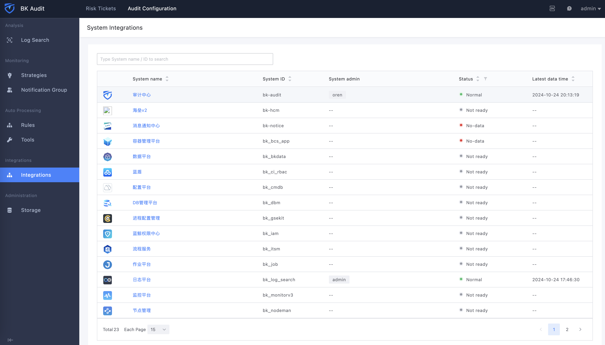
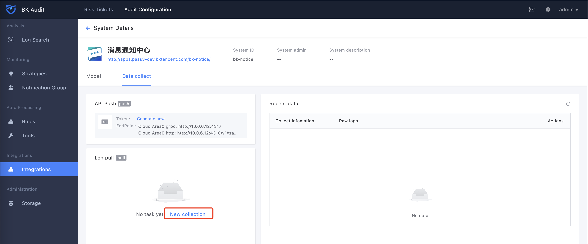
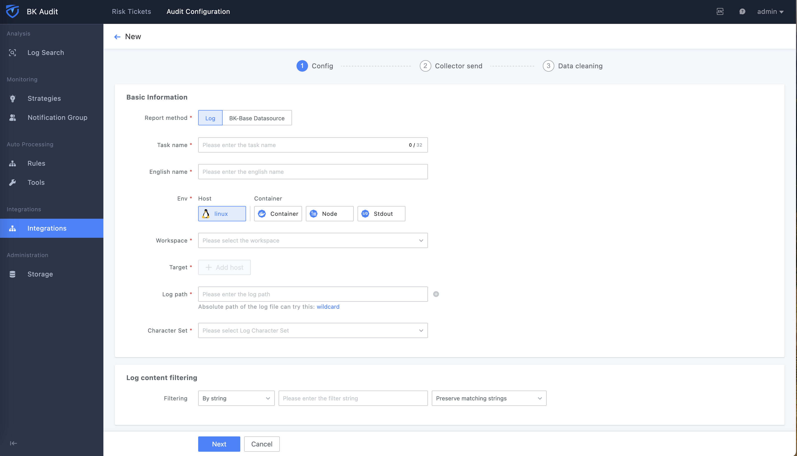
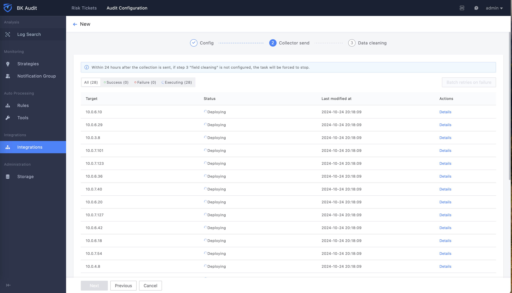
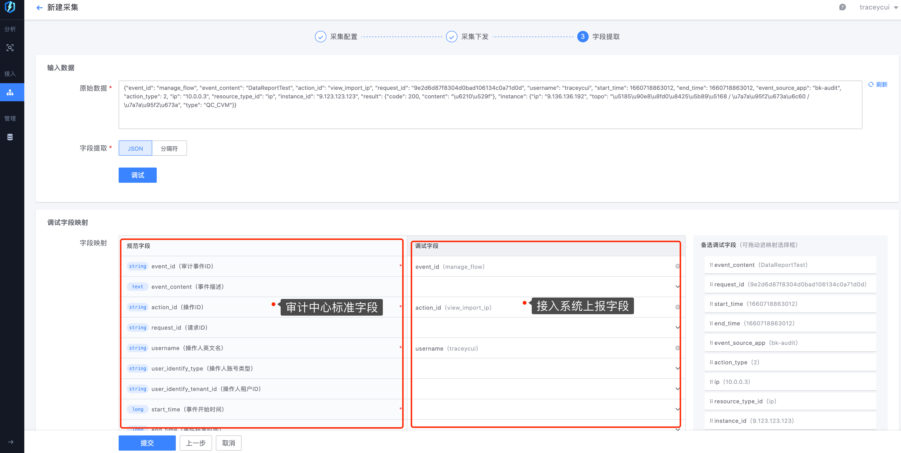
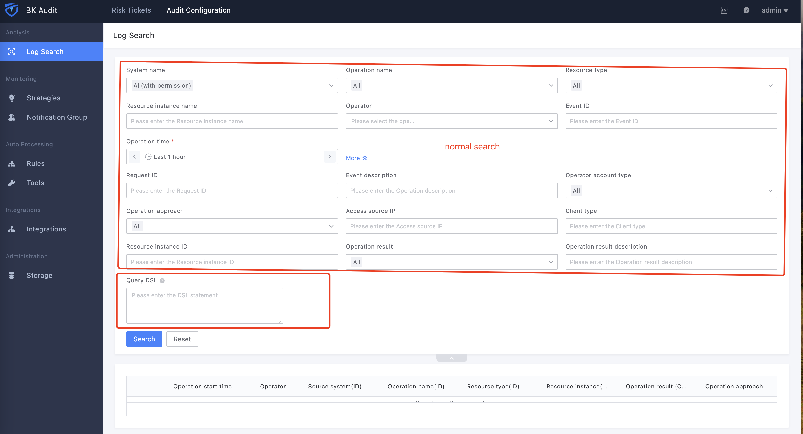
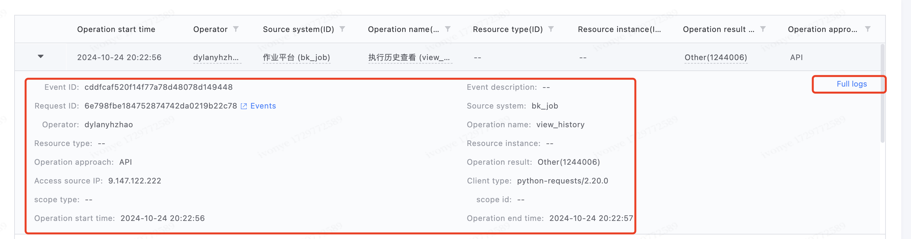
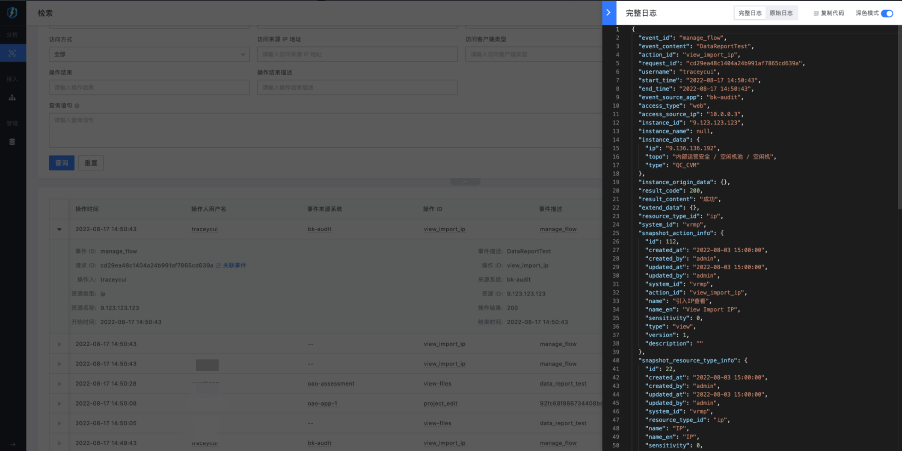
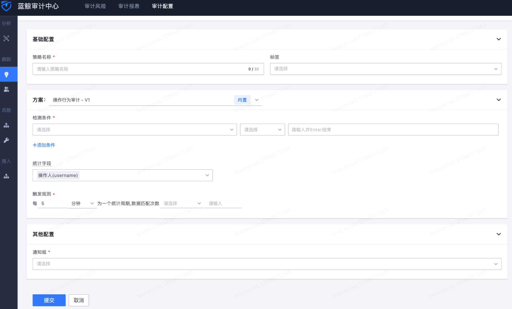
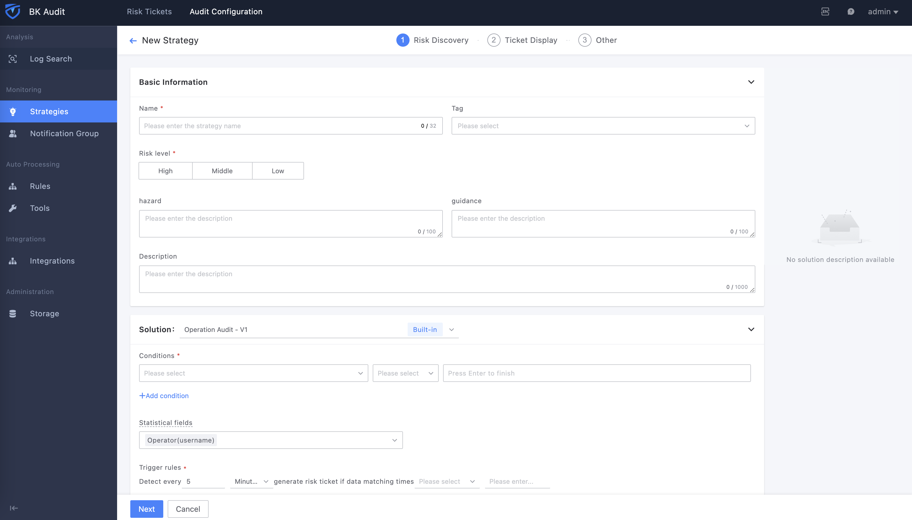

# Product Features

## 1. System Access

After the system is connected to the audit center according to the instructions, the corresponding system information can be seen in the access list

## 2. Data Reporting

After the system is connected to the audit center, data reporting can be performed. The audit center supports reporting logs by log collection and API push

### 2.1 Log Collection Method

Configure the collection items in the data reporting, and report the logs through the three steps of collection configuration->collection distribution->field extraction. The Audit Center supports configuring multiple collection items

In the field extraction stage, the access system needs to report data in accordance with the [Audit Center Operation Log Recording Standard-User](https://doc.weixin.qq.com/sheet/e3_AIkASgZ9ACc7rqrm9vaSqeH7A11N4?scode=AJEAIQdfAAoLJMDc67AIkASgZ9ACc&tab=BB08J2 "Audit Center Operation Log Recording Standard-User")

### 2.2API push method

Under construction, please stay tuned

## 3. Data retrieval

The Audit Center supports multi-dimensional data retrieval. Supports general condition query and DSL query

The audit center supports viewing time details, and can view related events through request ID

Supports viewing complete logs (data uniformly expanded by the audit center, such as attribute expansion of operators, etc.), original logs (original logs reported by the system)

## 4. Strategy analysis

The audit center supports various types of audit strategies, and audit personnel can achieve audit requirements in various scenarios through simple configuration.
For example, currently more than 40 types of audit strategies have been implemented for multiple scenarios such as personnel changes (transfer/resignation), public cloud audits, and virtual resource audits

