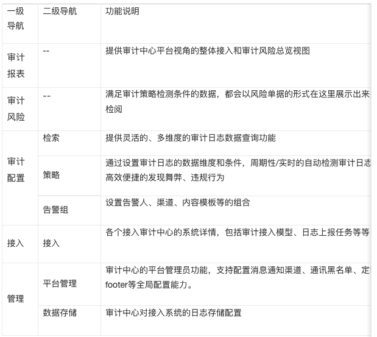

# Product Introduction

## Product Overview

The Audit Center (BK-Audit) aims to create a one-stop intelligent audit platform with centralized management.

Provides a full life cycle audit solution including data access, data retrieval, audit analysis, and exception handling; flexibly supports a variety of audit scenarios such as personnel operation audit, business asset audit, and business compliance audit, providing all-round security protection for enterprise audits.

## Functional Features

