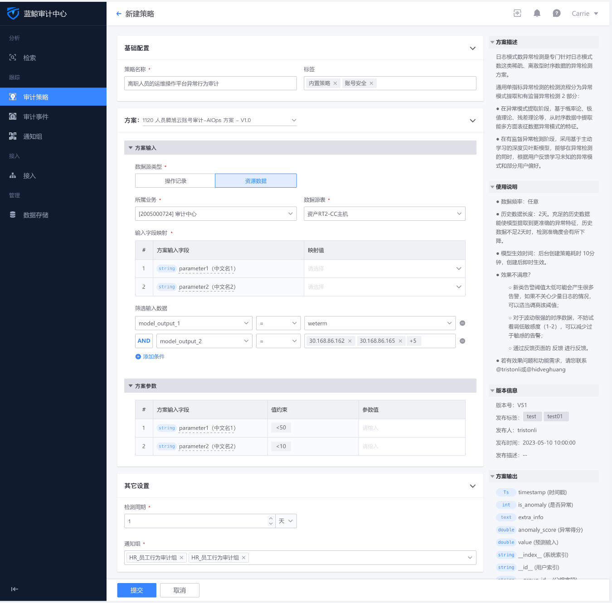

# Quick Start

## 1. System Access

Please refer to: [Audit Center-Access Process Guide](https://doc.weixin.qq.com/doc/w3_AQ8AaQYGAC49Jtxm6sTSByh0z9SvU?scode=AJEAIQdfAAovv4IAVNAIkASgZ9ACc "Audit Center-Access Process Guide")

## 2. Configure Audit Policies

The Audit Center supports the configuration of multiple types of audit policies. When configuring policies, you can choose general condition screening or AIops solutions. The AIops solution supports complex models and simple SQL

