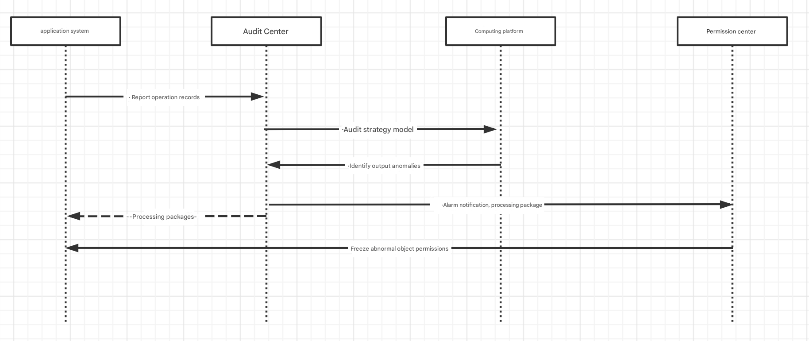

# Scenario Cases

## 1. Abnormal Permission Audit

If there is a personnel change, the audit center will audit the permissions, operations, and resources under the name of the person and push the audit documents of the relevant parties for timely processing

