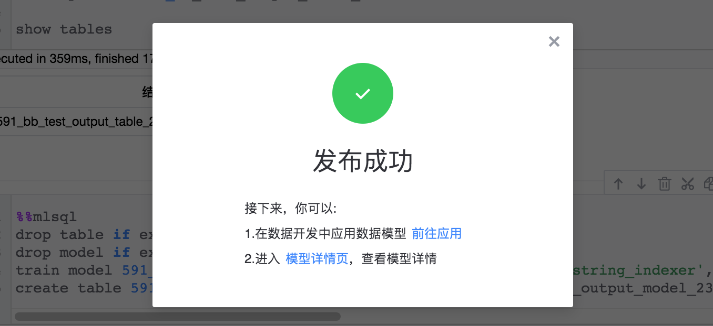

## 模型发布

如果期望模型被周期性调度，可以对模型预测结果进行发布。模型发布后，可以作为数据开发的一个处理节点，被数据开发任务周期性调度。

## 使用说明

### 操作路径

* MLSQL 模型预测执行成功后，可以对模型预测结果进行发布，发布位置如下所示：

### 操作步骤

示例：

- 新建模型

- 更新模型

- 发布状态展示

- 模型发布成功

### 我的模型

模型发布成功后，可以在 “我的模型” 下查看我有权限的模型列表

### 模型应用

模型发布后，可以作为数据开发的一个处理节点，被数据开发任务周期性调度。参考：[模型应用](../../../dataflow/components/modeling/mlsql_apply.md)

