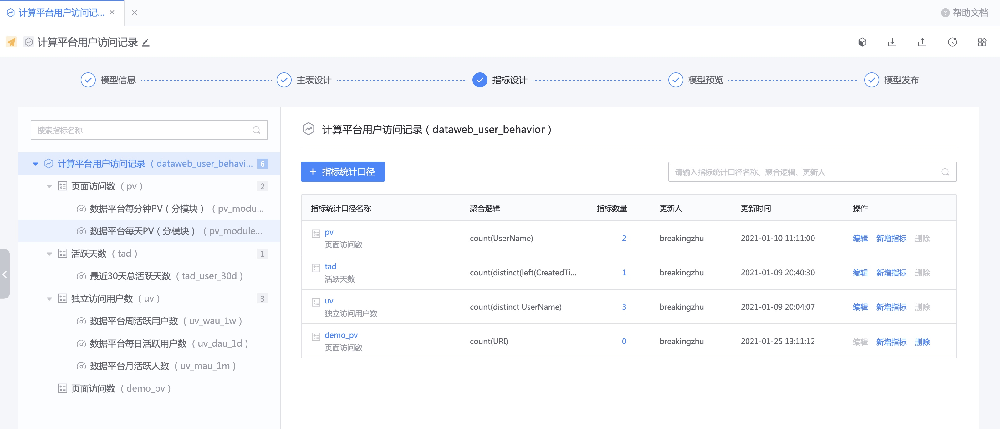

指标设计
----

指标设计包含 `指标统计口径设计` 和 `指标设计` 两部分。

## 指标统计口径
定义指标的计算逻辑，用于统一团队的指标统计口径。

除了常见的聚合函数(count/count_distinct/max/min/avg/sum)表单生成方式

还支持自定义 SQL

## 指标
基于统计口径、时间周期和维度，来统计分析的具体指标数值，实例化之后是一张结果表。

在生成指标的过程中，可以规范指标的生成方式，以及命名规则。

- 实时指标

- 离线指标

