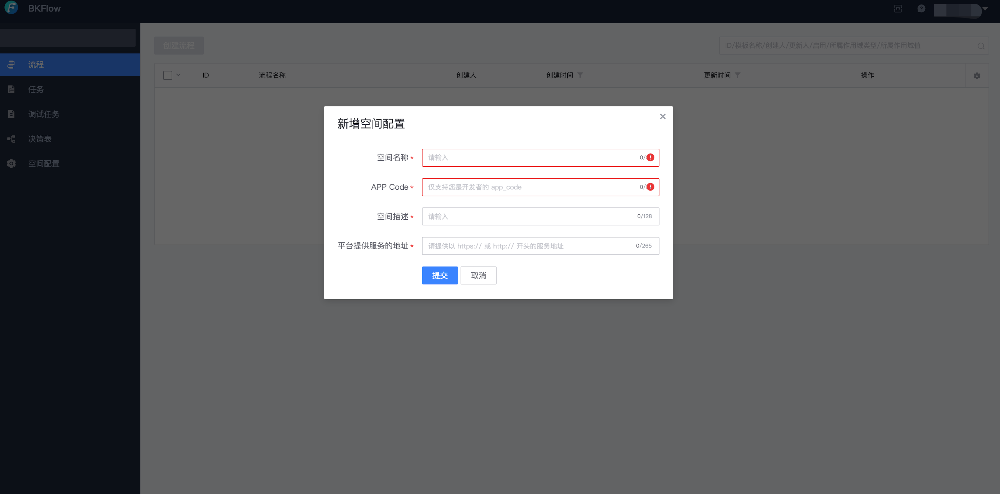
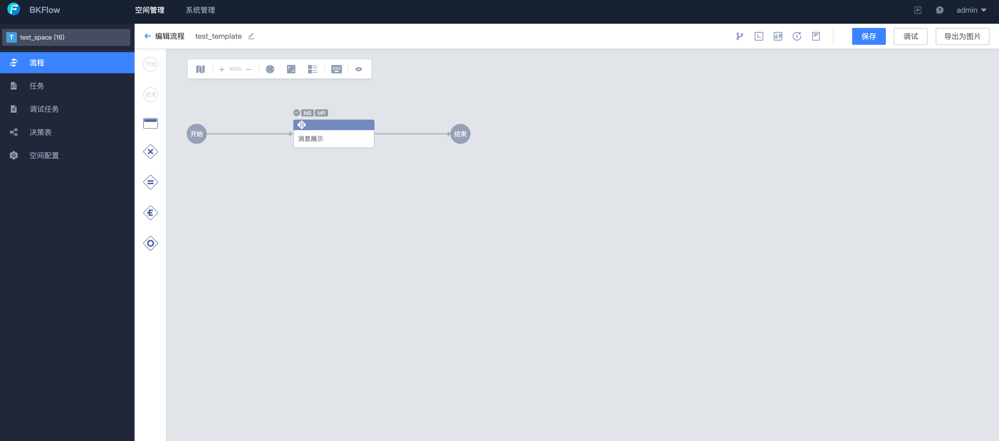
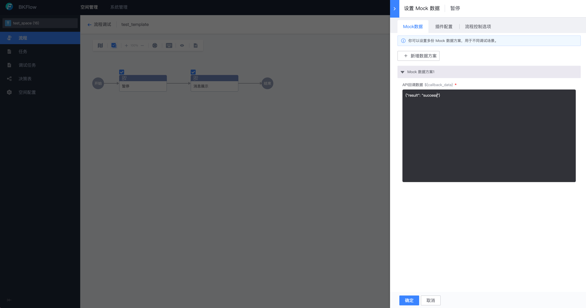
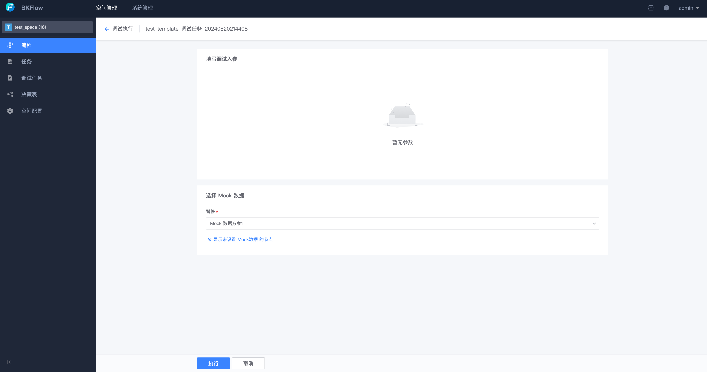

# Quick Start

> Here is how to quickly create your own space in BKFlow and complete the experience of related functions as a space administrator for a user who has never used or connected to BKFlow. For the system access process, please refer to the [System Access](../SystemAccess/system_access.md) document.

## Create a space

Click [Experience Now] on the project homepage.

Fill in the corresponding information and click Submit to create a space. BKFlow will automatically add you as the administrator of the space.

## Space Configuration

You can configure the space. The configurable items include space administrator, canvas mode, gateway expression, etc. These configurations will take effect on the entire space.

## Process Management

Space administrators can view and filter the process list.

You can create and edit process templates directly on the Admin management end.

Click the [Debug] button, the process template supports configuring Mock data schemes as node outputs and performing debugging.

Click the [Execute] button to create and execute a debugging task. You can see that the [Pause] node is executed in MOCK mode.

## Task Management

Space administrators can view and filter task and debugging task lists.

## Rule Decision Management

Space administrators can directly create a new decision table and associate a process template, and edit the input and output field configuration of the decision table.

By configuring rules, you can get a decision table.

Directly debug rule decisions based on the Admin management end.

Associate the decision table in the process and execute it.

## System Management

If you are a system administrator of BKFlow, you can also configure and manage spaces and modules on the Admin management end.

Space configuration can view and configure all space information.

Module configuration can configure the mapping relationship between space and task execution module.

