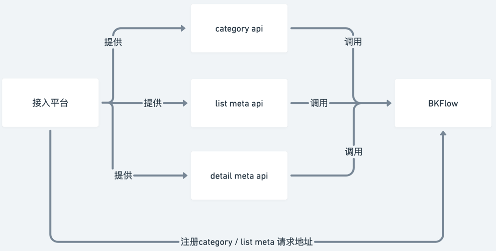

# API plugin development

API plugins can help system developers expand their business needs on BKFlow.

System developers only need to develop interfaces that meet the API unified protocol and register them with the BlueKing APIGW. After completing the [uniform_api] space configuration, they can batch register the corresponding API plugins in BKFlow. System users can directly interact with these plugins in forms and execute them. Combined with BKFlow's built-in process execution capabilities, system users can easily configure automated workflows that meet their business needs.

## API unified protocol

In BKFlow, the call logic of the unified API is uniformly encapsulated in the same plug-in [API plug-in]. The plug-in can dynamically render the parameters required for the interface call into a form by pulling metadata from the interface that complies with the protocol, so that users who access the system can fill in more intuitively and conveniently. The effect is as follows:


Because it is necessary to obtain the description data of the interface, if the access system wants to use the [API plug-in], it is necessary to provide the following metadata interfaces and register them under the corresponding space configuration of BKFlow:

1. category api: used to obtain interface classification information

2. list meta api: used to obtain interface list data

3. detail meta api: used to obtain metadata of interface details

category api and list meta api are used to obtain interface lists. Each specific interface can be mapped to a plug-in.

The detail meta api is used to obtain metadata of a specific interface through the plug-in form.



When the user opens the configuration panel of the plug-in, the interaction order is as follows:


Below, we will introduce the protocols of the above three interfaces respectively.

### category api

For the category api, the interface needs to return the category in full. The input and output of this interface are:

1. Input: GET method, such as category_api/?scope_value=xx&scope_type=xx, where scope_value and scope_type are the values ​​of the corresponding fields of the current process, representing the space (such as project or business) to which the process belongs in the access system. The access system can return the interface classification information under the corresponding space based on these two parameters.

2. Output: The interface returns a standard three-segment structure. When result is True, the interface list is displayed, and when False, an error prompt is displayed.
``` json
{
  "result": true,
  "message": "",
  "data": [
    {"name": "c1", "key": "c1"},
    {"name": "c2", "key": "c2"}
  ]
}
```
### list meta api
For list meta api, you need to provide api id and corresponding detail mata api address. The interface supports paging. The interface input and output are:

1. Input: GET method. The paging parameters use the limit + offset protocol. It needs to support filtering based on scope_type, scope_value and category, such as: list_mata_api/?limit=50&offset=0&scope_type=xx&scope_value=xxx&category=xxx.
2. Output: The interface returns a standard three-segment structure. When result is True, the interface list is displayed. When False, an error message is displayed.
``` json
{
  "result": true,
  "message": "",
  "data": [
    {
      "id": "api1",
      "meta_url": "xxxx/api1",  // 对应的 detail meta api
      "name": "api1",
      "category": "xxx"
    }
  ]
}
```

### detail meta api
Based on the selected api, BKFlow will obtain detailed information of the interface from the detail meta api. The input and output of the interface are as follows:
1. Input: GET method
2. Output: The interface returns a standard three-segment structure. When result is True, the interface list is displayed. When False, an error message is displayed.

``` json
{
  "result": true,
  "message": "",
  "data": {
    "id": "api1",
    "name": "api1",
    "url": "https://{some apigw host}/xxxx", // 执行时实际调用的 api
    "methods": [
      "GET"
    ],
    "inputs": [
      {
        "key": "xxx",
        "name": "xxx",
        "desc": "xxxx",
        "required": true,
        "type": "string",  // 可选，描述字段类型，如果没有form_type会基于该字段尝试映射对应的表单
        "form_type": "input",  // 可选，默认输入框
        "options": ["a", "b"],  // 可选，当type为list或者form_type为checkout/select等表单时
        "default": "abc"  // 可选
      }
    ],
    "outputs": [
      {
        "key": "xxx",
        "name": "xxx",
        "desc": "xxx",
        "type": "string"  // 可选，默认文本输出
      }
    ]
  }
}
```
- Dynamically generate forms based on inputs and outputs fields
  - Field type (type) and form type mapping relationship:
    - string -> input box
    - list -> checkbox, options field is required
    - int -> integer input box
    - bool -> switcher
- Allowed request methods based on methods field
- If you need to add a table to the input form, you need to specify form_type as table and add a table description field under the field, as follows:

``` json
{
  "table": {
    "meta": {
      "read_only": false,
      "import": false,
      "export": false
    },
    "fields": [
      {
        "key": "xxx",
        "name": "xxx",
        "desc": "xxxx",  // 可选
        "required": true,
        "type": "string",  // 可选，描述字段类型，如果没有form_type会基于该字段尝试映射对应的表单
        "form_type": "input",  // 可选，默认输入框，不能为 table
        "options": ["a", "b"],  // 可选，当type为list或者
        "default": "abc"  // 可选
      }
    ]
  }
}
```

The following is a complete protocol returned by a legal meta interface, which mainly shows how various form items are defined:
``` json
{
  "result": true,
  "message": "",
  "data": {
    "id": "api2",
    "name": "api2",
    "url": "https://{some apigw host}/xxxx", // 执行时实际调用的 api
    "methods": [
      "GET"
    ],
    "inputs": [
      {
        "key": "string_field",
        "name": "string_field",
        "required": true,
        "type": "string",
        "default": "default_value"
      },
      {
        "key": "textarea_field",
        "name": "textarea_field",
        "required": true,
        "type": "string",
        "form_type": "textarea",
        "default": "default_value"
      },
      {
        "key": "int_field",
        "name": "int_field",
        "required": true,
        "type": "int"
      },
      {
        "key": "bool_field",
        "name": "bool_field",
        "required": true,
        "type": "bool"
      },
      {
        "key": "list_field",
        "name": "list_field",
        "required": true,
        "type": "list",
        "options": [
          "a",
          "b",
          "c"
        ]
      },
      {
        "key": "select_field_1",
        "name": "select_field_2",
        "required": true,
        "type": "string",
        "options": [
          "a",
          "b",
          "c"
        ]
      },
      {
        "key": "select_field_2",
        "name": "select_field_2",
        "type": "string",
        "options": [
          {
            "text": "abc",
            "value": "ddd"
          },
          {
            "text": "def",
            "value": "aaa"
          }
        ]
      },
      {
        "key": "table_field",
        "name": "table_field",
        "required": true,
        "type": "list",
        "form_type": "table",
        "table": {
          "fields": [
            {
              "key": "string_field",
              "name": "string_field",
              "required": true,
              "type": "string",
              "default": "default_value"
            },
            {
              "key": "textarea_field",
              "name": "textarea_field",
              "required": true,
              "type": "string",
              "form_type": "textarea",
              "default": "default_value"
            },
            {
              "key": "select_field_1",
              "name": "select_field_2",
              "required": true,
              "type": "string",
              "options": [
                "a",
                "b",
                "c"
              ]
            },
            {
              "key": "select_field_2",
              "name": "select_field_2",
              "type": "string",
              "options": [
                {
                  "text": "abc",
                  "value": "ddd"
                },
                {
                  "text": "def",
                  "value": "aaa"
                }
              ]
            }
          ]
        }
      }
    ]
  }
}
```

## Make the API plugin support polling after request

**Background**

Some functions may not be completed through a single API call. For example, a Job task can only complete the trigger operation through a single API call. After the trigger, the process node will continue to flow down, and it is impossible to wait for the task to be completed and control the process execution according to the task execution status.

To meet this scenario, the API plugin supports polling calls after the call, and controls the node status and execution logic according to the polling results.

**Example**

Here, we take an access platform that provides an API interface and calls a Job platform task as an example:


**Operation**

As an access platform, if you want the API interface you provide to support polling, you need to:

1. The default API url interface returns a field that can be used as a `task_tag` identifier

2. Provide a corresponding polling interface polling_url, which receives the `task_tag` request parameter as the task identifier that needs to be queried

3. Declare the corresponding protocol fields in the detail meta api, including the polling interface address, `task_tag` identifier, node status flow judgment identifier, etc.

The following is an example that defines a polling configuration (other irrelevant fields are omitted here):
``` json
// detail meta api response
{
    "url": "{{api_url}}",  // 触发任务的 url
    "methods": ["POST"],
    "polling": {
        "url": "{{polling_url}}",  // 状态的轮询接口，必须接收 get 方法，需要接收参数 task_tag，形如 url/?task_tag={task_tag_key}
        "task_tag_key": "task_tag",  // {{api_url}} API 响应中可以用来作为任务标识的字段，执行过程中会用对应字段的值填入后进行请求，如果响应存在多级字段，可以通过 `.` 进行拼接，如 data.task_tag
        "success_tag": {"key": "status", "value": "success"},  // polling_url 响应中用于识别状态成功的 key 和 value（value 只支持字符串和数字类型)
        "fail_tag": {"key": "status", "value": "fail"},  // polling_url 响应中用于识别状态失败的 key 和 value（value 只支持字符串和数字类型)
        "running_tag": {"key": "status", "value": "running"}  // polling_url 响应中用于识别状态运行中的 key 和 value（value 只支持字符串和数字类型)
    },
    ...
}

// {{api_url}} api response
{
   "task_tag": 1234
}

// {{polling_url}} api response
{
    "status": "success",
}
```

## Make the API plugin support callback after request

**Background**

Some functions may not be completed through a single API call. For example, a Job task can only complete the trigger operation through a single API call. After the trigger, the process node will continue to flow down, and it is impossible to wait for the task to be completed and control the process execution according to the task execution status.

In order to meet this scenario, the API plugin supports the callee to make a callback to inform the API plugin that the task has been executed.

**Example**

Here, we take an access system (Access Platform) that provides an API interface and calls a Job platform task as an example:


**Operation**

As an access party, if you want the provided API interface to support callbacks, you need to:

1. Get the node_id parameter when the task is triggered and record it

2. Trigger and execute the task, and monitor the task status through polling or callback

3. When the task is executed, call back through the bkflow operate_task_node interface with the node_id and data parameters

The following is an example of defining a callback configuration (other irrelevant fields are omitted):
``` json
// detail meta api response
{
  "result": true,
  "data": {
      "url": "{{api_url}}",  // 触发任务的 url
      "methods": ["POST"],
      "callback": {
          "success_tag": {"key": "status", "value": "success"},  // polling_url 响应中用于识别状态成功的 key 和 value（value 只支持字符串和数字类型)
          "fail_tag": {"key": "status", "value": "fail"},  // polling_url 响应中用于识别状态失败的 key 和 value（value 只支持字符串和数字类型)
      },
      ...
  },
  "message": ""
}

// callback request data
{
    "status": "success",
}

```
