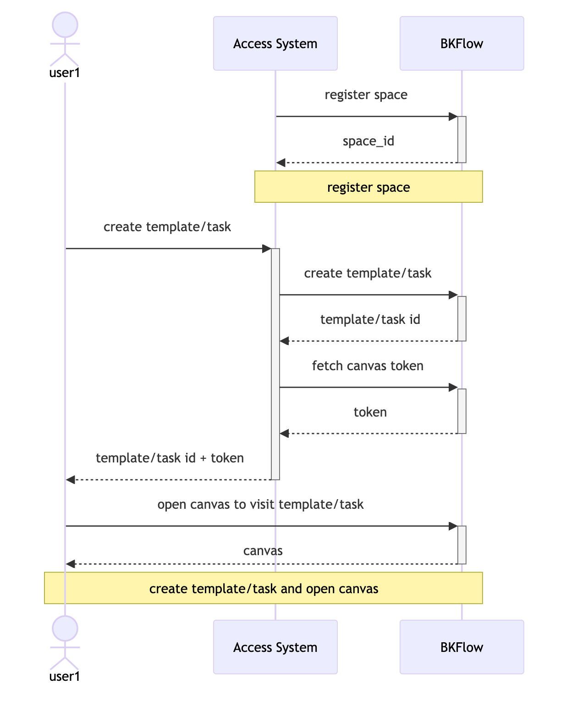

# System access

## Access method

BKFlow provides two different access methods. You can choose the appropriate method to access according to your needs.

### 1. Embed the BKFlow canvas in the access system
In this scenario, the access system embeds the BKFlow canvas into its own application so that users who access the system can intuitively create, edit and manage processes.

By registering the corresponding space in BKFlow, the access system can obtain the management rights of the resources under the space and manage these resources through API calls.

By embedding the BKFlow canvas, users who access the system do not need to be aware of the existence of BKFlow, but their operations of editing and viewing processes and tasks are actually performed in BKFlow. The access system grants users the right to view and edit processes and execute and operate tasks directly in the canvas by applying for a token on their behalf. When users access BKFlow with a token and the corresponding resource id, they can directly access the corresponding resources and perform operations.

The following is the interaction flow chart between the user, access system and BKFlow in this scenario:

### 2. Access system implements canvas
In this scenario, the access system needs to implement the canvas itself and manage and execute processes and tasks by calling BKFlow's API.

In this scenario, the access system needs to understand BKFlow's process and task protocol pipeline_tree and pass pipeline_tree as a parameter to BKFlow in the interface interaction. BKFlow will execute processes and tasks according to the definition of pipeline_tree.

The following is a flowchart of the interaction between the user, access system and BKFlow in a scenario where the access system implements its own canvas and process management and only relies on BKFlow for task execution:

## Quick access

All BKFlow APIs are registered and published through BlueKing APIGW. The access system can complete the access by applying for call permissions and calling APIs.

1. Create a space: [create_space api]() or Admin management end
2. Configure the space: [renew_space_config api]() or Admin management end
3. Create a process: [create_template api]() or Admin management end
4. Create a task: [create_task api]() or Admin management end
5. Execute a task: [operate_task api]() or Admin management end

So far, the most basic platform access and process execution have been completed.

## Business expansion

The access system supports business expansion through BlueKing plug-ins, API plug-ins and Webhook subscriptions.

1. BlueKing plugin development: [Development Document](https://github.com/TencentBlueKing/bk-plugin-framework-python)
2. API plugin development: [API plugin development](api_plugin.md)
3. Webhook subscription: You can subscribe to events by calling [apply_webhook_configs api](). When the corresponding event is triggered, BKFlow will automatically make a callback, and the access system can customize the callback request.

## Resource isolation

In order to save resources, all spaces will be executed under the same task module by default, that is, all tasks in different spaces will use the same storage and computing resources. The disadvantage is that the execution of tasks in different spaces may interfere with each other. For example, when a large number of tasks are executed in one space, the execution speed of tasks in another space may also slow down.

BKFlow also provides the option of resource isolation, and you need to contact the environment administrator to apply for resources and configure them in advance.

Currently, BKFlow supports two resource isolation methods with different granularities:

1. Computation isolation only: only the node flow and calculation of task execution are isolated.

2. Computation isolation + storage isolation: in addition to computation isolation, the storage of task data is also isolated.