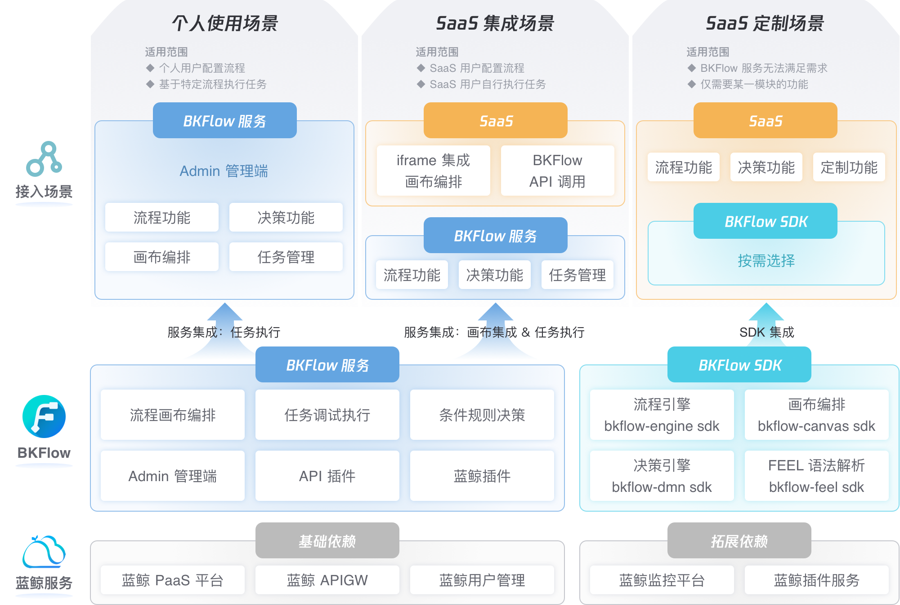

# Product Introduction

BKFlow is a platform-oriented, efficient and flexible process engine platform, designed to help access systems quickly obtain process execution capabilities.

**Three core functional services**

- Process orchestration and canvas embedding: intuitively create, edit and manage processes, support custom permission control.

- Process task execution capability: realize the creation, execution and control of process tasks through API.

- Decision engine capability: can perform rule management and decision-making in the process.

**Multiple access and integration methods**

In order to meet different usage scenarios of the access system, BKFlow supports a variety of different access scenarios and integration methods:

- Access scenario
  - Personal usage scenario
  - SaaS integration scenario
  - SaaS customization scenario
- Integration method
  - Web service integration
  - SDK integration

**Access system expansion & management**

In order to meet the flexible business and configuration requirements of the access system, BKFlow provides custom expansion and data management capabilities:

- Highly scalable & customizable: Supports BlueKing plug-ins and API plug-ins to meet the custom requirements of various access system business scenarios.

- Data management: Provides a spatial data management terminal, and the access system administrator can manage and operate resource data based on the spatial view.

- Webhook subscription mechanism: The access system can easily perceive process task events and automatically expand.

- Computing and storage resource isolation: Task execution and data can be isolated from other access spaces.