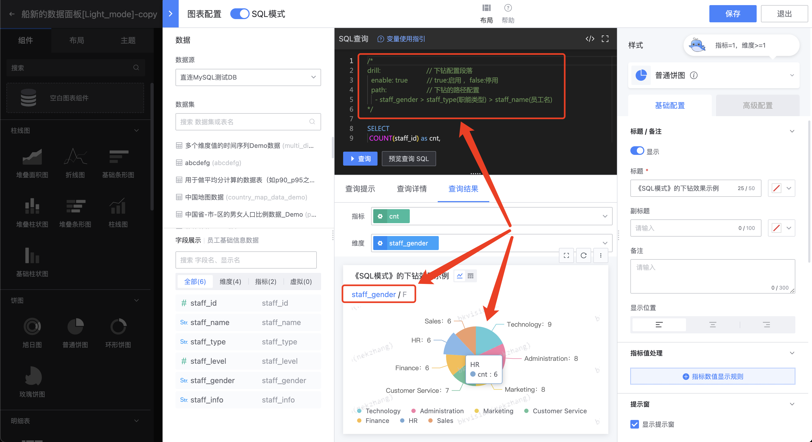

## Implement in-depth analysis of multi-level dimensional data through "drill-down" configuration

Drill-down is an operation that drills down into data details. It allows users to drill down from the current data level to a lower level of data level, so as to view more detailed information about the data;

### Simple mode
In simple mode, you can quickly configure the drill-down logic through the configuration of the page:

- **Set drill-down**


On the "Chart Configuration" page, check **`Drill-down`**, and select the drill-down dimension according to the drill-down rule; the first-level dimension of the drill-down in the figure is **`Customer_Type`**, and the second-level dimension is **`customer`**. After the configuration is completed, click Save;

- **The drill-down effect is shown below**


Select **`Direct Sales Customer`** under the first-level dimension **`Customer_Type`**, and it will be displayed **`Direct Sales Customer`** includes the data of the secondary dimension **`customer`**;

Click the "Drill Down" icon again to restore it to its original state.

### SQL Mode

In SQL mode, due to the variety of SQL statements, there may be many different complex query situations, so we define a set of standard declarative configurations. Users only need to declare the drill-down fields as required to achieve the same purpose of drilling down!
```sql
/*
drill:                 // Drill-down configuration section
  enable: true         // true: enable, false: disable
  path:                // Drill-down path configuration (multiple groups are allowed, field aliases can be set in brackets)
    - country > province(省份) > city(城市) > area(地区) > avenu(街道)
    - dept > centre(中心) > group(小组)
*/
```


