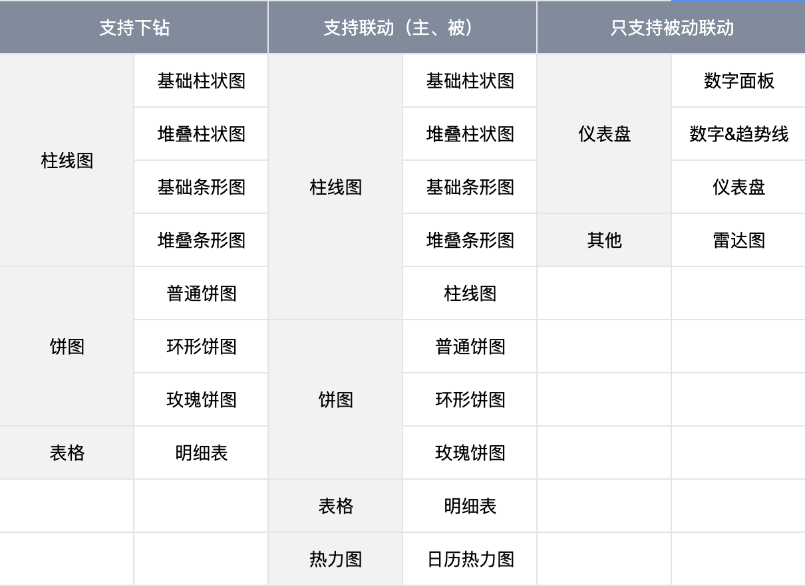
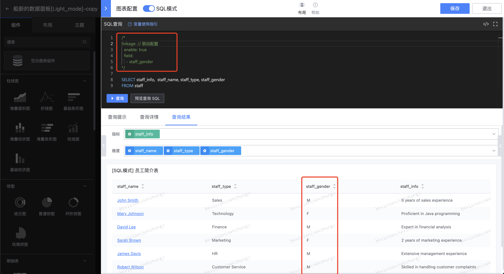
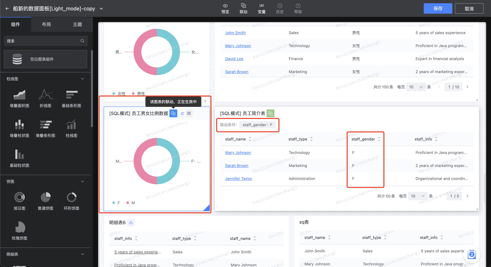

## By configuring linkage, the data interaction between different charts can be closer to the scene!

Linkage is an interactive data visualization function that allows users to view a data view, and the selection or operation made can affect other related data views in real time;

### Simple mode
In simple mode, each icon will clearly set its own "indicator" and "dimension", so you can quickly and easily choose to set it in the linkage configuration:

- **Set linkage**

Enter the "Edit Mode" page - click **`Linkage`**;


Click **`Add`**;


According to the instructions, select the linkage chart and dimension information;


- **The linkage results are shown below**


- **Note**

Not all charts support drill-down and linkage. The following table shows which charts support drill-down and linkage:



### SQL mode

In SQL mode, firstly, the chart does not need to explicitly specify the "data set", and secondly, the user cannot locate the list of fields that can be output in complex joint table query statements; therefore, we have agreed on a set of standard declarative configurations similar to the "drill-down" configuration! Users only need to declare the fields that can be set as linkage dimensions in the current chart as required, and then select the linkage fields of the SQL mode chart in the linkage configuration page:
```sql
/*
linkage:              // Linkage configuration section
  enable: true        // true: enable, false: disable
  field:              // Supports fields that can be linked
    - field_a
    - field_b
    - field_c
*/
```
In the example below, `staff_gender` is set as a linkable dimension:



Next, we can select this field as the linked dimension in the linkage configuration:


Finally, we click `F` on the pie chart on the left side of the figure below to link the "Employee Profile Table" on the right side to achieve the linkage effect:

