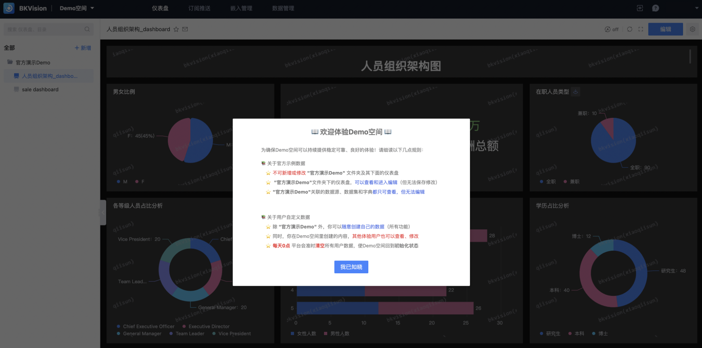

## What should a novice do when using BKVision for the first time? <Demo space> helps you get started quickly

In order to help users better experience the existing components and functions of BKVision and meet the display of multi-scenario chart templates, BKVision provides a Demo space for users to experience. In the Demo space, users can browse and experience different chart templates and observe the data structure and interactive effects presented;

- **Enter the Demo space demonstration**

- **Demo space precautions**

