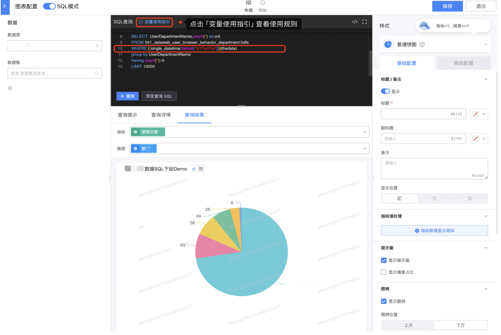

## In SQL mode, how to reference the parameter value of "interactive component"?

First, understand how to reference variables and how to use the variable charm:

#### Variable reference method

- {{var_name}}

The variable name uses double curly brackets {{}} to output the corresponding variable value; one thing to note is that if the variable is a multiple-select value of the selector component, when referenced in this way, the platform will default to output multiple values ​​as a string separated by commas;

- {{var_name}}(field_name)

Add a bracketed field reference after the variable, and the platform will automatically adapt and generate the corresponding SQL query syntax according to the value and type of the variable;

```
Take MySQL as an example: select field_a, field_b, field_c from table where {{userlist}}(username) group by field_a, field_b;

When the interactive component of userlist is a single-select value, the platform will render it as an "equal to" expression, that is:
select field_a, field_b, field_c from table where username = 'admin' group by field_a, field_b;

When the interactive component of userlist is a multiple-select value, the platform will render it as an "in" expression, that is:
select field_a, field_b, field_c from table where username in ('admin1', 'admin2') group by field_a, field_b;
```

#### Usage of "Variable Charm Tail"

Variable Charm Tail is a unified predefined variable processing function method provided by the platform. Users can use this ability to change the output format or content of the variable; the usage is just like its name, just append the method name to the end of the variable name, such as: `{{variable name.method name (method parameter)}}`; Several methods supported:

- .format()
Description: Support formatted output of time type variables
Usage: `datetime.format('%Y-%m-%d %H:%M:%S')`
Parameters:
%Y: Output 4-digit year, such as: 2022
%y: Output 2-digit year, such as: 22
%m: Outputs a two-digit month, such as 07
%b or %h: Outputs an abbreviated month, such as Jul
%B: Outputs a full month, such as July
%d: Outputs a two-digit date, such as 31
%A: Outputs a full day of the week, such as Saturday
%a: Outputs an abbreviated day of the week, such as Sat
%H: Outputs the hour in a 24-hour format (00-23)
%I: Outputs the hour in a 12-hour format (01-12)
%M: Outputs a two-digit minute (00-59)
%S: Outputs a two-digit second (00-60), 60 is a leap second
%s: Outputs a second-level timestamp, such as 1700626692
%p: Outputs a morning/afternoon indicator, such as AM or PM
%Z: Outputs a time zone name, such as CST
%z: Output time zone offset, such as: +0800

Take the interactive component - time selector as an example:


Confirm **`component identifier`**, which is unique;



In "SQL query", follow the "Variable Usage Guide" to query **`component identifier`** through **`where`** statement;