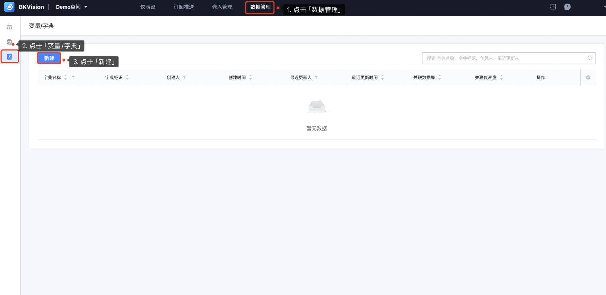
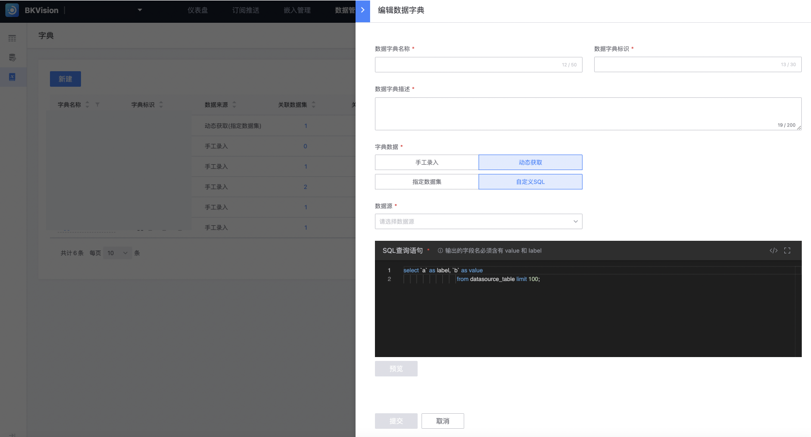
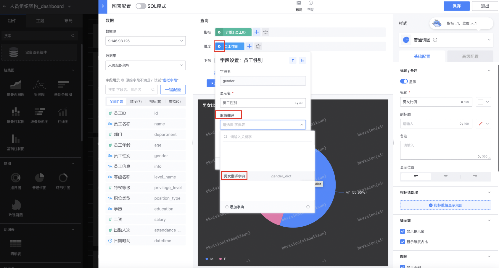

## Data dictionary

Supports users to customize a set of related data values ​​and use these values ​​in the dashboard. It not only simplifies the data input process, but also improves data consistency and maintainability.

1. Click **`Data Management`** — Click **`Variable/Dictionary`** — Click **`New`**

2. **Fill in the data dictionary information**

​ **`Data dictionary name`**: The specific name. The dictionary can be referenced by the data dictionary name in the chart configuration;

​ **`Data dictionary identifier`**: This identifier is used to guide the chart in the "SQL mode" in the form of a variable;

​ **`Data dictionary description`**: A detailed overview of the data dictionary content for quick understanding and use;

​ **`Dictionary data`**: It is divided into **`Manual entry`** and **`Dynamic acquisition`**;

​ **`Manual entry`**: Enter the value (actual value) and label (displayed value) one by one in a table form, that is, the value in the actual data set corresponds to the displayed value after using the data dictionary;

**`Dynamic acquisition`**: divided into **`Specified data set`** and **`Custom SQL`**;

​ **`Specified data set`**: Select the specified **`Data source`**, **`Data set`**, **`Value field`** and the corresponding **`Lable field`**;

​ **`Custom SQL`**: Output SQL statement to specify the **`Value field`** and the corresponding **`Lable field`** of a data set

3. **Take manual entry as an example:**

Create a set of dictionaries in advance, the data dictionary name is the male and female translation dictionary, and then apply this dictionary in the chart configuration;

The initial gender of employees in this chart is F and M;

Click the employee gender setting button - select value translation - select the male and female translation dictionary - click query;

In the chart, female replaces F and male replaces M;