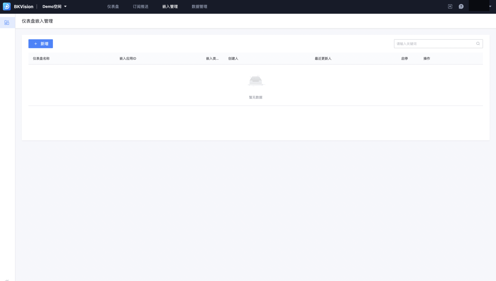

## Dashboard Embedded Management

Supports users to embed the created dashboard into other platforms or applications to achieve cross-platform display and analysis of data;

Users can view and retrieve the embedded information that has been embedded into other platforms through the list;

Click **`New`** to enter the "Add Embed" page;

1. **Fill in the new embedded information**

- **Basic Information**: Fill in the embedded dashboard and application ID

​ **`Dashboard`**: Select the dashboard to be embedded

​ **`Version`**: You can choose different version numbers to push, the default is the latest version

​ **`BlueKing Application ID`**: Select the BlueKing platform to be embedded and enter the ID number

- **Parameter configuration**: Users can see all interactive components configured on the dashboard to be embedded in the parameter configuration. Users can use interactive components to customize the data in the dashboard and display watermarks;

2. **Edit embed**

​ When embedding the dashboard into other platforms or applications, users can choose different embedding methods based on their own technology stack and needs. Three embedding modes are currently supported: **`iFrame embedding`, `JS-SDK embedding`, `VUE-SDK embedding`**