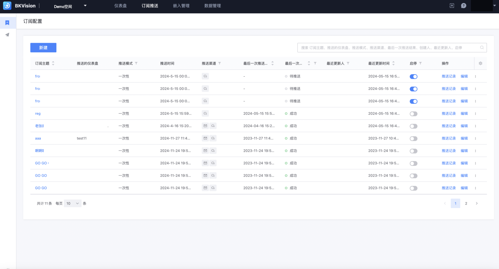

## Subscription Configuration

User-defined settings allow users to pre-define a set of dashboard subscription conditions according to their needs. When these conditions are met, the system will automatically send subscription notifications to users through the screenshot function, so as to achieve the purpose of regularly viewing dashboard content; in short, subscription configuration is a set of user-defined rules to determine when to receive notifications from which dashboards.

### Create a new subscription

Click **`Create`** — Enter the "Create a new subscription theme" page

1. **Fill in subscription information**

**Basic information**: Fill in the subscription theme, i.e. the push name and the dashboard to be pushed

​ **`Subscription theme`**: the push name, which can be directly queried and displayed in the list

​ **`Push dashboard`**: Select the dashboard to be pushed

​ **`Version`**: You can choose different version numbers for push, the default is latest

​ **`Image width`**: Because the screenshot function is used to take a screenshot of the dashboard at a certain moment and push it, the image provides 4 width options: 1920px, 1440px, 1366px and 1280px

**Parameter configuration**: Users can see all the interactive components configured on the dashboard to be pushed in the parameter configuration. Users can customize the filter data. Finally, the screenshot service will take a screenshot of the dashboard after the parameter configuration

**Push rules**: Users can customize the push mode, channel and recipient information.

​ **`Push mode`**: divided into **`One-time`** and **`Periodic`**, followed by setting the corresponding sending time point

​ **`Push channel`**: divided into **`Email`** and **`WeChat`**, support multiple selection

​ **`Email`**

​ **`Email title`**: fill in the title of the push email, so that the recipient is clear at a glance

​ **`Recipient`**: Select the push recipient, support name search, support multiple selection

​ **`Attach PDF attachment`**: Support dashboard screenshots to be sent in PDF format

​ **`WeChat`**

​ **`Recipient`**: Select the push recipient, support name search, support multiple selection

​ **`Additional information`**: You can fill in the description of the dashboard and other content to send together

2. **Push preview**: After selecting the push dashboard, you can display the dashboard in the push preview on the right to ensure that it is correct;