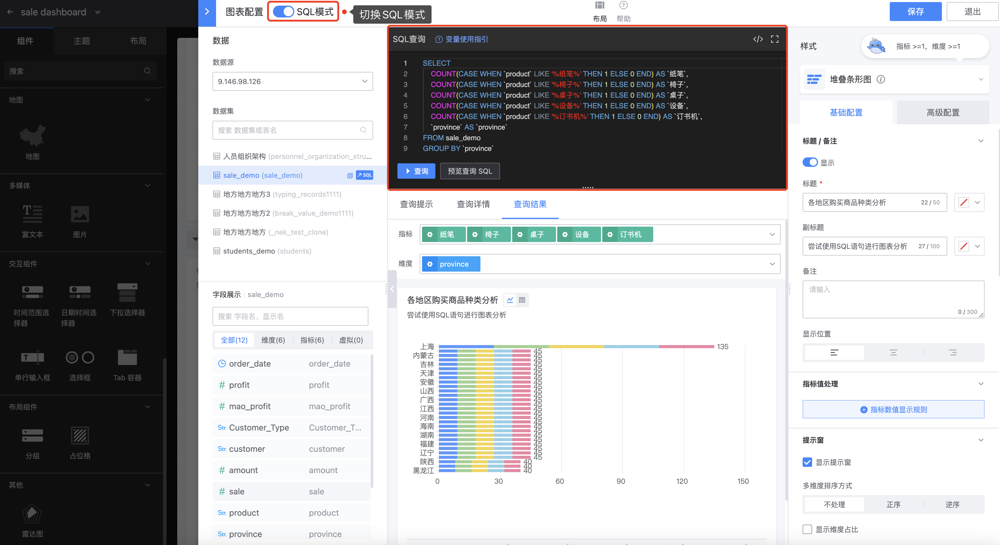
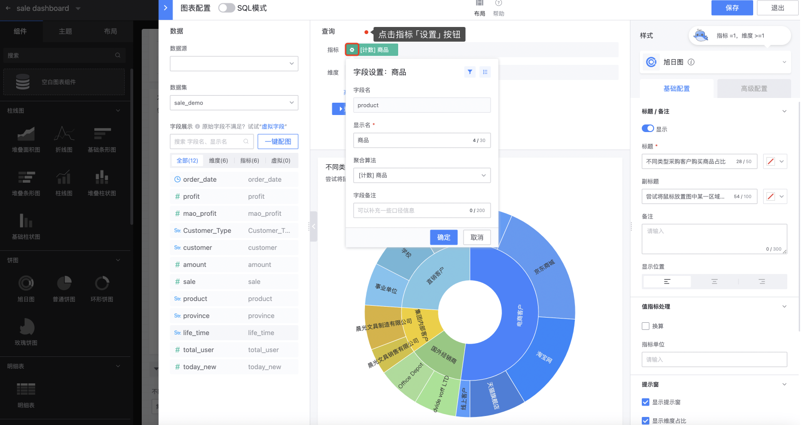
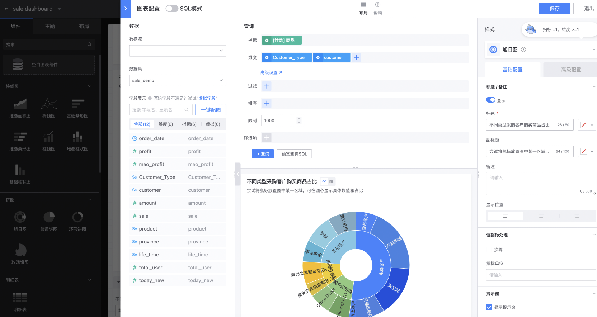
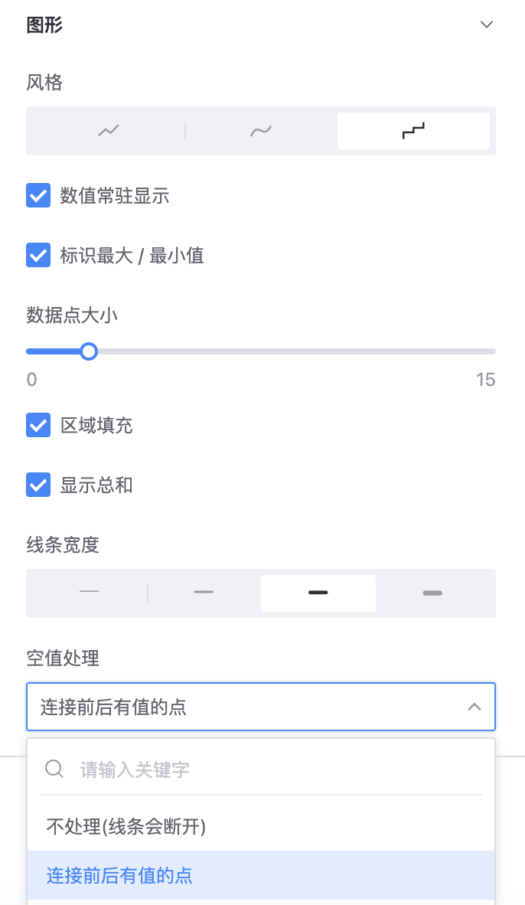
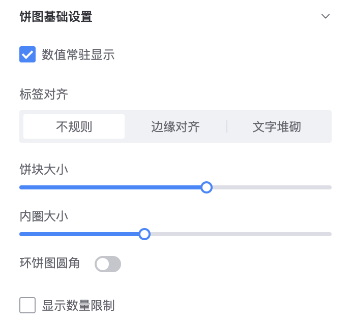
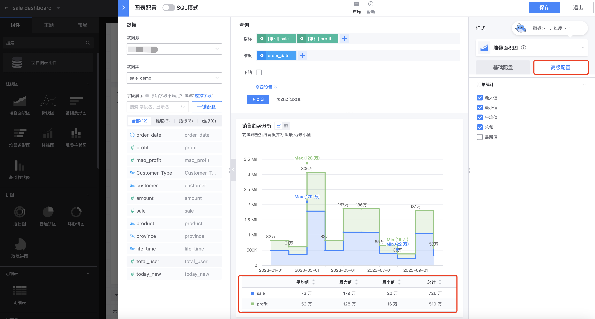
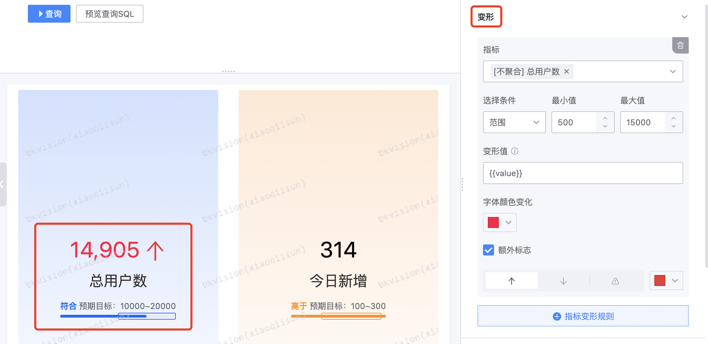

## Chart Configuration

As the core page of the chart platform, its design and functionality are crucial to the user experience and efficiency of chart generation. The following is a further explanation of the chart configuration page:

### Mode selection

Chart configuration is divided into two modes, namely "**Simple Mode**" and "**SQL Mode**". The data, style and display box of the two modes are the same, only the query method is different. The query in the simple mode requires the user to select indicators and dimensions for setting, while the query in the SQL mode is queried through SQL statement output;

- **Simple Mode**

- **SQL Mode**

### Layout

It is divided into data, style, query and preview. Users can choose the layout according to specific needs. The query and preview cannot be hidden;

### Data

​ **`Data Source`**: Find the data source for configuring the chart;

​ **`Data Set`**: Find the data set for configuring the chart;

​**`Field display`**: Based on the selected data set, display the field name and display name of the data set;

​ **`Virtual field`**: A field that does not actually store data in the database, but is obtained by calculating or converting the data of existing fields. It can be created based on the values, functions, and expressions of other fields; click the virtual field, and the page jumps to the new virtual field page;

​ **`One-click picture matching`**: Help users automatically match the appropriate chart according to the data set;

### Query

- **Simple mode**: Select the indicators and dimensions to be configured for the chart from the field display of the data on the left; advanced settings also include filtering, sorting, limiting, and filtering items;

​ **Indicators**: Click the indicator setting button to display the "Field Settings" page, where the field name cannot be modified, the display name can be modified, the aggregation algorithm includes count, deduplication count, and non-aggregation, and the field notes help users understand the meaning of the field by entering information;

​**Dimension**: Click the dimension setting button to display the "Field Setting" page, where the field name cannot be modified, the display name can be modified, the value is translated into a selected dictionary table, and the field notes help users understand the meaning of the field by entering information;

​ **Time Dimension**: The time dimension is suitable for scenarios where trend display of time series data is performed, such as displaying the data growth trend over a period of time through line charts and bar charts; after selecting the time dimension field, data aggregation calculations are performed by configuring different aggregation granularities.

​ **Advanced Settings**:

​ **Filter**: Allows users to filter data based on specific conditions or attributes. For example, users can choose to display only records with sales greater than a certain value, or only display sales data for a specific region;

​ **Sort**: Allows users to sort by the selected field; users can choose ascending (small to large) or descending (large to small) sorting;

​ **Limit**: Allows users to limit the amount of data displayed;

​ **Filter**: Not yet available;

​ **Preview Query SQL**: Displays the SQL statement corresponding to the query module;

- **SQL Mode**: Enter SQL statements, three-step query;

**Query Hint**: Query hints are an auxiliary function that provides real-time suggestions and feedback when users write SQL queries; these hints can help users avoid syntax errors and optimize query performance;

**Query Details**: The query details page shows the progress of the SQL query constructed by the user; this includes submitting the query, connecting to storage, executing the query, and rendering the data;

**Query Results**: Displays the execution results of the SQL query; this includes the queried indicators, dimensions, and charts;

### Display Box

Based on the **`Query`** operation, you can intuitively view the configured chart in the display box, which is convenient for timely adjustment and change of configuration;

### Style

Different types of components have different style settings. The following will divide the components into charts, interactive components, and layout components for explanation:

#### 1. Charts

Divided into **`Basic Configuration`** and **`Advanced Configuration`**, users can customize styles according to their needs to meet different application scenarios. Of course, in addition to general configurations such as title, indicator value processing, etc., different configurations are provided for different charts;
**Basic configuration**:

**General**:

- **Title/Note**: briefly summarizes the theme or content of the chart; title/note can be displayed;

​ Title and subtitle: font color can be modified;

​ Note: help users better understand the meaning of the chart;

​ Display position: the position of the title, divided into left alignment, center alignment and right alignment;

- **Indicator value processing**: that is, "unit conversion", to prevent the length of a single data in the chart from being too long and affecting observability; can choose not to convert; supports multiple indicator value display rules;

​ Conversion information: according to the conversion rules, retain decimal places, source data value units and target units are converted into appropriate target value units;

- **Prompt window**: Displays the information of the indicator or dimension at that position when the user hovers or clicks the chart element; the prompt window can be closed;

​ Multi-dimensional sorting method: Select the information display method in the prompt window to be divided into no processing, positive order and reverse order;

- **Legend**: The legend explains the meaning of the dimensions represented by different colors in the chart; the legend can be closed;

​ Legend position: Determine the position of the legend, such as below and to the right, to avoid blocking the data;

- **Coordinate axis**: That is, "X axis" and "Y axis"; adjust the coordinate axis scale spacing and text angle;

​ X axis: Enter a title; display a value; the text angle of the X axis can be adjusted;

​Y axis: enter title; display grid lines; the number of scales on the Y axis can be automatically calculated or manually fixed; display values;

- **Background**: supports users to adjust the color of the chart background and upload background images;

- **Border**: adjust the design of the chart border;

**Special**: different types of **graphics** have different settings;

- **Line chart**

​ Style: select three different styles of line charts;

​ Value permanent display: whether to display each data point on the chart;

​Identify the maximum/minimum value: Identify the maximum and minimum values ​​of each broken line;

​ Data point size: The size range of the circle of each data point. The larger the data point, the more obvious it is;

​ Area filling: Fill the area of ​​the broken line with color from the x-axis;

​ Display the sum: Display the sum of the ordinates corresponding to the abscissa;

​ Line width: The thickness of the corresponding broken line;

​ Null value processing: According to the particularity of the line chart, there may be a y value corresponding to a certain x-axis that is a null value. Two processing methods are supported, namely, no processing and connecting the points with values ​​before and after;

- **Bar chart**

​ Numerical resident display: Whether to display each data point on the chart;

​ Position: The position of the numerical mark in the column, which is divided into the inside of the column, the top of the column and the right side of the column;

​ Identify the maximum/minimum value: Identify the maximum and minimum values ​​of all columns;

​Column transparency: drag to display the transparency of the column and display the transparency value on the right;

- **Pie chart**

​ Value permanent display: whether to display each data point on the chart;

​ Label alignment: that is, the position of each part display label, divided into irregular, edge alignment and text stacking;

​ Pie size: the size of the outer circle of the pie chart;

​ Inner circle size: that is, the size of the hollow circle centered on the center of the circle, making the basic pie chart into a ring chart;

​ Ring chart rounded corners: by smoothing the edges of the ring chart, it presents a rounded appearance;

​ Display quantity limit: too many types of pie chart data are placed, resulting in the inability to determine key information due to stacking. The quantity limit can be limited to maintain the beauty of the chart;

- **Digital panel**

​ Display indicator name: the name of the data indicator displayed on the digital panel;

​ Font size; font color;

​ Multi-indicator spacing: the horizontal distance between multiple indicators on the digital panel, to improve the clarity of the overall layout;

​ Multi-indicator arrangement: the layout of multiple indicators, divided into paging and tiling;

​ Number of displays per row: the number of indicators displayed per row;

- **Details table**

​ Style: the overall style of the details table, divided into a unified background color, i.e. white and zebra stripes;

​ Row height: the height of each row of data, custom numerical adjustment;

​ Column width: the width of each column of data, divided into default and custom;

​ Column order: the arrangement order of each column, each custom adjustment order;

​Column freeze: When scrolling the detail table, the function of keeping certain columns always visible can lock the columns from left to right or from right to left;

Column alignment: The horizontal alignment of each column data in the detail table, which is divided into left alignment, center alignment and right alignment;
​ Function switch: provides some optional functions, such as search box, column filter and column sorting;

​ Pagination: the function of dividing into multiple parts for display, which can be paginated and set the number of data displayed per page;

​ Lines: lines used to separate rows and columns, supporting row separators, column separators and outer borders;

**Advanced configuration**: only some charts support;

- **Summary statistics**: **Bar chart** and **Pie chart** support; that is, according to the selected different indicators, the maximum, minimum, average, total and latest values ​​are counted respectively, and displayed in a table at the bottom of the chart in the display box, so that users can see the special values ​​of the chart at a glance;

- **Transformation**: **Digital panel** and **Digital & trend line** support;

​Indicator: Select the configured indicator that needs to be deformed; supports multiple indicator deformation;

​ Selection conditions: that is, the conditions that need to be deformed, divided into value, range and regularity;

​ Deformed value: You can use the variable {{value}}l to read the original value. For example, if the original value is 9999, fill in the deformed value: "Danger!{{value}}", and the final rendering result is: "Danger!9999";

​ Font change: Change the color of the indicator value and the deformed value;

​ Additional logo: When the selection conditions are met and the additional logo is checked, the following effects will appear on the chart, supporting three logos and changing colors;

- **Auxiliary trend line**: Only **Number & trend line**;

​ Whether to compare values: whether to compare data points, and the trend and percentage will be displayed in the chart;

​ Comparison point interval: custom interval;

​Contrast mark: custom red up and green down and green up and red down;

​ Note suffix: briefly explain the content;

​ Whether to display the trend: the starting value of the Y axis can be customized;

- **Mark**: only **map**;

​ Field: select the configured indicator field;

​ Selection condition: the specific conditions that need to be marked;

​ Marking icon: if the selection condition is met, the corresponding position on the map will be marked, and custom icons are supported;

​ Marking color: the color of the icon;

​ Prompt information: hover the mouse over the position marked by the icon to display the prompt window and prompt information;

#### 2. Interactive components

Interactive components and layout components do not have a chart configuration page, that is, the right edit bar pops up for direct editing;

**Time range selector**: filter data by selecting a time range to achieve the demand of viewing data graphics of different time ranges;

​ **Basic information**:

​ Component ID: characters used to uniquely identify components, only **`a-z 0-9 _`** are supported;

​ Component title: text displayed on the dashboard, concisely matching functions and content;

​ Component description: detailed description of component functions for easy understanding;

​ Title style: two styles are provided to choose from, namely top-bottom structure and left-right structure;

​ Select scope: select the specific chart information of the time range filter, including data source, data set and corresponding time field;

​ Default value: the time range of the chart data display;

**Drop-down selector**: configure different drop-down option values ​​to provide users with choices to filter the data returned by the chart;

​Basic information: Same as time range selector;

​ Filter data: Support filtering multiple data; Manually enter data source, data set and field; Support multiple selections, support providing all options;

​ Select scope: Select the specific chart information that the drop-down selector acts on, including data source, data set and corresponding fields;

**Selection box**: Provide different options, allowing users to check to filter the data returned by the chart; Provide two style options based on the function of the drop-down selector;

#### 3. Layout components

**Grouping**: Group similar charts into a group for easy moving, editing or viewing;

**Placeholder**: Blank placeholder for beautiful layout;

**Tab container**: Applicable to scenarios where different contents need to be displayed in the same area by switching tabs; for example: the "electrical appliances" classification area of ​​e-commerce, each tab is a type of electrical appliance, such as TV, washing machine, air conditioner, etc.; each time a tab is switched, any component can be dragged and embedded in the container; supports four different style settings;

