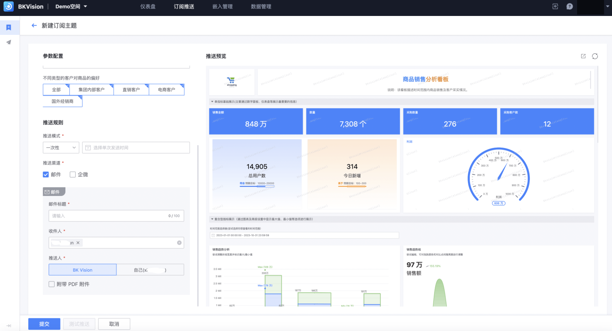

## Subscription configuration

User-specific settings allow users to pre-define a set of dashboard subscription conditions according to their needs; when these conditions are met, the system will automatically send subscription notifications to users through the screenshot function, so as to achieve the purpose of regularly viewing dashboard content; in short, subscription configuration is a set of user-defined rules to determine when to receive notifications from which dashboards;

### New subscription

Click **`New`** — Enter the "New Subscription Theme" page

1. **Subscription information**

**Basic information**: Fill in the subscription topic, i.e. the push name and the dashboard to be pushed;

​ **`Subscription topic`**: the push name, which can be directly queried and displayed in the list;

​ **`Push dashboard`**: Select the dashboard to be pushed;

​ **`Version`**: You can choose different version numbers for push, the default is latest;

​ **`Image width`**: Because the screenshot function is used to take a screenshot of the dashboard at a certain moment for push, the image provides 4 width options, namely 1920px, 1440px, 1366px and 1280px;

**Parameter configuration**: Users can see all the interactive components configured on the dashboard to be pushed in the parameter configuration, and users can customize the filtering data. Finally, the screenshot service will take a screenshot of the dashboard after the parameter configuration;

**Push rules**: Users can customize the push mode, channel and recipient information;

​ **`Push mode`**: It is divided into **`One-time`** and **`Periodic`**, set the corresponding sending time point immediately afterwards;

​ **`Push channel`**: divided into **`Email`** and **`WeChat`**, support multiple selection;

​ **`Email`**: BKVision pushes subscriptions to one or more people through official or personal mailboxes

​ `Email title`: fill in the title of the push email, so that the recipient is clear at a glance;

​ `Recipient`: fill in the push recipient, support automatic name association, support multiple selection;

​ `Blind sender`: Blind sender can only see himself, cannot see other recipients or blind senders;

​ `Attach PDF attachment`: support dashboard screenshots to be sent in PDF format;

​ **`WeChat`**: BKVision pushes subscriptions to individuals through the official WeChat account

​ `Recipient`: Select the push recipient, support name search, support multiple selection;

​ `Extra information`: You can fill in the description of the dashboard and other content to send together;

​**`Enterprise WeChat Group Chat`**: Users add BKVision official robots to the group chat to receive subscriptions

​ `Group Chat Session ID`: Enter the enterprise WeChat group chat session ID, multiple IDs are supported, separated by commas;

​ `Extra Information`: You can enter the text content sent together with the description of the dashboard;

2. **Push Preview**: After selecting the dashboard to push, the dashboard can be displayed in the push preview on the right to ensure that it is correct;

3. **Action Bar**:

​ `Submit`: Save and start the current subscription item

​ `Test Push`: Push the current user according to the configuration of the current subscription item to test the final effect of the push

​ `Cancel`: Clear and exit this subscription configuration