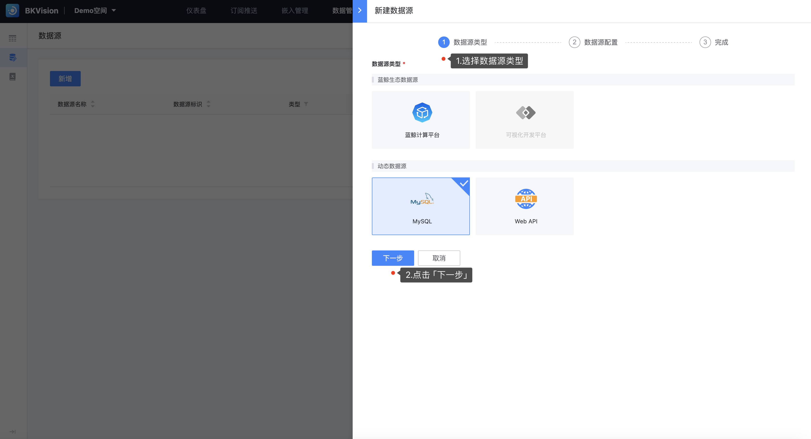

## 2. Connect to the data source

### Operation steps

1. Go to **Space** and determine the spatial scope of the connected data source

Click **`Data Management`** — Click **`Data Source`** in the left navigation bar — Click **`Add`**

2. **Fill in the data source information**

After entering the "New Data Source" page, select and fill in the "Data Source Type" and "Data Source Configuration" information in turn

- **Data Source Type**

The chart platform supports **Blue Whale Ecological Data Source** and **Dynamic Data Source**;

Among them, **Blue Whale Ecological Data Source** is divided into **`Blue Whale Computing Platform`** and **`Visual Development Platform`** (under development);

**Dynamic Data Source** is divided into **`MySQL`** and **`Web API`**;

Due to different "Data Source Type" selections, the "Data Source Configuration" information page is different. The following shows the information filled in for different data source types:

- **Computing platform**

​ **Basic information**: including **`Data source name`** and **`Data source identifier`**, to help users locate and identify the required data source more efficiently

​ **`Data source name`**: Data source display name, assign a clear and easy-to-understand name to the data source;

​ **`Data source identifier`**: A code or symbol that uniquely identifies the data source, which is only allowed to contain these characters: `a-z 0-9 _`, and is unique;

​ **Connection information**: including **`Select object`** and **`Specific object name`**, this operation represents the application for connecting to the data table of the computing platform project (the actual data usage rights are subject to the user's rights on the computing platform)

​ **`Select object`**: divided into **`Project`** and **`Business`**;

​ **`Project/Business`**: After determining the project/business, you can select the corresponding project/business name;

- **MySql**

​ **Basic information**: including **`Data source name`** and **`Data source identifier`** help users locate and identify the required data source more efficiently

​ **`Data source name`**: Data source display name, assign a clear and easy-to-understand name to the data source;

​ **`Data source identifier`**: A code or symbol that uniquely identifies the data source, which is only allowed to contain these characters: `a-z 0-9 _`, which is unique;

​ **Connection information**: Fill in the relevant information for the platform to access the database, including:

​ **`Database address`**: The location of the database server, usually expressed as an IP address or domain name, for example, "192.168.1.1

​ **`Port number`**: The port number is a number associated with a specific database service. When the platform tries to connect to the database, it needs to specify the correct port number;

​ **`Database name`**: Used to distinguish multiple databases on the same server;

​ **`User name`**: One of the user credentials used to connect to the database; the database administrator will create user accounts with different permissions, and the platform uses the correct username and password combination to gain access rights;

​**`Password`**: Credentials used in combination with the username to authenticate the application and grant access to the database;

​ **`Character Set`**: Defines the types of characters that can be stored and used in the database;

- **Web API**

​ **Basic Information**: Includes **`Data Source Name`** and **`Data Source Identifier`**, which help users locate and identify the required data source more efficiently

​ **`Data Source Name`**: Data Source display name, assigning a clear and understandable name to the data source;

​ **`Data Source Identifier`**: Code or symbol that uniquely identifies the data source, which is only allowed to contain these characters: `a-z 0-9 _`, which is unique;

​ **Connection Information**: Specify the requested resource

​ **`Request Method & Link`**: Supports **`GET`**, **`POST`** Two request methods, and enter the link, such as: https://bkvision.blueking.com/rest_api/demo

​ **`header`**: HTTP request header information, also known as HTTP header, which contains application-specific information about the request or response;

​ **`Request parameters`**: Data sent with the HTTP request, used to pass additional information to the server so that the server can perform corresponding operations based on this information;

