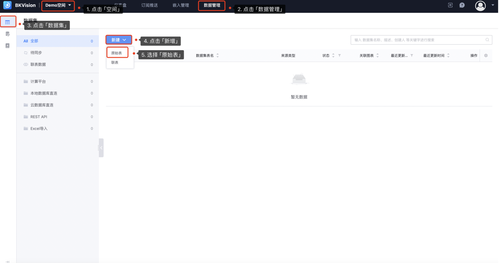
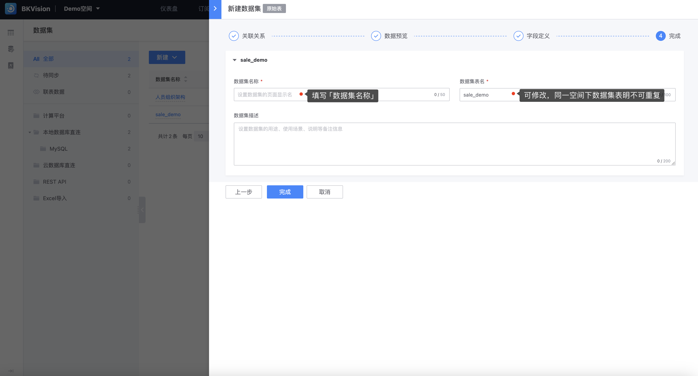

## 3. Create a dataset

1. Go to **Space** and determine the spatial scope of the new dataset

​ Click **`Data Management`** — Click **`Dataset`** in the left navigation bar — Click **`Add`**-Select **`Original Table`**

2.**Fill in the dataset information**

After entering the "New Dataset" page, select "Relationship", "Data Preview" and "Field Definition" information in turn

- **Relationship**: Lock the data source of the new dataset (data table)

​ **`Source Type`**: Divided into **`Computing Platform`**, **`Direct Connection to Local Database`**, **`REST API`**, **`Direct Connection to Cloud Database`**, **`Excel Import`**, **`MySQL`** (the latter three have not yet been developed). The data table can be quickly locked by selecting the data source information;

​**`Data Source`**: Select the connected data source;

​ **`Data Table`**: Select the data table of the data source. Multiple data tables can be connected at one time;

- **Data Preview**: When the table in the database is successfully connected, the connected data table is displayed;

- **Field Definition**: Except for **`Original Field Name`**, all others can be customized

​ **`Original Field Name`**: The actual field name in the data source, the column name in the database table;

​ **`Field Name`**: The name after renaming or translating the original field name to adapt to different scenarios, the default original field name;

​ **`Display Name`**: The field name finally displayed to the user;

​ **`Field Type`**: Identifies the type of field data, such as string, number (integer), number (floating point), time, etc.;

​**`Data classification`**: Divided into "dimension" and "indicator", which is convenient for direct selection when configuring the chart;

- **Completed**:

​ **`Dataset name`**: The page display name of the dataset;

​ **`Dataset table name`**: The actual table name of the dataset in the database;

​ **`Dataset description`**: Used to describe the purpose, usage scenario, instructions and other notes of the dataset;