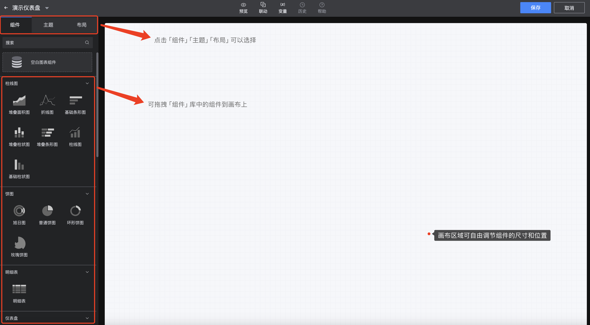
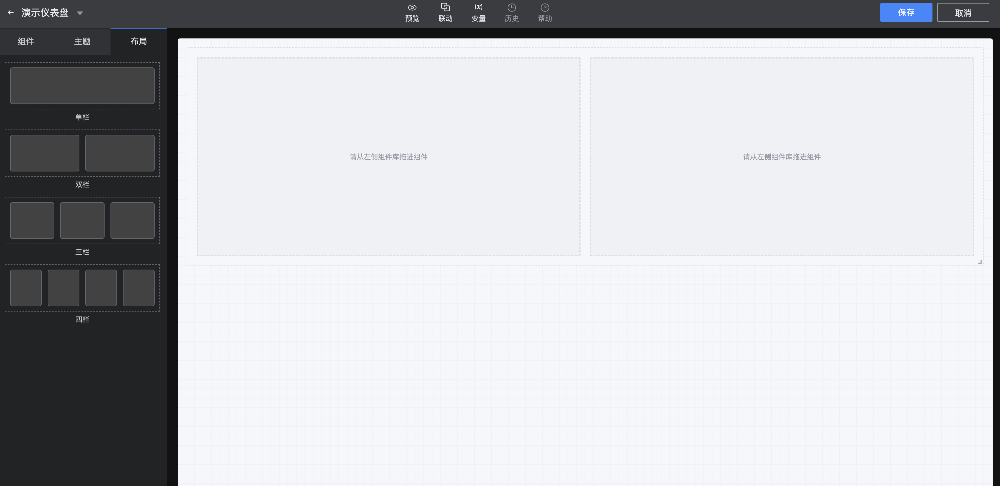

## 5. Configure charts in the dashboard

As the saying goes, "everything is ready, only the east wind is missing". After the space, data source, data set and catalog/dashboard are created, let's start to show our skills on the dashboard!

1. On the Dashboard page - click **`Edit`** to enter the Edit Mode:

2. **Chart Configuration**

In the Edit Mode, click **`Component`** - select any component and drag it to the canvas;

Drag any component to the canvas to immediately jump to the "Chart Configuration" page, where users can complete the configuration information of a single chart. The "Chart Configuration" page includes four modules, namely "Data", "Query", "Display", and "Style"

- **Data**: Select the connected data source and data set to view the configurable fields

**`Data Source`**: Find the data source for configuring the chart;

**`Data Set`**: Find the data set for configuring the chart;

**`Field display`**: Based on the selected data set, display the field name and display name of the data set;

**`Virtual field`**: A field that does not actually store data in the database, but is obtained by calculating or converting the data of existing fields. It can be created based on the values, functions, and expressions of other fields;

**`One-click matching chart`**: Help users automatically match the appropriate chart according to the data set;

- **Query**

Based on the displayed fields, select the **`Indicator`** and **`Dimension`** of the chart;

Click the gear on the left of the selected indicator to modify the field name, display name, **Aggregation algorithm** and field notes;

Click the gear on the left of the selected dimension to modify the field name, display name, **Dictionary table** and field notes;

You can filter data by drilling down and advanced settings, and finally click the **`Query`** button;

- **Display box**

After the **`Query`** operation, you can intuitively view the configured chart in the display box, which is convenient for timely adjustment and change of configuration;

- **Style**

It is divided into **`Basic configuration`** and **`Advanced configuration`**, users can customize the style according to their needs to meet different scenarios. Of course, in addition to general configurations such as title, value indicator processing, etc., different configurations are provided for different charts;

3. **Overall layout settings of the dashboard**

- **Component**

​ Currently supports 27 components. You can drag any component to the canvas to adjust the position, and adjust the size of the component through the border of the chart on the canvas;

- **Border size**: Drag the lower right corner of the blue border of the chart to change the size of the chart on the canvas at will;

- **Single chart editing**: hover the top of the chart, and the upper right corner will display **`Edit chart`**, **`Delete chart`**, **`Full screen display`**, **`Refresh`**, **`Copy to clipboard`**, **`Export Excel`**, **`View SQL`**;

- **Global functions**: **`Preview`**, **`Linkage`**, **`Variable`**, **`History`**, **`Help`**;

- **Theme**: Change the overall dashboard color and style to suit the scenario;

- **Layout**: Provides 4 optional layout modes, namely **`single column`**, **`double column`**, **`three columns`** and **`four columns`**, simplifying page layout and typesetting, without the need to manually adjust the chart border size;

