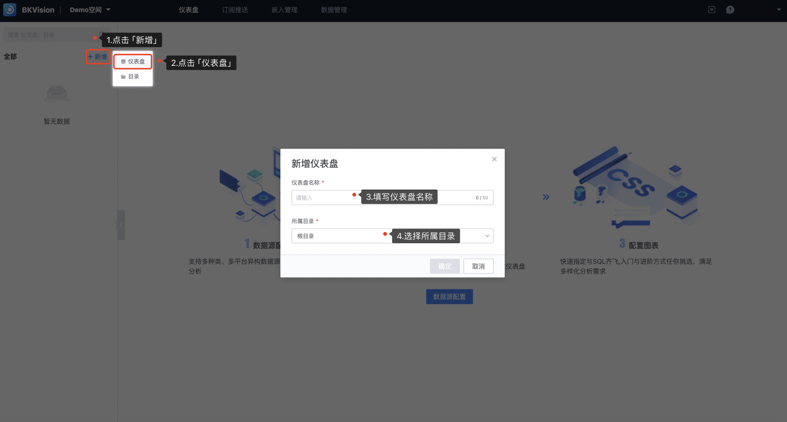

## 4. Create a new directory/dashboard

### Create a new directory

1. Click **`Add`** — Click **`Directory`** — Fill in **`Directory Name`** — Select **`Directory to which it belongs`**

​ **`Directory to which it belongs`**: a directory that has been created in the directory table, or a root directory

2. In addition to the above methods, you can also create a new directory on an existing directory:

### Create a new dashboard

1. Click **`Add`** — Click **`Dashboard`** — Fill in **`Dashboard Name`** — Select **`Directory to which it belongs`**

**`Directory to which it belongs`**: a directory that has been created in the directory table, or a root directory

2. In addition to the above methods, you can also create a new directory on an existing directory:

