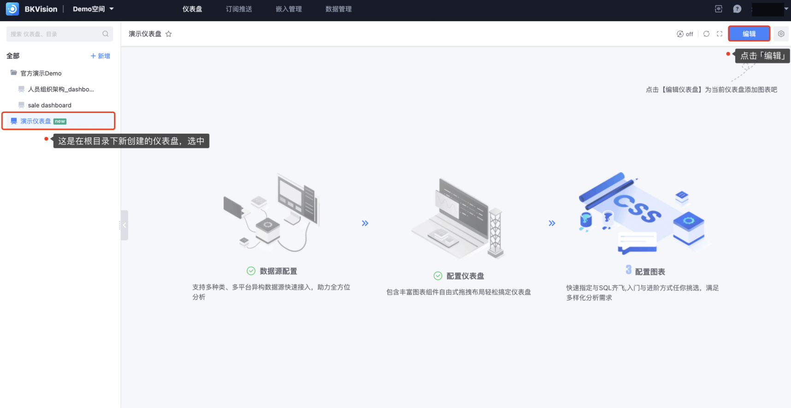
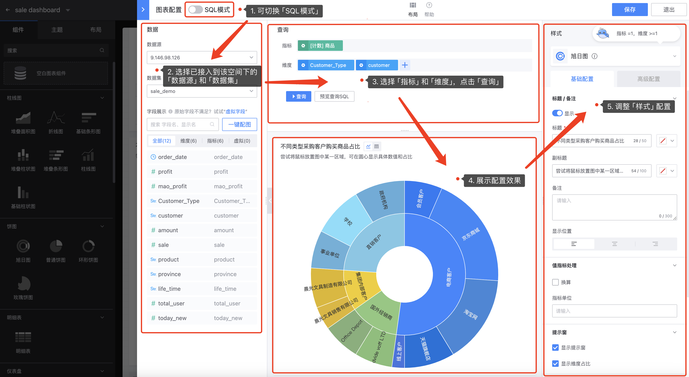

### 5. How to configure charts

As the saying goes, "everything is ready, only the east wind is missing". After the space, data source, data set and catalog/dashboard are created, let's start to show our skills on the dashboard!

1. On the Dashboard page — click **`Edit`** to enter the Edit Mode:

2. **Chart Configuration**

In the Edit Mode, click **`Component`** — select any component and drag it to the canvas. For how to select components, please refer to [Chart Classification and Function Description](../7.Chart-Classification-and-Function-Description.md);

Drag any component to the canvas to immediately jump to the "Chart Configuration" page. Users can complete the configuration information of a single chart through this page. The "Chart Configuration" page includes four major modules, namely "Data", "Query", "Display", and "Style"

- **Data**: Select the connected data source and data set to view the configurable fields

**`Data Source`**: Find the data source for configuring the chart

**`Dataset`**: Find the data set for configuring the chart

**`Field Display`**: Based on the selected data set, display the field name and display name of the data set

**`Virtual Field`**: Fields that do not actually store data in the database, but are obtained by calculating or converting the data of existing fields. They can be created based on the values, functions, and expressions of other fields.

**`One-click Map`**: Help users automatically match the appropriate chart based on the data set

- **Query**

Select the **`Indicator`** and **`Dimension`** of the chart through the displayed fields, and use advanced filtering? Filter the data, and finally click the **`Query`** button

- **Display box**

After the **`Query`** operation, you can intuitively view the configured chart in the display box, which is convenient for timely adjustment and change of configuration

- **Style**

It is divided into **`Basic configuration`** and **`Advanced configuration`**. Users can customize the style according to their needs to meet different scenarios. Of course, in addition to the general configuration such as title, value indicator processing, etc., different configurations are provided for different charts.

3. **Overall layout settings of the dashboard**

- **Component**

​ 27 components are currently supported. You can drag any component to the canvas to adjust the position, and adjust the size of the component through the border of the chart on the canvas

- **Border size**: Drag the lower right corner of the blue border of the chart to change the size of the chart on the canvas at will

- **Single chart editing**: hover the top of the chart, and the upper right corner will display **`Edit chart`**, **`Delete chart`**, **`Full screen display`**, **`Refresh`**, **`Copy to clipboard`**, **`Export Excel`**, **`View SQL`**

- **Global functions**: **`Preview`**, **`Linkage`**, **`Variable`**, **`History`**, **`Help`**

- **Theme**: Change the overall dashboard color and style to meet the scene application

- **Layout**: Provide 4 optional layout modes, namely **`single column`**, **`double column`**, **`three columns`** and **`four columns`**, simplify page layout and typesetting, no need to manually adjust the size of the chart border;

