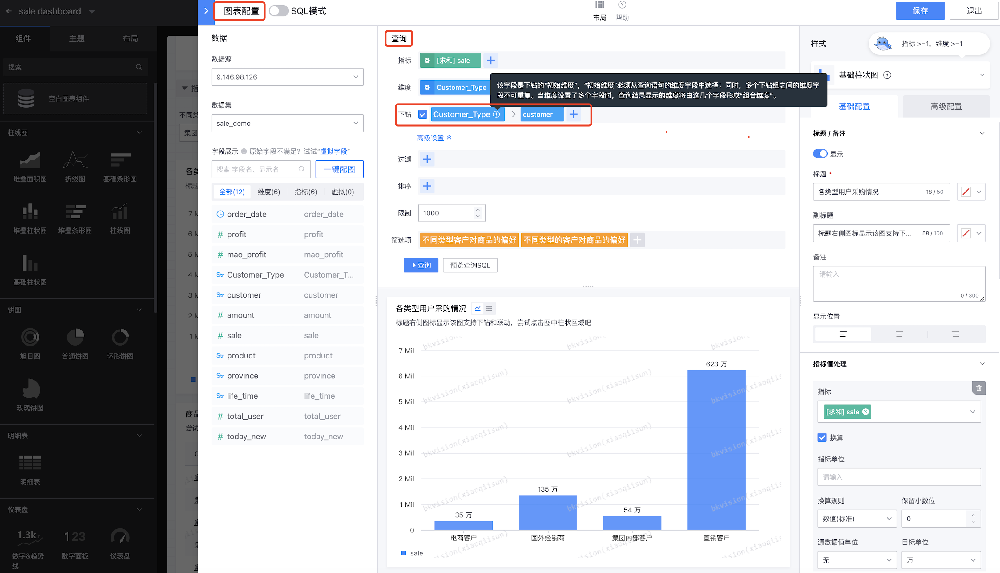
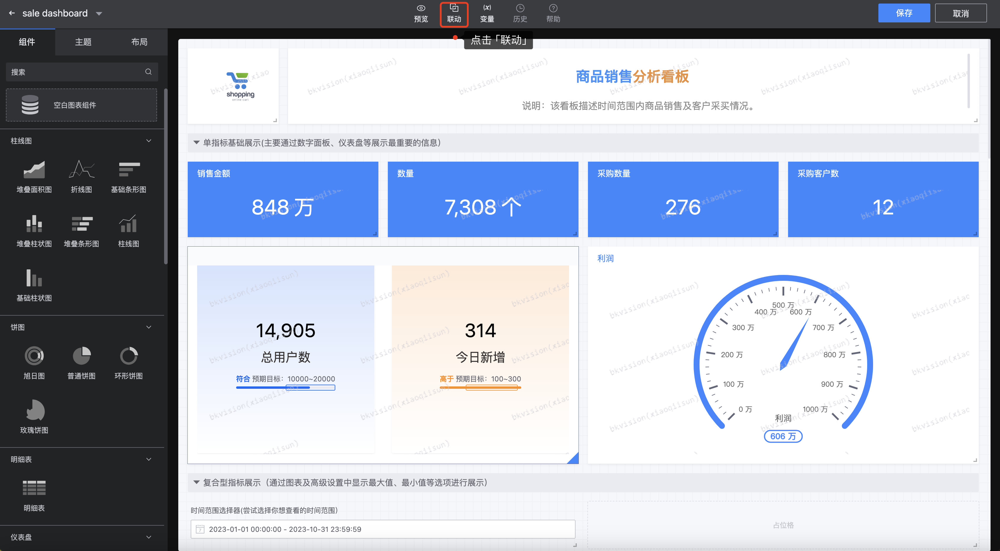
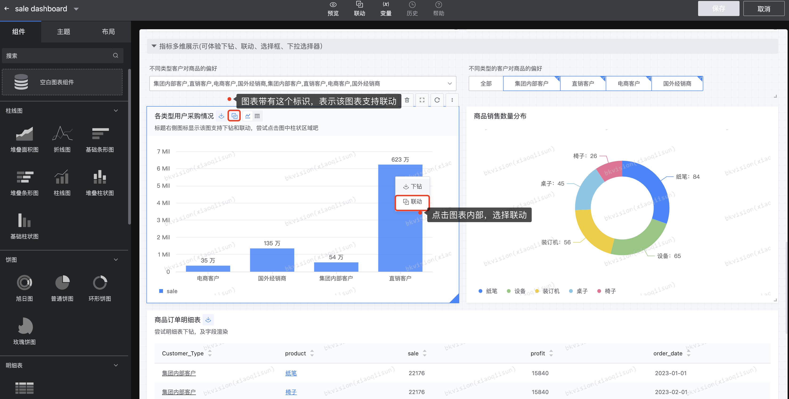
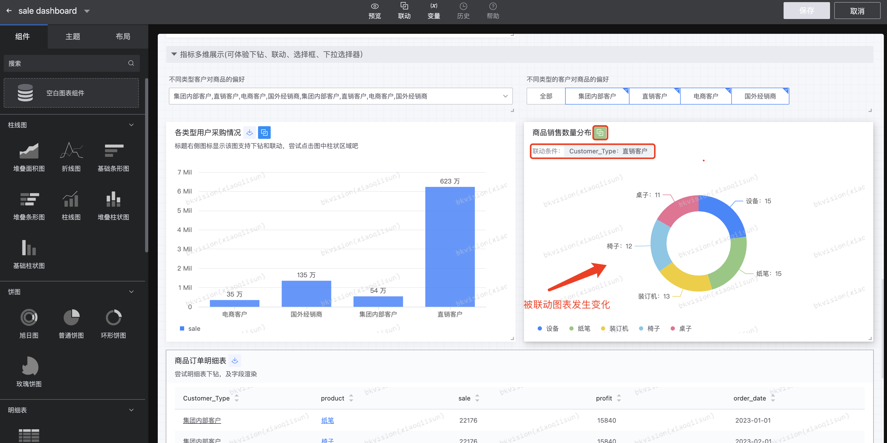

## 6. Drill-down and linkage application

### Drill-down

Drill-down is an operation to drill down into data details. It allows users to drill down from the current data level to a lower level of data level to view more detailed information about the data;

- **Set Drill-down**

On the "Chart Configuration" page, check **`Drill-down`**, and select the drill-down dimension according to the drill-down rules; the first-level dimension of the drill-down in the figure is **`Customer_Type`**, and the second-level dimension is **`customer`**. After the configuration is completed, click Save;

- **The drill-down effect is shown below**

Select **`Direct Sales Customer`** under **`Customer_Type`**, which shows the second-level dimension **`customer`** under **`Direct Sales Customer`** ;

Click the "Drill Down" icon again to restore it to its original state;

### Linkage

Linkage is an interactive function of data visualization, which allows users to view a data view, and the selection or operation made can affect other related data views in real time;

- **Set Linkage**

Enter the "Edit Mode" page - click **`Linkage`**;

Click **`Add`**;

According to the instructions, select the linked chart and dimension information;

- **Linkage results are shown below**

- **Note**

Not all charts support drill down and linkage. The following table can show which charts support drill down and linkage:

