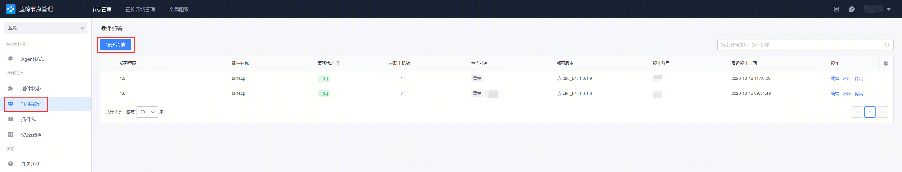
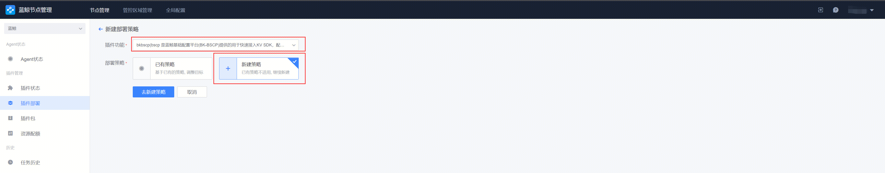

# Client pull configuration

Currently supports four clients: container Sidecar, node management plug-in, command line, and SDK. Each client has different usage scenarios, as follows:

* Container Sidecar is mainly used for containerized applications to pull file-type configuration

* Node management plug-in is mainly used for non-containerized applications (traditional hosts) to pull file-type configuration

* The command line will not monitor configuration version changes, manually pull application configuration, and support file-type configuration and key-value configuration pull

* SDK is mainly used for application to pull key-value and table-type configuration. Currently supported languages ​​are: Go, Python, Java, C++

## 1. Container Sidecar client pull configuration

Container Sidecar example

```yaml
apiVersion: apps/v1
kind: Deployment
metadata:
  name: test-listener
  namespace: default
spec:
  selector:
    matchLabels:
      app: test-listener
  template:
    metadata:
      labels:
        app: test-listener
    spec:
      initContainers:
        # BSCP init container, responsible for pulling the configuration file to the specified directory for the first time
        - name: bscp-init
          image: ccr.ccs.tencentyun.com/blueking/bscp-init:latest
          env:
            # BSCP business ID
            - name: biz
              value: "10"
            # BSCP Service Name
            - name: app
              value: "file_demo"
            # BSCP service subscription address, executed on the cluster deployed by BSCP background (by default, under the "BlueKing" project of the container provider), execute the following command to obtain:
            # kubectl get svc bk-bscp-feed-feedserver-nodeport -n bk-bscp
            # If the client is not connected to the cluster Node network, you can configure LoadBalancer for the feedserver yourself
            - name: feed_addrs
              value: "10.0.0.1:31510"
            # Service Key, fill in the service key created in the previous step
            - name: token
              value: "ABCDEFGHIJKLMNOPQRSTUVWXYZ1234"
            # Instance tags are generally used in scenarios with multiple configuration versions and grayscale releases.
            - name: labels
              value: '{"city":"shanghai"}'
            # Configure the temporary directory of the configuration file. The files will be sent to the {temp_dir}/files directory.
            - name: temp_dir
              value: '/data/bscp'
          # The temporary directory of the file needs to be mounted to the init container, sidecar container, and business container at the same time
          volumeMounts:
            - mountPath: /data/bscp
              name: bscp-temp-dir
      containers:
        # Business Container
        - name: test-listener
          image: alpine
          command:
          - "/bin/sh"
          - "-c"
          - |
            apk add --no-cache inotify-tools
            echo "start watch ..."
            while true; do
            # Listen for write events of /data/bscp/metadata.json
            inotifywait -m /data/bscp/metadata.json -e modify |
                while read path action file; do
                    # Recursively traverse all files in the /data/bscp/files directory and output their absolute paths
                    find /data/bscp/files
                done
            done
          resources:
            limits:
              memory: "128Mi"
              cpu: "500m"
          # The temporary directory of the file needs to be mounted to the init container, sidecar container, and business container at the same time
          volumeMounts:
            - mountPath: /data/bscp
              name: bscp-temp-dir
        # The BSCP sidecar container is responsible for monitoring the version change time, updating the configuration files in the temporary directory, and writing events to metadata.json after the update is completed.
        - name: bscp-sidecar
          image: ccr.ccs.tencentyun.com/blueking/bscp-sidecar:latest
          env:
            # The environment variable configuration of the bscp-sidecar container is exactly the same as that of the bscp-init container.
            - name: biz
              value: "10"
            - name: app
              value: "file_demo"
            - name: feed_addrs
              value: "10.0.0.1:31510"
            - name: token
              value: "ABCDEFGHIJKLMNOPQRSTUVWXYZ1234"
            - name: labels
              value: '{"city":"shanghai"}'
            - name: temp_dir
              value: '/data/bscp'
          resources:
            limits:
              memory: "128Mi"
              cpu: "500m"
          volumeMounts:
            - mountPath: /data/bscp
              name: bscp-temp-dir
      volumes:
        - name: bscp-temp-dir
          emptyDir: {}
```

The example contains 3 containers, 1 bscp-init initialization container, 1 business container, and 1 bscp-sidecar container. The shared file directory between the 3 containers uses the emptyDir volume.

```yaml
      volumes:
        - name: bscp-temp-dir
          emptyDir: {}
```
* bscp-init Initialize container
Enabled before business container and bscp-sidecar container, used to pull the configuration file required for business container process startup when business Pod starts
* Business container
Business container, providing business logic processing
* bscp-sidecar container
Listen to the version changes of service configuration, pull the latest version of configuration file when a new configuration version is released

Parameters required for bscp-init initialization container and Sidecar container

- biz
Business ID for which configuration file needs to be obtained, for example: 10


- app

Service name for which configuration file needs to be obtained, for example: service_demo


- feed_addrs

Service subscription address, client connection service configuration center backend address and port, for example: 10.0.0.1:31510

Execute on the cluster deployed by BSCP backend (by default, under the "BlueKing" project of the container Provider), and execute the following command to obtain:

``` kubectl get svc bk-bscp-feed-feedserver-nodeport -n bk-bscp```
If the client is not connected to the cluster Node network, you can configure LoadBalancer for the feedserver yourself

- token

Service key, used for client authentication


- labels

Instance label, used with [Group Management](./group_management.md) to implement the grayscale release scenario of the service instance. If grayscale release is not required, this environment variable can be left unconfigured

- temp_dir

Temporary storage directory for configuration files. Because the client needs to support pulling configurations under multiple businesses and multiple services, the path contains the business ID and service name

The path of the storage file after the client pulls the configuration file is: temp_dir + business ID + service name + files + absolute path of the configuration file

For example: temp_dir is configured as: /data/config, business ID is: 10, service name is: service_demo, configuration item path is: /etc/nginx/nginx.conf, then the client pulls the configuration file storage directory: /data/config/10/serivce_demo/files/etc/nginx/nginx.conf

After deploying the above sample deployment, enter the container to view the pulled configuration

```bash
# Adjust the parameters of the above sample file according to the actual situation and save it as a file: demo.yaml, and then deploy the sample deployment on the k8s cluster
kubectl apply demo.yaml

# After all containers under the Pod are ready, enter the bscp-sidecar container
kubectl exec -it test-listener-658f478944-stwps -c bscp-sidecar -- /bin/bash

# cd to the temporary storage file directory
cd /data/bscp/10/service_demo/files

# View the pulled configuration files
ls -lR
.:
total 8
drwxr-xr-x    3 root     root          4096 Mar  6 08:09 etc
drwxr-xr-x    3 root     root          4096 Mar  6 08:09 usr

./etc:
total 4
drwxr-xr-x    2 root     root          4096 Mar  6 08:09 nginx

./etc/nginx:
total 64
-rw-r--r--    1 root     root          1077 Mar  6 08:09 fastcgi.conf
-rw-r--r--    1 root     root          1077 Mar  6 08:09 fastcgi.conf.default
-rw-r--r--    1 root     root          1007 Mar  6 08:09 fastcgi_params
-rw-r--r--    1 root     root          1007 Mar  6 08:09 fastcgi_params.default
-rw-r--r--    1 root     root          2837 Mar  6 08:09 koi-utf
-rw-r--r--    1 root     root          2223 Mar  6 08:09 koi-win
-rw-r--r--    1 root     root          5231 Mar  6 08:09 mime.types
-rw-r--r--    1 root     root          5231 Mar  6 08:09 mime.types.default
-rw-r--r--    1 root     root          2657 Mar  6 08:09 nginx.conf
-rw-r--r--    1 root     root           636 Mar  6 08:09 scgi_params
-rw-r--r--    1 root     root           636 Mar  6 08:09 scgi_params.default
-rw-r--r--    1 root     root           664 Mar  6 08:09 uwsgi_params
-rw-r--r--    1 root     root           664 Mar  6 08:09 uwsgi_params.default
-rw-r--r--    1 root     root          3610 Mar  6 08:09 win-utf

./usr:
total 4
drwxr-xr-x    2 root     root          4096 Mar  6 08:09 sbin

./usr/sbin:
total 1240
-rw-r--r--    1 root     root       1266632 Mar  6 08:09 nginx
# Exit the container and view the configuration file pull log
# View when the Pod is started
kubectl logs --tail=50 test-listener-658f478944-stwps -c bscp-init

# View after the Pod is enabled
kubectl logs --tail=50 test-listener-658f478944-stwps -c bscp-sidecar
```

## 2. Node management plug-in client pull configuration

In the traditional host scenario, the BlueKing Node Management Provider is used to deploy the client plug-in. First, you need to open the BlueKing Node Management Provider and select the business to deploy the client. Here, it is recommended to select only a single business


Enter the "Plug-in Deployment" function page of the plug-in management and create a new policy



Select "bkbscp" for the plug-in function and "New Policy" for the deployment policy



After filling in the policy name, it is recommended to use "Dynamic Topology" for the deployment target and select the CMDB module to deploy the client. The hosts placed under this CMDB module will automatically deploy bkbscp in the future. Plugin


Currently only supports the Linux operating system of the x86_64 architecture, and other operating systems will be supported in the future


The plugin configuration parameters are the same as the Sidecar configuration parameters. If you don't understand, please refer to the previous section Container Sidecar client pull configuration


Enter the execution preview page, click the "Save and Execute" button, and wait for the client plug-in to be installed


Log in to the host to check that the configuration file has been successfully issued


## 3. Command line client pull configuration
### 1. Download command line binary and create binary configuration

```bash
# Install bscp command line
go install github.com/TencentBlueKing/bscp-go/cmd/bscp@latest

# Download bscp command line, download the latest version
https://github.com/TencentBlueKing/bscp-go/releases/
```

Configure client parameters, save the content as file bscp.yaml after configuration
```yaml
# BSCP service subscription address, executed on the cluster deployed by the BSCP backend (by default, under the "BlueKing" project of the container provider), execute the following command to obtain:
# kubectl get svc bk-bscp-feed-feedserver-nodeport -n bk-bscp
# If the client is not connected to the cluster Node network, you can configure LoadBalancer for the feedserver yourself
feed_addr: "10.0.0.1:31510"

# Fill in the service key in the previous step
token: ABCDEFGHIJKLMNOPQRSTUVWXYZ1234

# Fill in the business ID
biz: 10
```

Environment variables can be used to support paths

```bash
export BSCP_CONFIG=./bscp.yaml
```

### 2. Get key-value configuration and file-type configuration from the command line

```bash
# Load client configuration in the current environment
./bscp
bscp is a command line tool for blueking service config provider

Usage:
  bscp [command]

Available Commands:
  get         Display app or kv resources
  pull        pull file to temp-dir and exec hooks
  watch       watch release then pull file, exec hooks
  version     show version of the bscp-go cli.
  help        Help about any command

Flags:
  -c, --config string      config file path [env BSCP_CONFIG]
  -h, --help               help for bscp
      --log-level string   log filtering level, One of: debug|info|warn|error. (default info)

Use "bscp [command] --help" for more information about a command.

# Get bscp service list
 ./bscp get app
NAME        CONFIG TYPE   REVISER   UPDATEAT    
file_demo   file          demo      5 hours ago   
kv_demo     kv            demo      2 hours ago

# If you need to format the output
./bscp get app -o json
[
    {
        "id": 205,
        "name": "file_demo",
        "config_type": "file",
        "revision": {
            "creator": "demo",
            "reviser": "demo",
            "create_at": "2024-03-04T09:33:44Z",
            "update_at": "2024-03-04T09:33:44Z"
        }
    },
    {
        "id": 206,
        "name": "kv_demo",
        "config_type": "kv",
        "revision": {
            "creator": "demo",
            "reviser": "demo",
            "create_at": "2024-03-04T12:23:42Z",
            "update_at": "2024-03-04T12:23:42Z"
        }
    }
]

# Get the kv list
./bscp get kv --app kv_demo
KEY          TYPE     REVISER   UPDATEAT   
string_key   string   demo      1 hour ago   
json_key     json     demo      1 hour ago

# Get metadata of kv
./bscp get kv --app kv_demo string_key -o json
[
    {
        "id": 0,
        "key": "string_key",
        "kv_type": "string",
        "revision": {
            "creator": "demo",
            "reviser": "demo",
            "create_at": "2024-03-04T12:38:49Z",
            "update_at": "2024-03-04T12:38:49Z"
        },
        "kv_attachment": {
            "biz_id": 10,
            "app_id": 206
        }
    }
]
./bscp get kv --app kv_demo json_key -o json
[
    {
        "id": 0,
        "key": "json_key",
        "kv_type": "json",
        "revision": {
            "creator": "demo",
            "reviser": "demo",
            "create_at": "2024-03-04T12:42:34Z",
            "update_at": "2024-03-04T12:42:34Z"
        },
        "kv_attachment": {
            "biz_id": 10,
            "app_id": 206
        }
    }
]

# Get the value of kv
./bscp get kv --app kv_demo string_key -o value
string_value

./bscp get kv --app kv_demo json_key -o value
{
"name": "blueking",
"desc": "Blueking is an operation and maintenance provider"
}

# Pull file-based configuration
./bscp pull --help
pull file to temp-dir and exec hooks

Usage:
  bscp pull [flags]

Flags:
  -f, --feed-addrs string          feed server address, eg: 'bscp-feed.example.com:9510' [env feed_addrs]
  -b, --biz int                    biz id [env biz]
  -a, --app string                 app name [env app]
  -t, --token string               sdk token [env token]
  -l, --labels string              labels [env labels]
      --labels-file string         labels file path [env labels_file]
  -d, --temp-dir string            bscp temp dir, default: '/data/bscp' [env temp_dir]
      --file-cache-enabled         enable file cache or not (default true)
      --file-cache-dir string      bscp file cache dir (default "/data/bscp/cache")
      --cache-threshold-gb float   bscp file cache threshold gigabyte (default 2)
  -h, --help                       help for pull

Global Flags:
  -c, --config string      config file path [env BSCP_CONFIG]
      --log-level string   log filtering level, One of: debug|info|warn|error. (default info)
```

Pull file type configuration requires adjusting the content of the bscp.yaml configuration file. The specific content is as follows:
```yaml
# BSCP service subscription address, executed on the cluster deployed by the BSCP background (by default, under the "BlueKing" project of the container provider), execute the following command to obtain:
# kubectl get svc bk-bscp-feed-feedserver-nodeport -n bk-bscp
# If the client is not connected to the cluster Node network, you can configure LoadBalancer for the feedserver yourself
feed_addrs: "10.0.0.1:31510"

# Fill in the service key in the previous step
token: ABCDEFGHIJKLMNOPQRSTUVWXYZ1234

# Fill in the business ID
biz: 10

# Fill in the service name
apps:
name: service_demo

# Fill in the temporary directory
temp_dir: /data/bscp
```

```bash
# Execute the command line to pull files
export BSCP_CONFIG=./bscp.yaml
./bscp pull
===================================================================================
oooooooooo   oooo    oooo         oooooooooo     oooooooo     oooooo    oooooooooo
 888     Y8b  888   8P             888     Y8b d8P      Y8  d8P    Y8b   888    Y88
 888     888  888  d8              888     888 Y88bo       888           888    d88
 888oooo888   88888[      8888888  888oooo888     Y8888o   888           888ooo88P
 888     88b  888 88b              888     88b        Y88b 888           888
 888     88P  888   88b            888     88P oo      d8P  88b    ooo   888
o888bood8P   o888o  o888o         o888bood8P   88888888P     Y8bood8P   o888o
===================================================================================

Version  : v1.1.1
BuildTime: 2024-02-19T11:03:28+0800
GitHash  : bb1e4ecd29525971a894db35e22086999f0de625
GoVersion: go1.20.4
use config file: ./bscp.yaml
time=2024-03-06T17:20:12.318+08:00 level=INFO source=client/client.go:69 msg="instance fingerprint" fingerprint=497d4ddc285e441e9f8c650686bf11e1
time=2024-03-06T17:20:12.321+08:00 level=INFO source=upstream/upstream.go:143 msg="dial upstream server success" upstream=10.0.5.16:31510
time=2024-03-06T17:20:12.324+08:00 level=INFO source=cache/cache.go:189 msg="start auto cleanup file cache " cacheDir=/data/bscp/cache cleanupIntervalSeconds=300s thresholdGB=2GB retentionRate=90%
time=2024-03-06T17:20:12.324+08:00 level=INFO source=cache/cache.go:202 msg="calculate current cache directory size" currentSize="4.0 KiB"
time=2024-03-06T17:20:12.459+08:00 level=INFO source=client/types.go:69 msg="copy file from cache success" dst=/data/bscp/10/service_demo/files/etc/nginx/fastcgi.conf
time=2024-03-06T17:20:12.459+08:00 level=INFO source=client/types.go:69 msg="copy file from cache success" dst=/data/bscp/10/service_demo/files/etc/nginx/fastcgi_params
time=2024-03-06T17:20:12.461+08:00 level=INFO source=client/types.go:69 msg="copy file from cache success" dst=/data/bscp/10/service_demo/files/etc/nginx/fastcgi_params.default
time=2024-03-06T17:20:12.462+08:00 level=INFO source=client/types.go:69 msg="copy file from cache success" dst=/data/bscp/10/service_demo/files/etc/nginx/koi-utf
time=2024-03-06T17:20:12.462+08:00 level=INFO source=client/types.go:69 msg="copy file from cache success" dst=/data/bscp/10/service_demo/files/etc/nginx/fastcgi.conf.default
time=2024-03-06T17:20:12.658+08:00 level=INFO source=client/types.go:69 msg="copy file from cache success" dst=/data/bscp/10/service_demo/files/etc/nginx/mime.types
time=2024-03-06T17:20:12.660+08:00 level=INFO source=client/types.go:69 msg="copy file from cache success" dst=/data/bscp/10/service_demo/files/etc/nginx/mime.types.default
time=2024-03-06T17:20:12.660+08:00 level=INFO source=client/types.go:69 msg="copy file from cache success" dst=/data/bscp/10/service_demo/files/etc/nginx/koi-win
time=2024-03-06T17:20:12.661+08:00 level=INFO source=client/types.go:69 msg="copy file from cache success" dst=/data/bscp/10/service_demo/files/etc/nginx/scgi_params.default
time=2024-03-06T17:20:12.773+08:00 level=INFO source=client/types.go:69 msg="copy file from cache success" dst=/data/bscp/10/service_demo/files/etc/nginx/scgi_params
time=2024-03-06T17:20:12.969+08:00 level=INFO source=client/types.go:69 msg="copy file from cache success" dst=/data/bscp/10/service_demo/files/etc/nginx/nginx.conf
time=2024-03-06T17:20:12.969+08:00 level=INFO source=client/types.go:69 msg="copy file from cache success" dst=/data/bscp/10/service_demo/files/etc/nginx/uwsgi_params.default
time=2024-03-06T17:20:13.053+08:00 level=INFO source=client/types.go:69 msg="copy file from cache success" dst=/data/bscp/10/service_demo/files/etc/nginx/uwsgi_params
time=2024-03-06T17:20:13.060+08:00 level=INFO source=client/types.go:69 msg="copy file from cache success" dst=/data/bscp/10/service_demo/files/usr/sbin/nginx
time=2024-03-06T17:20:13.156+08:00 level=INFO source=client/types.go:69 msg="copy file from cache success" dst=/data/bscp/10/service_demo/files/etc/nginx/win-utf
time=2024-03-06T17:20:13.156+08:00 level=INFO source=eventmeta/metadata.go:79 msg="append event metadata to metadata.json success" event="{\"releaseID\":362,\"status\":\"SUCCESS\",\"message\":\"\",\"eventTime\":\"2024-03-06T17:20:13+08:00\"}"
time=2024-03-06T17:20:13.156+08:00 level=INFO source=pull.go:131 msg="pull files success" releaseID=362
```

## 4. SDK client pull configuration

### 1. GO SDK
https://github.com/TencentBlueKing/bscp-go

### 2. Java SDK
https://github.com/TencentBlueKing/bscp-java-sdk

### 3. Python SDK
https://github.com/TencentBlueKing/bscp-python-sdk

### 4. C++ SDK
https://github.com/TencentBlueKing/bscp-cpp-sd