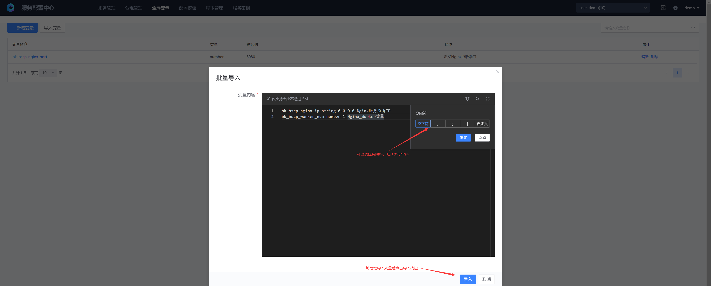
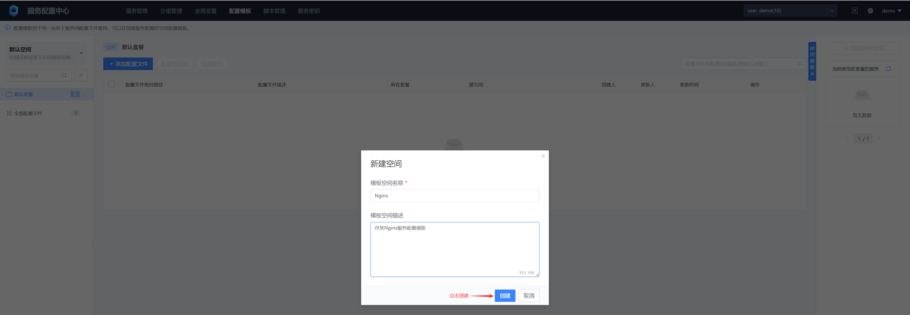
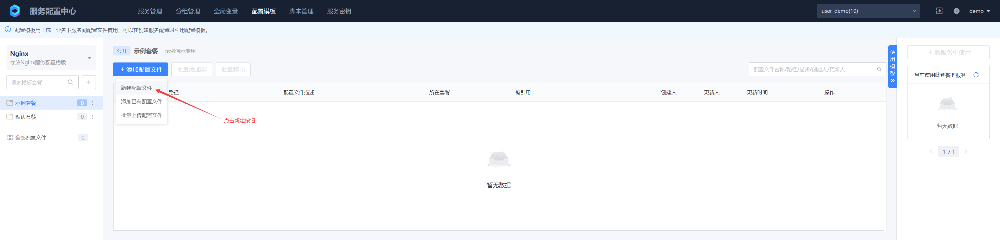
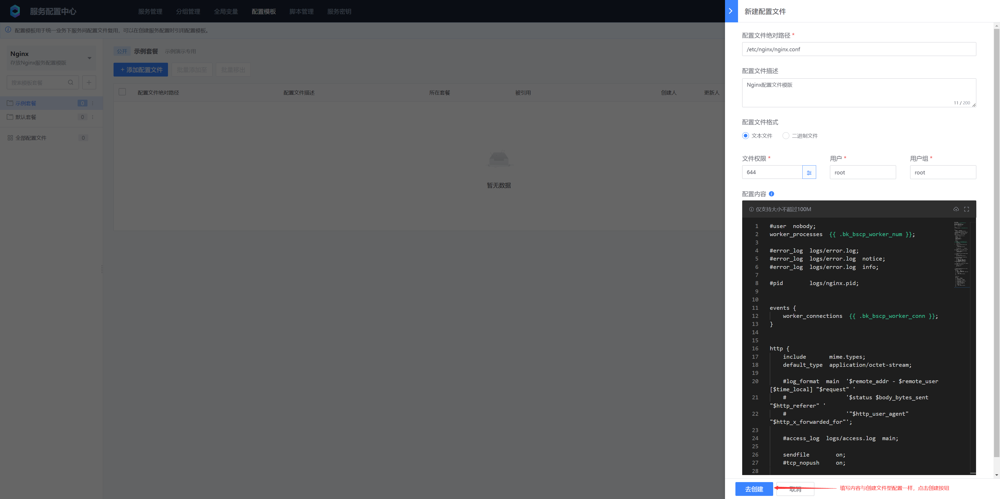
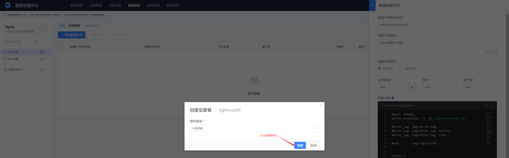
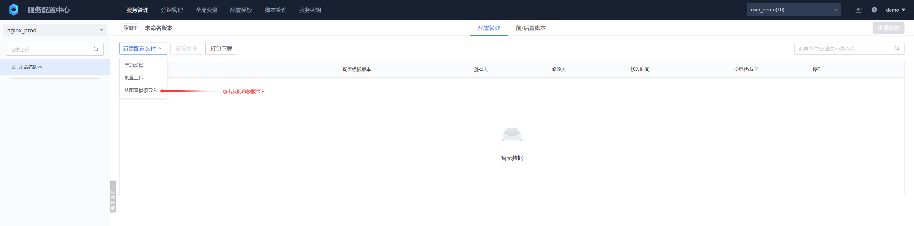
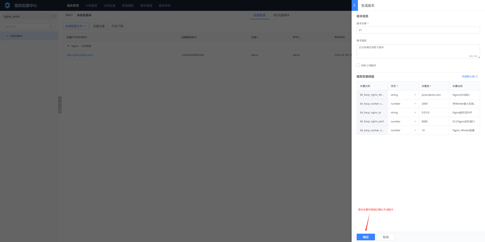

# Configuration templates and variables
The main purpose of configuration templates is to share a set of common configuration files between multiple services. For the parts that differ between services, we can use variables to resolve these differences. This can improve the efficiency and consistency of configuration management. Currently, configuration templates and variables are only applicable to file-based configuration services

## 1. Introduction to configuration template levels


* Configuration templates belong to the business level. Multiple services under a business can share one or more configuration template packages

* The specific levels of configuration templates are: template space → template package → template file

* The template space name is unique under the same business, the template package name is unique under the same template space, and the template configuration item name + template configuration item path is unique

* A service can import one or more configuration template packages under one or more template spaces, and cannot directly import configuration template files

* The template configuration item name + template configuration item path under multiple template spaces imported by the service needs to be unique. If there is a conflict, import is prohibited

## 2. Variable description

Variables are divided into two levels: business level and service level. Business-level variables are global variables and apply to the entire business scope. When a service needs to use global variables, the default value of the global variable can be modified according to actual needs to meet the configuration requirements of a specific service, which ensures the flexibility and consistency of the configuration.

Variables can be applied to both template and non-template file configurations. When variables are used in template configurations, the variable values ​​of each service are different; when variables are used in non-template file configurations, the variable values ​​of each version are different.

### 1. Create a new global variable manually


* Variable name

For the purpose of unification and identification, we stipulate that variables are prefixed with bk_bscp_ or BK_BSCP_. You can choose the appropriate variable prefix according to your usage habits, which makes it easier to identify and manage your variables

* Variable type

We support two types of variable values: string and number. You can choose the appropriate type according to actual needs and the specific situation of the variable value to ensure the correctness and validity of the variable

* Variable default value

Global variables are set with default values ​​when they are predefined. These default values ​​can be adjusted accordingly in subsequent use as needed.

### 2. Import global variables




Batch import format:

Each variable occupies one line, containing a total of 4 fields. The first field is the variable name, the second field is the variable type, the third field is the variable default value, and the fourth field (until the last field) is the variable description. By default, the null character is used as a delimiter between fields, but users can customize the delimiter as needed


### 3. Use global variables

Configuration file variables use **bk_bscp_** or **BK_BSCP_** as prefixes and are enclosed in double curly braces, with formats such as **{{ .bk_bscp_name }}**, **{{ .BK_BSCP_NAME }}**

In the subsequent chapters "Create a Configuration Template" and "Reference Configuration Template", we will introduce the use of global variables and service variables in detail so that you can better understand and apply these two types of variables.

## 3. Create a new configuration template
### 1. Create a template space
If you do not create a template space, you can directly use the default space




### 2. Create a template package

If you do not create a template package, you can directly use the default package


### 3. Add template file





Template file content:

```tex
#user  nobody;
worker_processes  {{ .bk_bscp_worker_num }};

#error_log  logs/error.log;
#error_log  logs/error.log  notice;
#error_log  logs/error.log  info;

#pid        logs/nginx.pid;


events {
    worker_connections  {{ .bk_bscp_worker_conn }};
}


http {
    include       mime.types;
    default_type  application/octet-stream;

    #log_format  main  '$remote_addr - $remote_user [$time_local] "$request" '
    #                  '$status $body_bytes_sent "$http_referer" '
    #                  '"$http_user_agent" "$http_x_forwarded_for"';

    #access_log  logs/access.log  main;

    sendfile        on;
    #tcp_nopush     on;

    #keepalive_timeout  0;
    keepalive_timeout  65;

    #gzip  on;

    server {
        listen       {{ .bk_bscp_nginx_ip }}:{{ .bk_bscp_nginx_port }};
        server_name  {{ .bk_bscp_nginx_domain }};

        #charset koi8-r;

        #access_log  logs/host.access.log  main;

        location / {
            root   html;
            index  index.html index.htm;
        }

        #error_page  404              /404.html;

        # redirect server error pages to the static page /50x.html
        #
        error_page   500 502 503 504  /50x.html;
        location = /50x.html {
            root   html;
        }

        # proxy the PHP scripts to Apache listening on 127.0.0.1:80
        #
        #location ~ \.php$ {
        #    proxy_pass   http://127.0.0.1;
        #}

        # pass the PHP scripts to FastCGI server listening on 127.0.0.1:9000
        #
        #location ~ \.php$ {
        #    root           html;
        #    fastcgi_pass   127.0.0.1:9000;
        #    fastcgi_index  index.php;
        #    fastcgi_param  SCRIPT_FILENAME  /scripts$fastcgi_script_name;
        #    include        fastcgi_params;
        #}

        # deny access to .htaccess files, if Apache's document root
        # concurs with nginx's one
        #
        #location ~ /\.ht {
        #    deny  all;
        #}
    }


    # another virtual host using mix of IP-, name-, and port-based configuration
    #
    #server {
    #    listen       8000;
    #    listen       somename:8080;
    #    server_name  somename  alias  another.alias;

    #    location / {
    #        root   html;
    #        index  index.html index.htm;
    #    }
    #}


    # HTTPS server
    #
    #server {
    #    listen       443 ssl;
    #    server_name  localhost;

    #    ssl_certificate      cert.pem;
    #    ssl_certificate_key  cert.key;

    #    ssl_session_cache    shared:SSL:1m;
    #    ssl_session_timeout  5m;

    #    ssl_ciphers  HIGH:!aNULL:!MD5;
    #    ssl_prefer_server_ciphers  on;

    #    location / {
    #        root   html;
    #        index  index.html index.htm;
    #    }
    #}

}
```
The template file contains 4 variables:

- {{ .bk_bscp_worker_num }}

Number of Nginx workers, global variable

- {{ .bk_bscp_worker_conn }}

Maximum number of connections per Nginx worker, non-global variable

- {{ .bk_bscp_nginx_ip }}

Nginx service listening IP address, global variable

- {{ .bk_bscp_nginx_port }}

Nginx service listening port, global variable

- {{ .bk_bscp_nginx_domain }}

Nginx bound domain name, non-global variable




## 4. Reference configuration template

Create two file-based services, Nginx test environment and Nginx official environment




When importing a template file, the latest version is used by default, but you can also choose to specify a specific version. If a specific version is specified, the imported template file will not be automatically updated after the template file is updated, and manual adjustment is required.


Fill in the variable information for the formal environment and the test environment, generate the version, and automatically detect the variables in the configuration template file when generating the version





View the contents of the version configuration files generated by the formal environment and the test environment respectively


