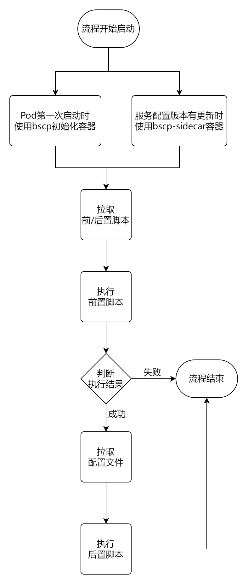
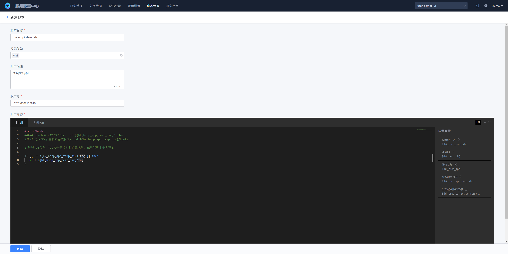
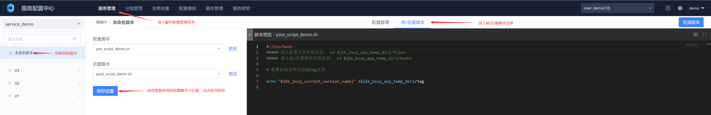
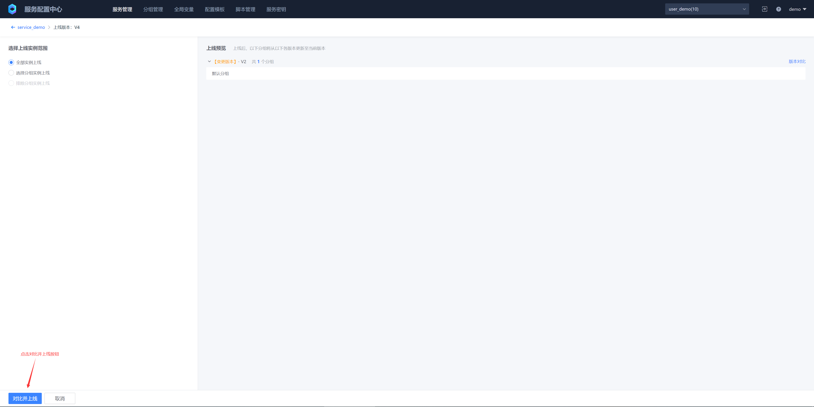
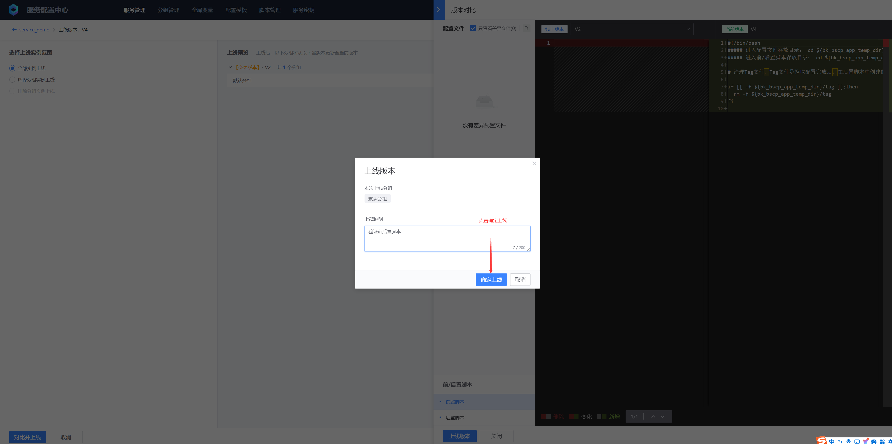

# Pre/Post Scripts
## 1. Application Scenarios and Limitations

- Pre/Post Scripts are currently only applicable to file-based configuration services, and are not supported for key-value and table-based configuration services

- Like service configuration files, pre- and post-scripts also need to be versioned to track their changes

- The pre-script is executed before the client instance pulls the configuration file, and the post-script is executed after the file is pulled

- Pre-scripts are often used to prepare the environment, check dependencies, and other operations

- Post-scripts are usually used to perform operations after the client completes configuration pull, such as creating a configuration pull completion identifier, verifying the configuration file, and applying configuration changes.

## 2. Concept Description

- Scripts
Scripts support two types: Python and Shell. You can choose the appropriate script type based on your needs and programming language preferences.

- Script Versions
Scripts support version management, allowing you to create and maintain multiple versions of scripts. When you modify a script, you can create a new version without affecting the old version of the script that has been bound to the service.

- Online
A script can only have one online version. When a service binds a script, the currently online script version is bound by default.

- Script execution

In the container scenario, the pre/post script is executed in the bscp initialization container (when the Pod is started for the first time) and the bscp-sidecar container (when the service configuration version is updated), and will not be executed in the business container. If the pre/post script needs to operate the business container process, you can refer to: [Share process namespace between containers in Pod](https://kubernetes.io/zh-cn/docs/tasks/configure-pod-container/share-process-namespace/)

## 3. Execution process



## 4. Operation steps
### 1. Create pre/post scripts



* Script name
Script unique identifier

* Category label

Scripts are classified by function, purpose, etc., and can be viewed by category on the script list page

* Script description

Used to describe the script function, purpose and other information

* Version number

The script has version control, and the default name is: v%Y%m%d%H%M%S. Users can customize the version number

* Script content

Supports bash and python scripts, and python uses python3 version

* Built-in variables

- Configuration root directory

${bk_bscp_temp_dir}: Temporary directory (temp_dir) for client configuration storage, the default value is /data/bscp

- Business ID

${bk_bscp_biz}: Business ID on the BlueKing configuration Provider, for example: 2

- Service name: ${bk_bscp_app}

Service name on the service configuration center, for example: demo_service

- Service configuration directory

${bk_bscp_app_temp_dir}: A single client can use the configuration of multiple services. To ensure the uniqueness of the path, the service configuration needs to be stored in: configuration root directory/business ID/service name, service configuration storage directory = configuration storage root directory/business ID/service name

- Current configuration version name

${bk_bscp_current_version_name}: The name of the service configuration version that the current client successfully pulled last time, such as V1. Usually, an identifier is added to the service configuration version in the post-script to indicate that the configuration file has been pulled.


### 2. Use pre/post scripts










### 3. Pre/post script execution results

Deployment example demo.yaml, view pre/post script execution results

```yaml
apiVersion: apps/v1
kind: Deployment
metadata:
  name: test-listener
  namespace: default
spec:
  selector:
    matchLabels:
      app: test-listener
  template:
    metadata:
      labels:
        app: test-listener
    spec:
      initContainers:
        # BSCP init container, responsible for pulling the configuration file to the specified directory for the first time
        - name: bscp-init
          image: ccr.ccs.tencentyun.com/blueking/bscp-init:latest
          env:
            # BSCP service ID
            - name: biz
              value: "10"
            # BSCP service name
            - name: app
              value: "service_demo"
            # BSCP service subscription address, executed on the cluster deployed by the BSCP backend (by default, under the "BlueKing" project of the container provider), execute the following command to obtain it:
            # kubectl get svc bk-bscp-feed-feedserver-nodeport -n bk-bscp
            # If the client is not connected to the cluster Node network, you can configure LoadBalancer for the feedserver yourself
            - name: feed_addrs
              value: "10.0.0.1:31510"
            # Service key, fill in the service key created in the previous step
            - name: token
              value: "ABCDEFGHIJKLMNOPQRSTUVWXYZ1234"
            # Configure the temporary directory of the file. The file will be sent to the {temp_dir}/files directory.
            - name: temp_dir
              value: '/data/bscp'
          # The temporary directory of the file needs to be mounted to the init container, sidecar container, and business container at the same time
          volumeMounts:
            - mountPath: /data/bscp
              name: bscp-temp-dir
      containers:
        # Business Container
        - name: test-listener
          image: alpine
          command:
          - "/bin/sh"
          - "-c"
          - |
            apk add --no-cache inotify-tools
            echo "start watch ..."
            while true; do
            # Listen for write events of /data/bscp/metadata.json
            inotifywait -m /data/bscp/metadata.json -e modify |
                while read path action file; do
                    # Recursively traverse all files in the /data/bscp/files directory and output their absolute paths
                    find /data/bscp/files
                done
            done
          resources:
            limits:
              memory: "128Mi"
              cpu: "500m"
          # The temporary directory of the file needs to be mounted to the init container, sidecar container, and business container at the same time
          volumeMounts:
            - mountPath: /data/bscp
              name: bscp-temp-dir
        # The BSCP sidecar container is responsible for monitoring the version change time, updating the configuration files in the temporary directory, and writing events to metadata.json after the update is completed.
        - name: bscp-sidecar
          image: ccr.ccs.tencentyun.com/blueking/bscp-sidecar:latest
          env:
            # The environment variable configuration of the bscp-sidecar container is exactly the same as that of the bscp-init container.
            - name: biz
              value: "10"
            - name: app
              value: "service_demo"
            - name: feed_addrs
              value: "10.0.0.1:31510"
            - name: token
              value: "ABCDEFGHIJKLMNOPQRSTUVWXYZ1234"
            - name: temp_dir
              value: '/data/bscp'
          resources:
            limits:
              memory: "128Mi"
              cpu: "500m"
          volumeMounts:
            - mountPath: /data/bscp
              name: bscp-temp-dir
      volumes:
        - name: bscp-temp-dir
          emptyDir: {}
```

```bash
# Deployment Example
kubectl apply -f demo.yaml

# When you start a Pod for the first time, check the bscp-init container, and then check the bscp-sidecar container.
kubectl logs test-listener-658f478944-5vzw8 -c bscp-init
===================================================================================
oooooooooo   oooo    oooo         oooooooooo     oooooooo     oooooo    oooooooooo
 888     Y8b  888   8P             888     Y8b d8P      Y8  d8P    Y8b   888    Y88
 888     888  888  d8              888     888 Y88bo       888           888    d88
 888oooo888   88888[      8888888  888oooo888     Y8888o   888           888ooo88P
 888     88b  888 88b              888     88b        Y88b 888           888
 888     88P  888   88b            888     88P oo      d8P  88b    ooo   888
o888bood8P   o888o  o888o         o888bood8P   88888888P     Y8bood8P   o888o
===================================================================================

Version  : v1.1.1
BuildTime: 2024-02-19T11:05:52+0800
GitHash  : bb1e4ecd29525971a894db35e22086999f0de625
GoVersion: go1.20.4
use command line args or environment variables
args: --biz=10 --app=service_demo --feed-addrs=10.0.5.10:31510 --token=*** --temp-dir=/data/bscp --port=9616 --file-cache-enabled=true --file-cache-dir=/data/bscp/cache --cache-threshold-gb=2.000000
time=2024-03-08T01:53:52.259Z level=INFO source=client/client.go:69 msg="instance fingerprint" fingerprint=172-17-2-165:606135
time=2024-03-08T01:53:52.260Z level=INFO source=upstream/upstream.go:143 msg="dial upstream server success" upstream=10.0.5.10:31510
time=2024-03-08T01:53:52.263Z level=INFO source=cache/cache.go:189 msg="start auto cleanup file cache " cacheDir=/data/bscp/cache cleanupIntervalSeconds=300s thresholdGB=2GB retentionRate=90%
time=2024-03-08T01:53:52.263Z level=INFO source=cache/cache.go:202 msg="calculate current cache directory size" currentSize="4.0 KiB"

# The pre-script was executed successfully
time=2024-03-08T01:53:52.272Z level=INFO source=util/hook.go:76 msg="exec hook success" script=pre_hook output=""

# Start pulling configuration
time=2024-03-08T01:53:52.426Z level=INFO source=client/types.go:69 msg="copy file from cache success" dst=/data/bscp/10/service_demo/files/etc/nginx/fastcgi.conf.default
time=2024-03-08T01:53:52.426Z level=INFO source=client/types.go:69 msg="copy file from cache success" dst=/data/bscp/10/service_demo/files/etc/nginx/fastcgi_params.default
time=2024-03-08T01:53:52.427Z level=INFO source=client/types.go:69 msg="copy file from cache success" dst=/data/bscp/10/service_demo/files/etc/nginx/koi-utf
time=2024-03-08T01:53:52.427Z level=INFO source=client/types.go:69 msg="copy file from cache success" dst=/data/bscp/10/service_demo/files/etc/nginx/fastcgi.conf
time=2024-03-08T01:53:52.427Z level=INFO source=client/types.go:69 msg="copy file from cache success" dst=/data/bscp/10/service_demo/files/etc/nginx/fastcgi_params
time=2024-03-08T01:53:52.629Z level=INFO source=client/types.go:69 msg="copy file from cache success" dst=/data/bscp/10/service_demo/files/etc/nginx/scgi_params
time=2024-03-08T01:53:52.629Z level=INFO source=client/types.go:69 msg="copy file from cache success" dst=/data/bscp/10/service_demo/files/etc/nginx/scgi_params.default
time=2024-03-08T01:53:52.629Z level=INFO source=client/types.go:69 msg="copy file from cache success" dst=/data/bscp/10/service_demo/files/etc/nginx/koi-win
time=2024-03-08T01:53:52.629Z level=INFO source=client/types.go:69 msg="copy file from cache success" dst=/data/bscp/10/service_demo/files/etc/nginx/mime.types.default
time=2024-03-08T01:53:52.629Z level=INFO source=client/types.go:69 msg="copy file from cache success" dst=/data/bscp/10/service_demo/files/etc/nginx/mime.types
time=2024-03-08T01:53:52.832Z level=INFO source=client/types.go:69 msg="copy file from cache success" dst=/data/bscp/10/service_demo/files/etc/nginx/uwsgi_params.default
time=2024-03-08T01:53:52.832Z level=INFO source=client/types.go:69 msg="copy file from cache success" dst=/data/bscp/10/service_demo/files/etc/nginx/nginx.conf
time=2024-03-08T01:53:52.832Z level=INFO source=client/types.go:69 msg="copy file from cache success" dst=/data/bscp/10/service_demo/files/etc/nginx/win-utf
time=2024-03-08T01:53:52.832Z level=INFO source=client/types.go:69 msg="copy file from cache success" dst=/data/bscp/10/service_demo/files/etc/nginx/uwsgi_params
time=2024-03-08T01:53:52.843Z level=INFO source=client/types.go:69 msg="copy file from cache success" dst=/data/bscp/10/service_demo/files/usr/sbin/nginx

# Post script execution successful
time=2024-03-08T01:53:52.845Z level=INFO source=util/hook.go:76 msg="exec hook success" script=post_hook output=""

# Write the configuration pull results to the meta file
time=2024-03-08T01:53:52.845Z level=INFO source=eventmeta/metadata.go:79 msg="append event metadata to metadata.json success" event="{\"releaseID\":376,\"status\":\"SUCCESS\",\"message\":\"\",\"eventTime\":\"2024-03-08T01:53:52Z\"}"
time=2024-03-08T01:53:52.845Z level=INFO source=pull.go:131 msg="pull files success" releaseID=376

# Enter the bscp-sidecar container to view the path of the pre- and post-scripts
kubectl exec -it test-listener-658f478944-5vzw8 -c bscp-sidecar -- /bin/bash
cd /data/bscp/10/service_demo/hooks/
pwd
/data/bscp/10/service_demo/hooks
ls -l
total 8
-rwxr-xr-x    1 root     root           271 Mar  8 01:53 post_hook.sh
-rwxr-xr-x    1 root     root           332 Mar  8 01:53 pre_hook.sh

# View the content of the pre/post script
cat pre_hook.sh
#!/bin/bash
##### Enter the configuration file storage directory: cd ${bk_bscp_app_temp_dir}/files
##### Enter the pre/post script storage directory: cd ${bk_bscp_app_temp_dir}/hooks

# Clean up the Tag file, which is created in the post script after the pull configuration is completed

if [[ -f ${bk_bscp_app_temp_dir}/tag ]];then
  rm -f ${bk_bscp_app_temp_dir}/tag
fi

cat post_hook.sh 
#!/bin/bash
##### Enter the directory where configuration files are stored: cd ${bk_bscp_app_temp_dir}/files
##### Enter the directory where pre-/post-scripts are stored: cd ${bk_bscp_app_temp_dir}/hooks

# Create a tag file after the configuration is pulled
echo "${bk_bscp_current_version_name}" >${bk_bscp_app_temp_dir}/tag

# View the content of the tag file written by the post-script
cat ../tag
V4