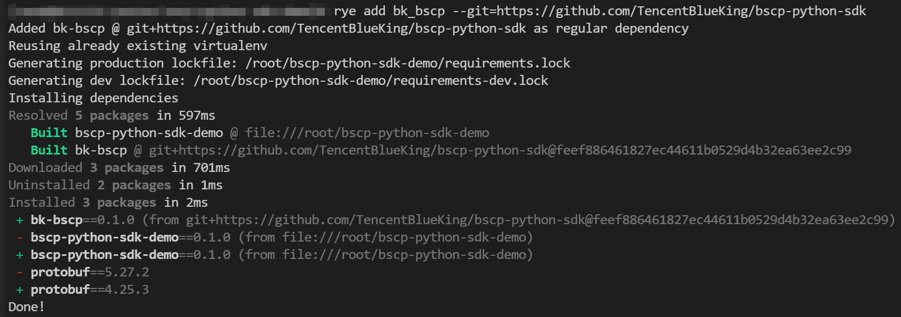

# BSCP Python SDK Dependency Description
[BSCP Python SDK](https://github.com/TencentBlueKing/bscp-python-sdk) depends on the following libraries:

* Python version 3.8 and above
* grpcio version 1.60.0 and above
* typing-extensions version 4.9.0 and above
* protobuf version 4.25.2 and above

In order to quickly experience the BSCP Python SDK example, we use the open source project "[rye](https://github.com/astral-sh/rye)", which is easy to use, cross-provider and can flexibly manage Python versions and dependencies. Please note that the Python version and component dependency deployment in the formal business environment must be determined by the development and operation and maintenance team

## 1. Install rye

```bash
# Execute the following command line on the Linux server to install the rye component
curl -sSf https://rye.astral.sh/get | bash
```


```bash
# Configure the environment variable path of Rye and Python
source "$HOME/.rye/env"

# View the current environment python version number
python -V
```

## 2. Deploy BSCP Python SDK dependencies

```bash
# Initialize bscp-python-sdk-demo project
rye init bscp-python-sdk-demo

# Enter bscp-python-sdk-demo directory
cd bscp-python-sdk-demo

# Add grpcio dependencies
rye add "grpcio>=1.60.0"

# Add typing-extensions dependencies
rye add "typing-extensions>=4.9.0"

# Add protobuf dependencies
rye add "protobuf>=4.25.2"
```


## 3. Deploy BSCP Python SDK components

```bash
# If the deployment server environment has git commands, you can execute the following command to deploy BSCP Python SDK component
rye add bk_bscp --git=https://github.com/TencentBlueKing/bscp-python-sdk

# If there is no git command and the deployment fails, you can use the following command to deploy the BSCP Python SDK component. If the component is updated, you need to replace v0.1.0 with the latest version
rye add bk_bscp --url=https://github.com/TencentBlueKing/bscp-python-sdk/archive/refs/tags/v0.1.0.tar.gz
```



## 4. Verify the BSCP Python SDK component

Before verifying the BSCP Python SDK component, you need to first create a key-value service in the service configuration center (BSCP) and add the corresponding key-value configuration. Next, generate and publish the version. For operation guide, please refer to the white paper: [Key-value configuration](https://bk.tencent.com/docs/markdown/ZH/BSCP/1.29/UserGuide/QuickStart/kv.md)

Save the demo in the configuration example as a demo.py file and replace {{ YOUR_KEY }} with the actual business key
```python
### Get

from bk_bscp.client import BscpClient

SERVER_ADDRS = ["feed.demo.com:9510"]
TOKEN = "AAm***ayQ"
BIZ_ID = 2
APP = "demo"
LABELS = {}

def main(key):
    with BscpClient(SERVER_ADDRS, TOKEN, BIZ_ID) as client:
        pair = client.get(APP, key, LABELS)
        print(pair.value)

if __name__ == "__main__":
    # Please replace {{ YOUR_KEY }} with your actual Key
    key = {{ YOUR_KEY }}
    main(key)
```

```bash
# Execute demo.py to get the value of the specified key
python demo.py
```


