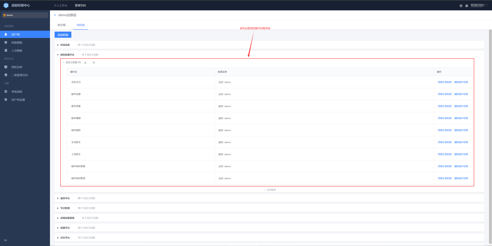

# Permission configuration
The Service Configuration Center (BSCP) uses the BlueKing Permission Center (BKIAM) to provide permission management services

To simplify the management of BlueKing Providers, when creating a business, the BlueKing Configuration Provider will automatically generate two user groups in the Permission Center (BKIAM): Business View Group and Business Operation and Maintenance Group

- Business View Group (Read-only)

This group is associated with the viewing permissions of the business on various BlueKing Providers, usually for non-operation and maintenance personnel to browse various information on the BlueKing Provider

- Business Operation and Maintenance Group (Read-Write)

This group is bound to the management permissions of the business on various BlueKing Providers, usually for operation and maintenance personnel to view various information on the Provider and operate various Providers to manage the business

View the information of these two user groups in the permission center

The business view group does not contain any members by default, and needs to be added by business operation and maintenance personnel later

The business operation and maintenance group includes the personnel with the business operation and maintenance roles set under the configuration provider business resources by default. The business operation and maintenance personnel can also add or remove members later

The permission management granularity of the business viewing group and the business operation and maintenance group is the business dimension. If more granular management is required, you can create a user group in the permission center and associate the corresponding operation permissions. You can also use the custom permission function (not recommended) in the permission center to manage a more refined permission range. For details, please refer to the following documents:

[Create a permission template](https://bk.tencent.com/docs/markdown/ZH/IAM/1.12/UserGuide/QuickStart/CreatePremissionTemplates.md)

[Create a user group](https://bk.tencent.com/docs/markdown/ZH/IAM/1.12/UserGuide/QuickStart/CreateGroups.md)

[Apply for custom permissions](https://bk.tencent.com/docs/markdown/ZH/IAM/1.12/UserGuide/QuickStart/ApplyToCustomPermissions.md)