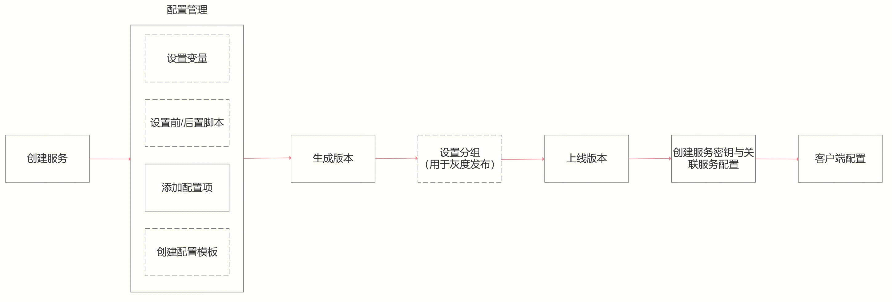

# Product Introduction

BlueKing Service Configuration Provider provides service configuration management functions for businesses. The product is connected with other Blueking products to provide a one-stop solution for businesses.

The product takes business as the top-level design, isolates the service configuration of each business, uses the Blueking Permission Center for service-level permission management, supports business configuration hosting in traditional and container modes, and currently supports file-based configuration and key-value (KV)-based configuration.

## Product Usage Process

## Service Management

* The BlueKing Service Configuration Provider is designed with "business" as the top-level design. Different businesses have different services, and the BlueKing Permission Center is used for permission control

* There are two perspectives for service list display, one is to view "all services under the business" under the business, and the other is "services I created"

* When creating a new service, you need to specify the data format of the configuration. Currently, only "file type" and "key-value type (KV)" configuration are supported. "Table type (Table)" and more data formats will be supported in the future

* The service can start and stop configuration data transmission encryption (data storage is encrypted by default), using RSA protocol encryption, allowing users to specify encryption keys

## Configuration Management
* Configuration is hosted under the service

* Configuration currently only supports "file type" and "key-value type (KV)" configuration. Subsequent versions will support "table type (Table)" and more data formats

* File type configuration supports text files and binary files

* File-based configuration supports user/user group/file permission configuration

* Version control of configuration files based on service levels

* Supports the use of configuration templates

* Supports the use of variables

* Supports pre-/post-scripts

* Supports grayscale release and full release

## Pre-/post-scripts
* Pre-scripts are supported during the service configuration launch process. Pre-scripts are scripts executed before pulling configuration files. Currently, bash and python scripts are supported. They are used in scenarios such as local backup of old version configuration

* Post-scripts are supported during the service configuration launch process. Pre-scripts are scripts executed after pulling configuration files. Currently, bash and python scripts are supported. They are used to determine whether the configuration file has been pulled into a group, place the configuration file from the temporary directory to the official directory, reload/restart the process to make the configuration file effective, etc.

* The scripts used by pre-/post-scripts are managed in the "Script Management" function item, supporting script version management and script version launch and launch operations

## Group management
* Grouping is mainly used for grayscale release of configuration files. If the business configuration does not require grayscale release, there is no need to use grouping

* Grouping is a grouping strategy based on the combination of tags. When the service configuration releases a version, a specific group is specified. At the same time, the corresponding tags are configured for the business client (sidecar/agent/sdk). When the client pulls the configuration file, it will pull the corresponding version of the configuration file according to the tags configured by the client

* Supports service visibility range configuration. By default, all services under the business are visible. After configuring the visibility range, only some services can use the group

## Configuration template
* Configuration templates are used in scenarios where multiple services under the business share configuration files. They are generally used in combination with variables

* To use configuration templates, you must first have a template space. The template space is used to isolate different functional modules of the business

* Configuration templates are added under the template space. There is not much difference from service configuration items. The difference is that a single configuration template file has version control capabilities, while service configuration items are based on overall service version control

* Depending on different scenarios, one or more configuration templates can be specified in the same template space to create template packages. Different template packages are used in different scenarios

* One or more template packages can be referenced in the service configuration item. Note: Service configuration items can only reference template packages, not configuration templates directly

* Supports service visibility range configuration. By default, all services under the business can use it. After configuring the visibility range, only some services can use the template package

## Variables
* Variables are used in scenarios where multiple services under the business share configuration files. They are generally used in combination with configuration templates

* Before generating the version, the backend will match the "bk_bscp_" or "BK_BSCP_" prefix string and automatically render the variable name as the variable value. The specific format is: {{ .bk_bscp_$variable name }} or {{ .BK_BSCP_$variable name }}

* Variable default values ​​can be pre-configured in variable management. When generating a service configuration version, if the variable value is found to be empty, the variable will be automatically filled with the pre-configured default value. If the variable has been used in the previous version of the service configuration, the variable value filled in the previous version will be used first

* Variable values ​​can be pre-set in the "Unnamed Version" of the service configuration, or they can be filled in when the version is generated

## Client Key
* The service key is configured in the business's BSCP client to provide authentication for the business to pull configurations through the BSCP client

* The service key can be controlled to a single file in file-based configurations and to a single configuration item (key) in key-value (KV) configurations

## Configuration storage
* BlueKing service configuration uses the BlueKing artifact library (bkrepo) as file-based configuration storage

* The BlueKing artifact library (bkrepo) is an important component in devops that connects development, construction, and deployment. The artifact library provides dependency management, build output management (binary packages, reports, container images), and deployment components (helm chart, oci chart, rpm package), providing data storage for these file packages

## Client configuration
* Container client, deployed as a container sidecar, deployed in the same Pod as the business container

* Traditional host client, deployed using the BlueKing node management plug-in