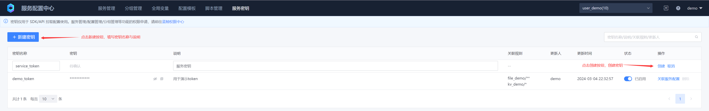
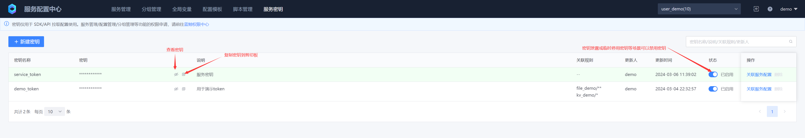
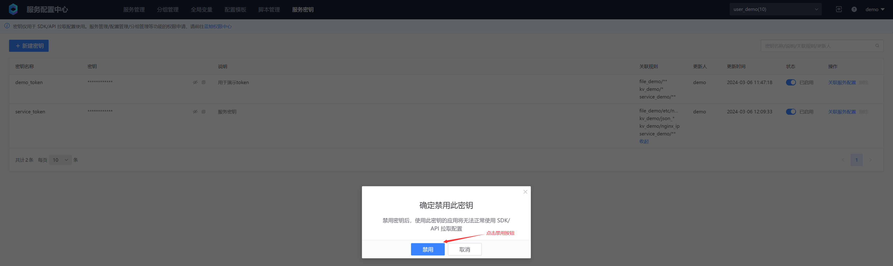
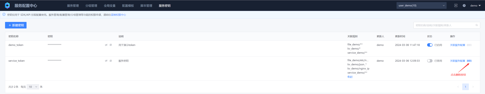
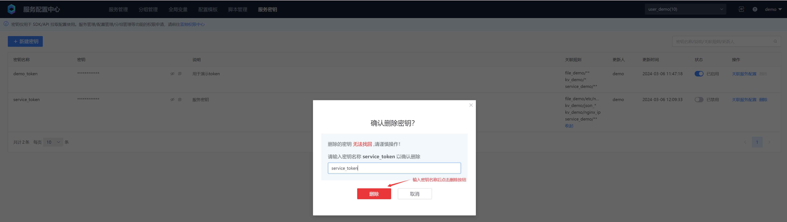

# Service key management
The service key provides an identity for the client to pull configuration. The control granularity of the service key in file-type configuration can be accurate to a single file, and in key-value (KV) configuration, it can be accurate to a single configuration item (key). If the client pulls a service configuration that is not associated, it will fail to pull the configuration due to insufficient permissions
## 1. Create a new service key





* Key name
Unique description of the service key, with uniqueness

* Key
32-bit random characters, providing an identity for the client to pull configuration

* Description

Describes the purpose of the service key

* Association rule

Determines which configuration files or configuration items of which services can be pulled using this key

* Updater

The updater of the service key. The update here mainly refers to updating the key status (enable/disable), adjusting the key association rules, and updating the key description. The key name and key are not allowed to be updated.

* Update time
Service key update time

## 2. Associated service configuration


A service key can be associated with multiple configuration files or configuration items of multiple services. The association rules support wildcards. The specific rule examples are as follows:

```tex
1. File-based configuration, taking the selection of service myservice as an example
**
Associate all configurations under the myservice service (including subdirectories)

etc/*
Associate all configurations under the myservice service/etc directory (excluding subdirectories)

etc/nginx/nginx.conf
Associate the myservice service/etc/nginx/nginx.conf file

2. Key-value (KV) configuration, take the selection of service myservice as an example
*
Associate all configuration items under the myservice service

demo_*
Associate all configuration items starting with demo_ under the myservice service
```


## 3. Delete service key

Deleting service key is a high-risk operation. The key to be deleted must be disabled first, and then the key name to be deleted must be correctly entered before it can be deleted






