# Configuration Management
## 1. Add file-type configuration
### 1. Add configuration

#### Manually add

By default, there will be an "unnamed version" under the newly created service, which is equivalent to a temporary storage area. You can delete or modify the configuration files in it. Once the service version is generated, the configuration files in the service version become read-only


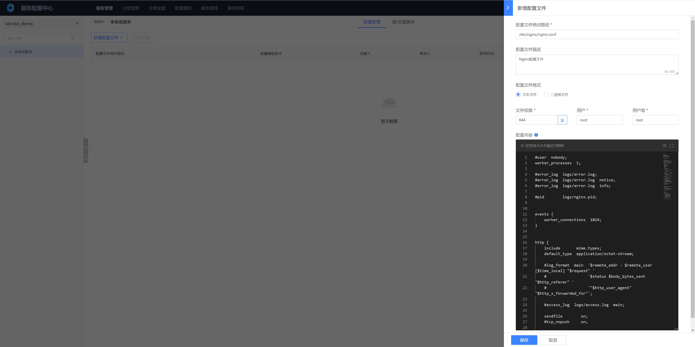


- Absolute path of the configuration file
The absolute path where the configuration file is placed, including the directory where the configuration file is located and the name of the configuration file

- Configuration file format
Supports text files and binary file formats. Text files support editing functions, while binary files only support uploading and deletion, and do not support editing

- File permissions / users / user groups
You need to fill in the existing users and user groups of the client operation, otherwise the configuration file will be assigned **nobody:nobody** Permissions

- Configuration content
Supports direct file input / copy and paste from other places / upload from local files, the configuration file must be less than **100MB**

#### Batch upload

Package Nginx configurations other than nginx.conf into: nginx_other_conf.tar.gz

```bash
ls -lR
.:
total 4
drwxr-xr-x 3 root root 4096 Mar  5 15:04 etc

./etc:
total 4
drwxr-xr-x 2 root root 4096 Mar  5 15:04 nginx

./etc/nginx:
total 60
-rw-r--r-- 1 root root 1077 Jan 20  2022 fastcgi.conf
-rw-r--r-- 1 root root 1077 Jan 20  2022 fastcgi.conf.default
-rw-r--r-- 1 root root 1007 Jan 20  2022 fastcgi_params
-rw-r--r-- 1 root root 1007 Jan 20  2022 fastcgi_params.default
-rw-r--r-- 1 root root 2837 Jan 20  2022 koi-utf
-rw-r--r-- 1 root root 2223 Jan 20  2022 koi-win
-rw-r--r-- 1 root root 5231 Jan 20  2022 mime.types
-rw-r--r-- 1 root root 5231 Jan 20  2022 mime.types.default
-rw-r--r-- 1 root root  636 Jan 20  2022 scgi_params
-rw-r--r-- 1 root root  636 Jan 20  2022 scgi_params.default
-rw-r--r-- 1 root root  664 Jan 20  2022 uwsgi_params
-rw-r--r-- 1 root root  664 Jan 20  2022 uwsgi_params.default
-rw-r--r-- 1 root root 3610 Jan 20  2022 win-utf
[root@bcs-op ~/workspace]# tar czf nginx_other_conf.tar.gz etc/
```


Manually added and batch uploaded configuration files will be classified under "Non-template configuration"

#### Import from configuration template

The specific content of importing configuration from configuration template is not detailed here, and will be introduced in detail in the [Configuration Templates and Variables](../Function/configuration_templates_and_variables.md) section later

### 2. Generate version

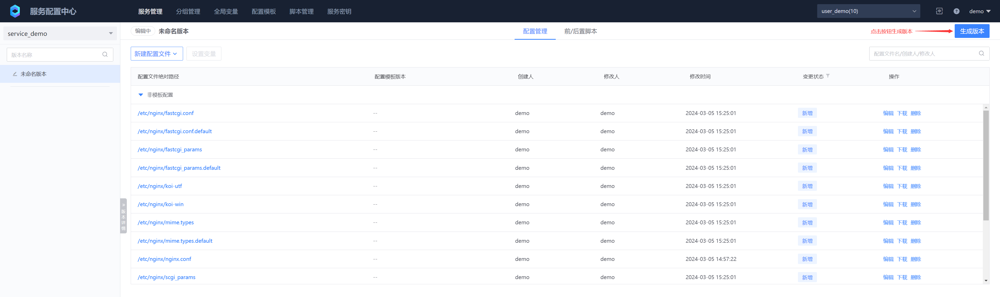


After filling in the version name and version description, there are two more parameters below:

* Simultaneous online version
Check the checkbox in front of the communication. After the version is generated, the version online process will be entered immediately, otherwise the version online process will not be entered

* Service variable assignment
Variables are used in scenarios where multiple services share configuration files under a business. They are generally used in conjunction with configuration templates. For details, see: [Configuration Templates and Variables](../Function/configuration_templates_and_variables.md) section

### 3. Online version


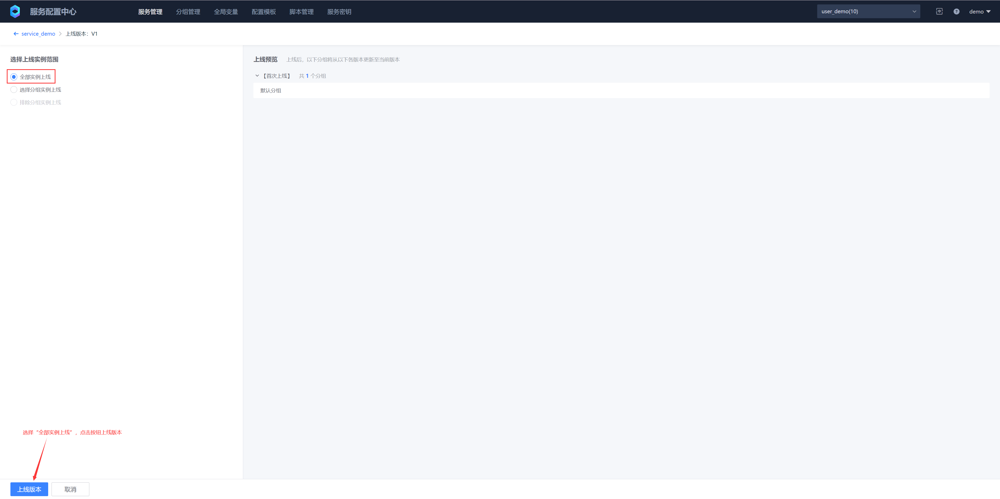


### 4. Edit configuration files and compare versions

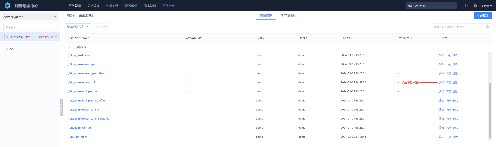


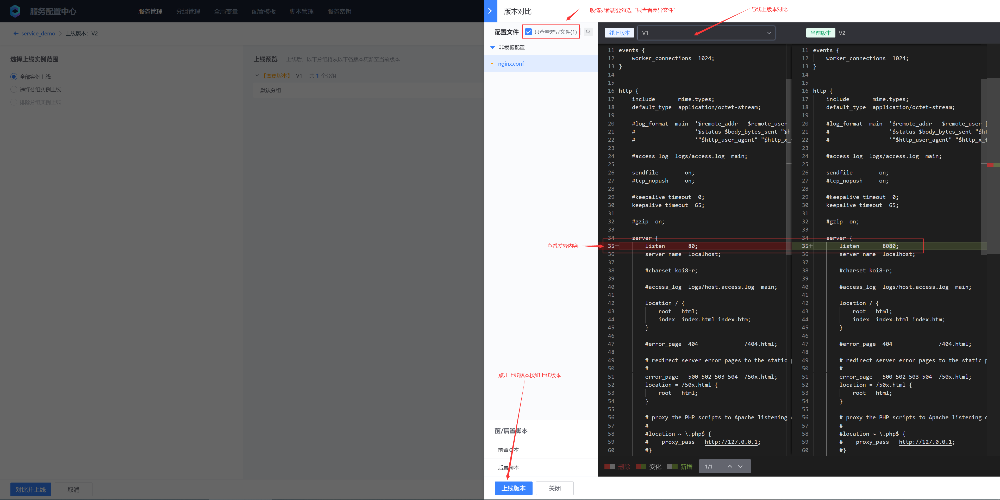


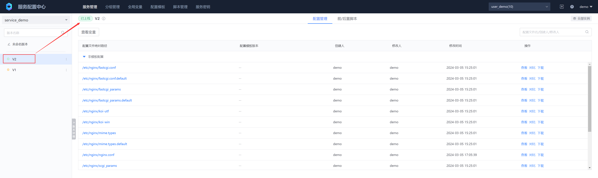

### 5. Version list details


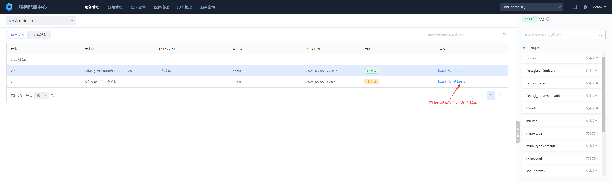


## 2. Add key-value configuration
### 1. Add configuration
#### Manually add


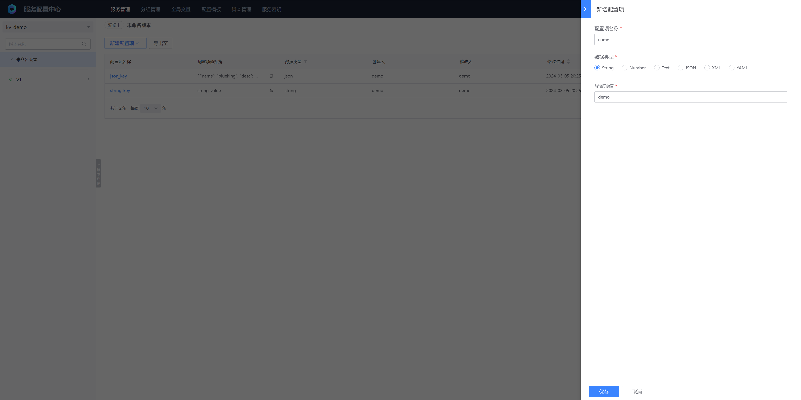


Key-value configuration supports single-line configuration

* String
Single-line string, maximum 2 MB
* Number
Will check whether the configuration item value is a number, support integers and floating point numbers

Key-value configuration supports multi-line configuration

* Text
Multi-line string, no format check, maximum size does not exceed 2 MB
* JSON
JSON format characters, format check will be done, maximum size does not exceed 2 MB
* XML
XML format characters, format check will be done, maximum size does not exceed 2 MB
* YAML
YAML format characters, format check will be done, maximum size does not exceed 2 MB


#### Batch import

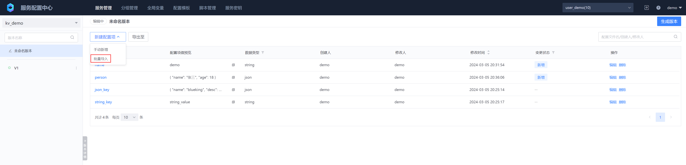

Text import is generally suitable for simple single-line configuration item import, and currently only supports String and Number

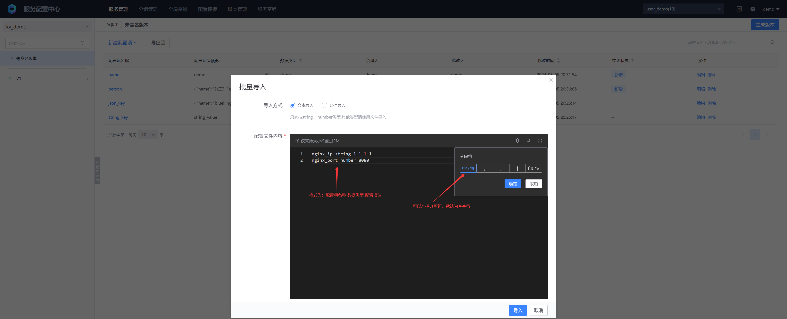

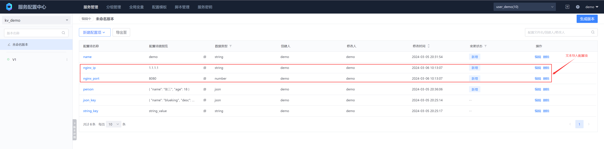

File import supports importing all types of configuration items. Currently, it supports JSON and YAML file imports. Both use the configuration item name as the key, and the data type and configuration item value as the value. The following are examples of two types of files

JSON example file json_import.json:

```json
{
  "json_string_demo": {
    "kv_type": "string",
    "value": "ABCDE"
  },
  "json_number_demo": {
    "kv_type": "number",
    "value": 100
  },
  "json_text_demo": {
    "kv_type": "text",
    "value": "line 1\nline 2"
  },
  "json_json_demo": {
    "kv_type": "json",
    "value": "{\"name\": \"John Doe\", \"age\": 30, \"city\": \"New York\", \"hobbies\": [\"reading\", \"travelling\", \"sports\"]}"
  },
  "json_xml_demo": {
    "kv_type": "xml",
    "value": "<person>\n  <name>John Doe</name>\n  <age>30</age>\n  <city>New York</city>\n  <hobbies>\n    <hobby>reading</hobby>\n    <hobby>travelling</hobby>\n    <hobby>sports</hobby>\n  </hobbies>\n</person>"
  },
  "json_yaml_demo": {
    "kv_type": "yaml",
    "value": "name: John Doe\nage: 30\ncity: New York\nhobbies:\n  - reading\n  - travelling\n  - sports"
  }
}
```

YAML example file yaml_import.yaml :

```yaml
yaml_string_demo:
  kv_type: string
  value: "ABCDE"

yaml_number_demo:
  kv_type: number
  value: 100

yaml_text_demo:
  kv_type: text
  value: |-
    line 1
    line 2

yaml_json_demo:
  kv_type: json
  value: |-
    {
      "name": "John Doe",
      "age": 30,
      "city": "New York",
      "hobbies": ["reading", "travelling", "sports"]
    }

yaml_xml_demo:
  kv_type: xml
  value: |-
    <person>
    <name>John Doe</name>
    <age>30</age>
    <city>New York</city>
    <hobbies>
      <hobby>reading</hobby>
      <hobby>travelling</hobby>
      <hobby>sports</hobby>
    </hobbies>
    </person>

yaml_yaml_demo:
  kv_type: yaml
  value: |-
    name: John Doe
    age: 30
    city: New York
    hobbies:
      - reading
      - travelling
      - sports
```


### 2. Export configuration items
Before exporting configuration items, you can only export all configuration items under the service. You cannot select batch export of configuration items for the time being. There are two main application scenarios for exporting configuration items:
* Back up configuration items to local files
* Use the export and import function to export configuration items under a service, and then import them to other business services, or import them to other service platforms


### 3. Other operations

Generate version, launch version, edit configuration items, compare configuration versions, and version list details are all file-based configurations, so I won't go into details here