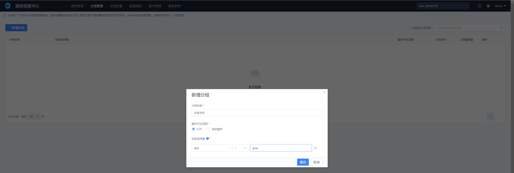
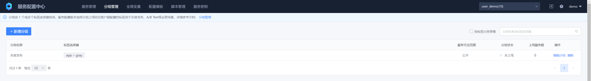
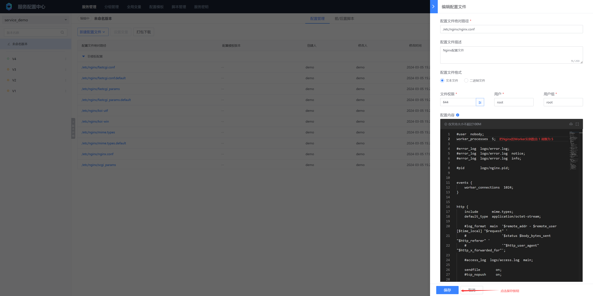
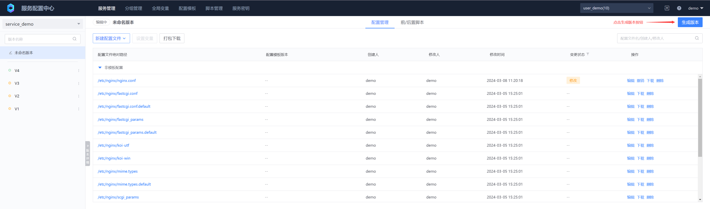
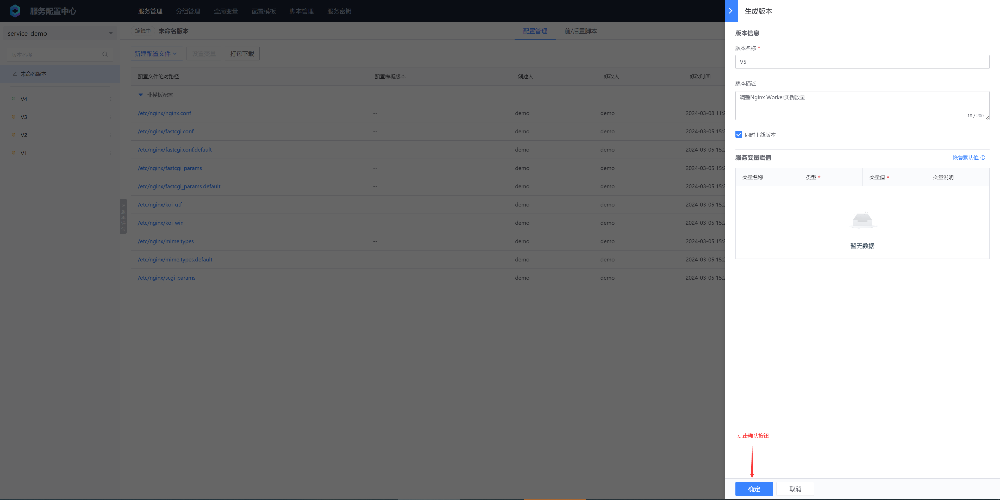
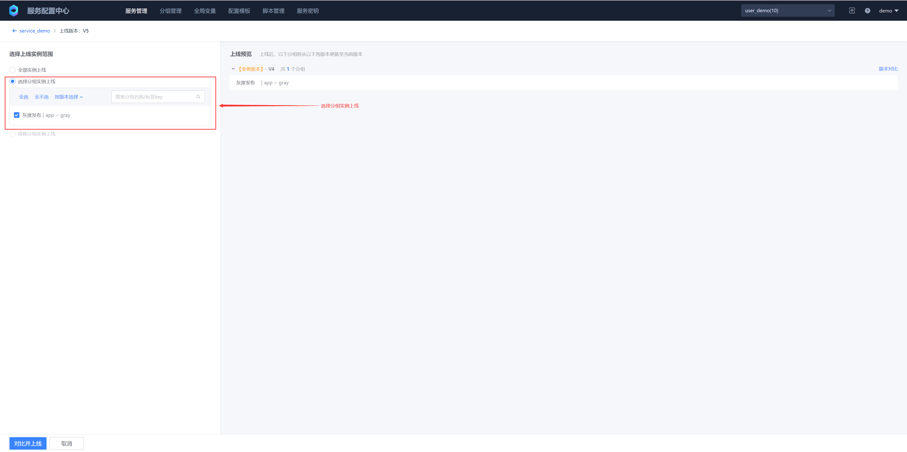
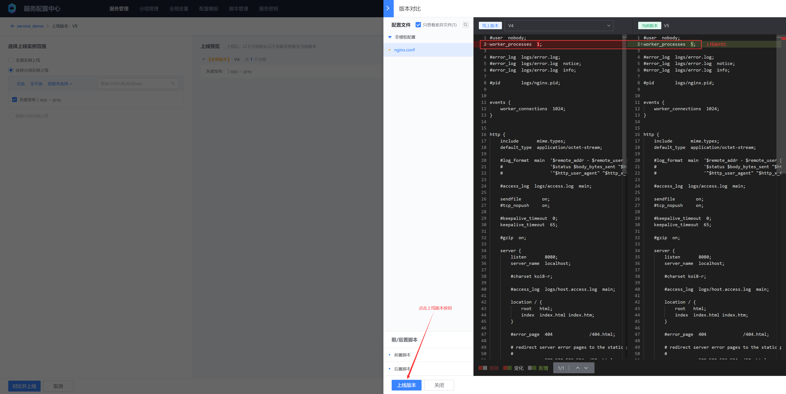
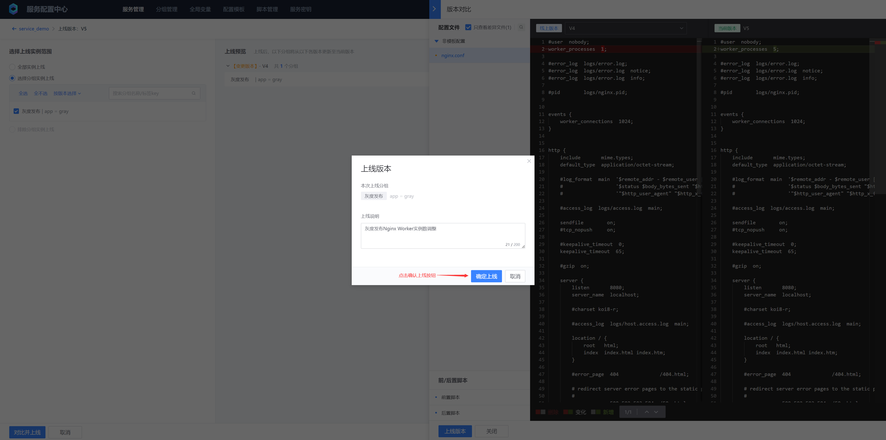
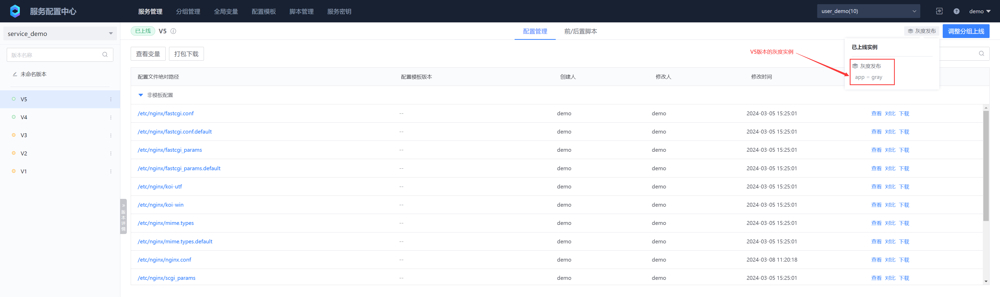
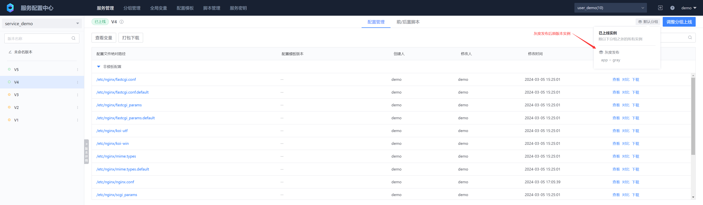

# Group management

A group consists of one or more label selectors. Multiple labels are in an AND relationship. They are used in conjunction with labels configured by the client. They are mainly used in service instance grayscale scenarios and multi-version scenarios with different instance configurations

## 1. Create a group




- Group name

Identifies a group. The group name under the business needs to be unique

- Service visibility
"Public" means that all services under the current business are visible. You can also specify one or more services to be visible

- Label selector
The format is key = value. A group supports multiple label selectors. Multiple labels are in an AND relationship. The operators supported by the label selector are: = (equal to), != (not equal to), > (greater than), ≥ (greater than or equal to), < (less than), ≤ (less than or equal to), IN (contains multiple values ​​separated by commas ["a", "b"]), NOT IN (does not include multiple values ​​separated by commas ["a", "b"]), RE (regular match ^[0-9]+$), NOT RE (regular does not match ^[0-9]+$)



## 2. Grayscale launch example

Adjust the number of Nginx Workers in the example from 1 to 5


















## 3. Verify grayscale results
* Deploy the client without label: app = gray, demo.yaml
  ```yaml
  apiVersion: apps/v1
  kind: Deployment
  metadata:
    name: test-listener
    namespace: default
  spec:
    selector:
      matchLabels:
        app: test-listener
    template:
      metadata:
        labels:
          app: test-listener
      spec:
        initContainers:
          # BSCP init container, responsible for pulling the configuration file to the specified directory for the first time
          - name: bscp-init
            image: ccr.ccs.tencentyun.com/blueking/bscp-init:latest
            env:
              # BSCP Service ID
              - name: biz
                value: "10"
              # BSCP Service Name
              - name: app
                value: "service_demo"
              # BSCP service subscription address, executed on the cluster deployed by BSCP background (by default, under the "BlueKing" project of the container platform), execute the following command to obtain:
              # kubectl get svc bk-bscp-feed-feedserver-nodeport -n bk-bscp
              # If the client is not connected to the cluster Node network, you can configure LoadBalancer for the feedserver yourself
              - name: feed_addrs
                value: "10.0.0.1:31510"
              # Service Key, fill in the service key created in the previous step
              - name: token
                value: "ABCDEFGHIJKLMNOPQRSTUVWXYZ1234"
              # Configure the temporary directory of the configuration file. The files will be sent to the {temp_dir}/files directory.
              - name: temp_dir
                value: '/data/bscp'
            # The temporary directory of the file needs to be mounted to the init container, sidecar container, and business container at the same time
            volumeMounts:
              - mountPath: /data/bscp
                name: bscp-temp-dir
        containers:
          # Business Container
          - name: test-listener
            image: alpine
            command:
            - "/bin/sh"
            - "-c"
            - |
              apk add --no-cache inotify-tools
              echo "start watch ..."
              while true; do
              # Listen for write events of /data/bscp/metadata.json
              inotifywait -m /data/bscp/metadata.json -e modify |
                  while read path action file; do
                      # Recursively traverse all files in the /data/bscp/files directory and output their absolute paths
                      find /data/bscp/files
                  done
              done
            resources:
              limits:
                memory: "128Mi"
                cpu: "500m"
            # The temporary directory of the file needs to be mounted to the init container, sidecar container, and business container at the same time
            volumeMounts:
              - mountPath: /data/bscp
                name: bscp-temp-dir
          # The BSCP sidecar container is responsible for monitoring the version change time, updating the configuration files in the temporary directory, and writing events to metadata.json after the update is completed.
          - name: bscp-sidecar
            image: ccr.ccs.tencentyun.com/blueking/bscp-sidecar:latest
            env:
              # The environment variable configuration of the bscp-sidecar container is exactly the same as that of the bscp-init container.
              - name: biz
                value: "10"
              - name: app
                value: "service_demo"
              - name: feed_addrs
                value: "10.0.0.1:31510"
              - name: token
                value: "ABCDEFGHIJKLMNOPQRSTUVWXYZ1234"
              - name: temp_dir
                value: '/data/bscp'
            resources:
              limits:
                memory: "128Mi"
                cpu: "500m"
            volumeMounts:
              - mountPath: /data/bscp
                name: bscp-temp-dir
        volumes:
          - name: bscp-temp-dir
            emptyDir: {}
  ```

  ```bash
  # Deployment example
  kubectl apply -f demo.yaml

  # Enter the bscp-sidecar container to view the number of Worker instances in nginx.conf
  kubectl exec -it test-listener-658f478944-5vzw8 -c bscp-sidecar -- /bin/bash
  grep 'worker_processes' /data/bscp/10/service_demo/files/etc/nginx/nginx.conf
  worker_processes 1;
  ```

* Deploy the client with the label: app = gray (grayscale client instance), gray.yaml

Adjust .metadata.name to: test-listener-gray

Add client configuration tags under .spec.template.spec.initContainers.env and .spec.template.spec.containers['bscp-sidecar'].env:

  ```yaml
    - name: labels
            value: '{"app": "gray"}'
  ```

  ```yaml
  apiVersion: apps/v1
  kind: Deployment
  metadata:
    name: test-listener-gray
    namespace: default
  spec:
    selector:
      matchLabels:
        app: test-listener
    template:
      metadata:
        labels:
          app: test-listener
      spec:
        initContainers:
          # BSCP init container, responsible for pulling the configuration file to the specified directory for the first time
          - name: bscp-init
            image: ccr.ccs.tencentyun.com/blueking/bscp-init:latest
            env:
              # BSCP service ID
              - name: biz
                value: "10"
              # BSCP service name
              - name: app
                value: "service_demo"
              # BSCP service subscription address, executed on the cluster deployed by the BSCP backend (by default, under the "BlueKing" project of the container platform), execute the following command to obtain it:
              # kubectl get svc bk-bscp-feed-feedserver-nodeport -n bk-bscp
              # If the client is not connected to the cluster Node network, you can configure LoadBalancer for the feedserver yourself
              - name: feed_addrs
                value: "10.0.0.1:31510"
              # Service key, fill in the service key created in the previous step
              - name: token
                value: "ABCDEFGHIJKLMNOPQRSTUVWXYZ1234" 
              # Configuring Client Tags
              - name: labels
                value: '{"app": "gray"}'
              # Configure the temporary directory of the configuration file. The files will be sent to the {temp_dir}/files directory.
              - name: temp_dir
                value: '/data/bscp'
            # The temporary directory of the file needs to be mounted to the init container, sidecar container, and business container at the same time
            volumeMounts:
              - mountPath: /data/bscp
                name: bscp-temp-dir
        containers:
          # Business Container
          - name: test-listener
            image: alpine
            command:
            - "/bin/sh"
            - "-c"
            - |
              apk add --no-cache inotify-tools
              echo "start watch ..."
              while true; do
              # Listen for write events of /data/bscp/metadata.json
              inotifywait -m /data/bscp/metadata.json -e modify |
                  while read path action file; do
                      # Recursively traverse all files in the /data/bscp/files directory and output their absolute paths
                      find /data/bscp/files
                  done
              done
            resources:
              limits:
                memory: "128Mi"
                cpu: "500m"
            # The temporary directory of the file needs to be mounted to the init container, sidecar container, and business container at the same time
            volumeMounts:
              - mountPath: /data/bscp
                name: bscp-temp-dir
          # The BSCP sidecar container is responsible for monitoring the version change time, updating the configuration files in the temporary directory, and writing events to metadata.json after the update is completed.
          - name: bscp-sidecar
            image: ccr.ccs.tencentyun.com/blueking/bscp-sidecar:latest
            env:
              # The environment variable configuration of the bscp-sidecar container is exactly the same as that of the bscp-init container.
              - name: biz
                value: "10"
              - name: app
                value: "service_demo"
              - name: feed_addrs
                value: "10.0.0.1:31510"
              - name: token
                value: "ABCDEFGHIJKLMNOPQRSTUVWXYZ1234"
              - name: labels
                value: '{"app": "gray"}'
              - name: temp_dir
                value: '/data/bscp'
            resources:
              limits:
                memory: "128Mi"
                cpu: "500m"
            volumeMounts:
              - mountPath: /data/bscp
                name: bscp-temp-dir
        volumes:
          - name: bscp-temp-dir
            emptyDir: {}
  ```

  ```bash
  kubectl apply -f gray.yaml
  kubectl exec -it test-listener-gray-5659f5488-wxxsj -c bscp-sidecar -- /bin/bash
  grep 'worker_processes' /data/bscp/10/service_demo/files/etc/nginx/nginx.conf 
  worker_processes  5;
  ```
