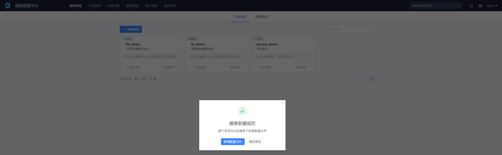
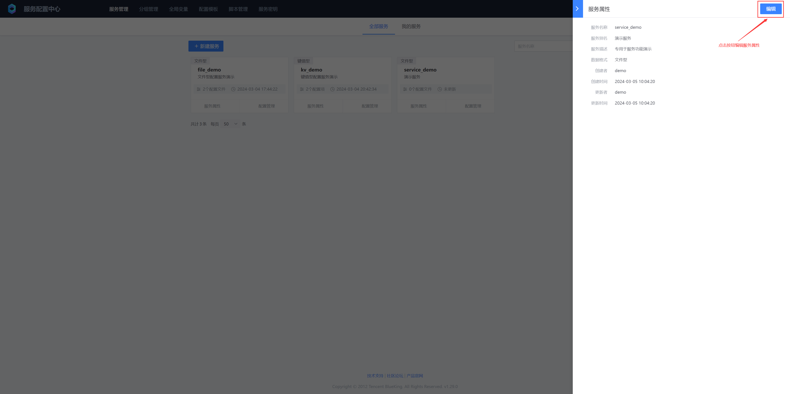
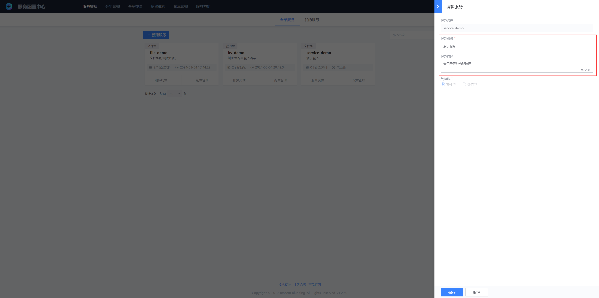
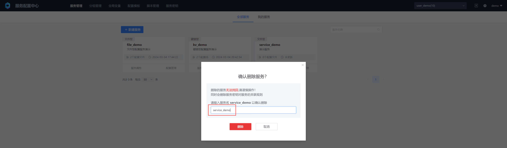

# Service Management

The BlueKing Service Configuration Platform (BK BSCP) uses the "business" in the BlueKing Configuration Platform (BK CMDB) as the top layer to isolate resources. One or more services can be created under one business, and a service can represent a module of the business. The specific logic of dividing different services is based on the business.

## 1. Create a new service

* Service name
The unique identifier of the service under the business, used by the client when consuming the service configuration
* Service alias
The service alias can use Chinese characters to facilitate memory and improve readability
* Service description
Describe the use scenario of the service, and you can also note other information
* Data format
* File type
Usually stored in the form of files, usually with good readability and maintainability
* Key-value type
Stored in the form of key-value pairs, where the key is used to identify a configuration item, and the value is the specific content of the configuration item. KV-type configuration is usually stored in a database and read using SDK or API.
* Data type
* Any type
No restrictions on the type of configuration item. If you select a type below, you can only create configuration items of the specified type
* String
Single-line string
* Number
Numerical value, including integer, floating point number, and data type verification
* Text
Multi-line string text, no data structure verification, size 2Mb
* JSON, XML, YAML
Structured data in different formats, data structure verification

## 2. View services
To view the service list, you can view the service list in two ways: "All Services" and "My Services". Under "My Services", there is a list of services I created

## 3. Editing service properties

File-based services support editing "service alias" and "service description", and key-value services also support editing "data type"

When editing key-value configurations, please note that when adjusting data types from "any type" to other types, all configuration items under the "unnamed version" of the service must be of this type. For example, when adjusting from "any type" to "String" type, all configuration items under the unnamed version of the service must be of String type, otherwise the adjustment will fail

## 4. Delete service

When the business no longer uses the configuration under the service, you can delete the service. The service cannot be restored after deletion. Please operate with caution

After the service is deleted, the configuration file that has been sent to the client will not be affected

