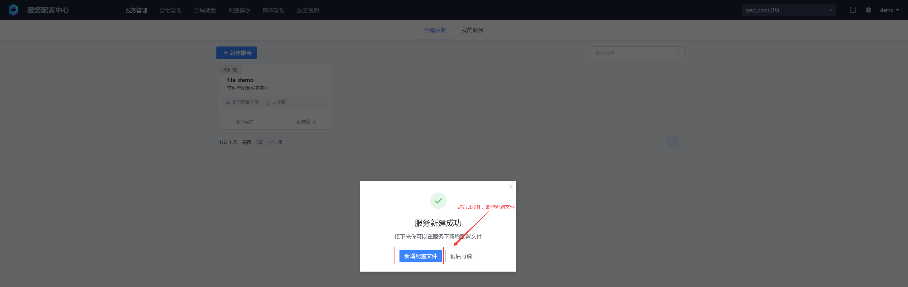
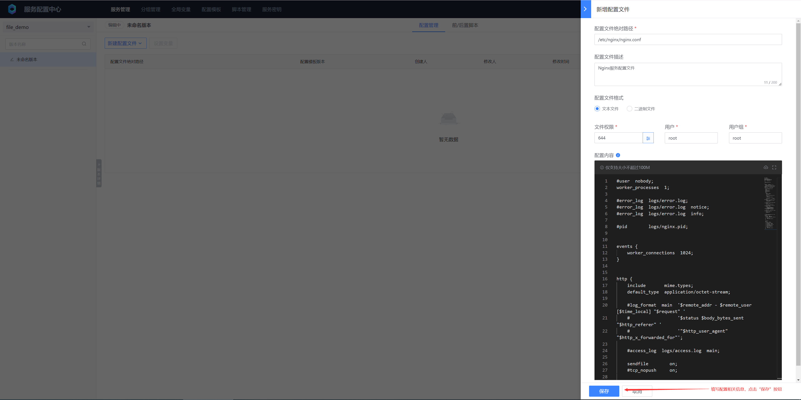
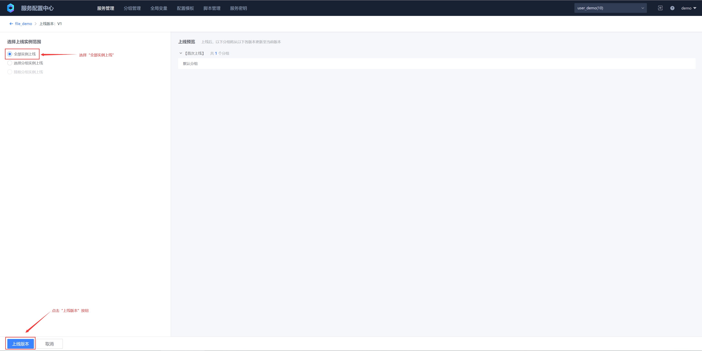
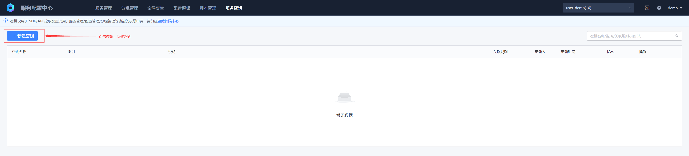
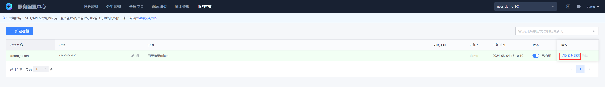
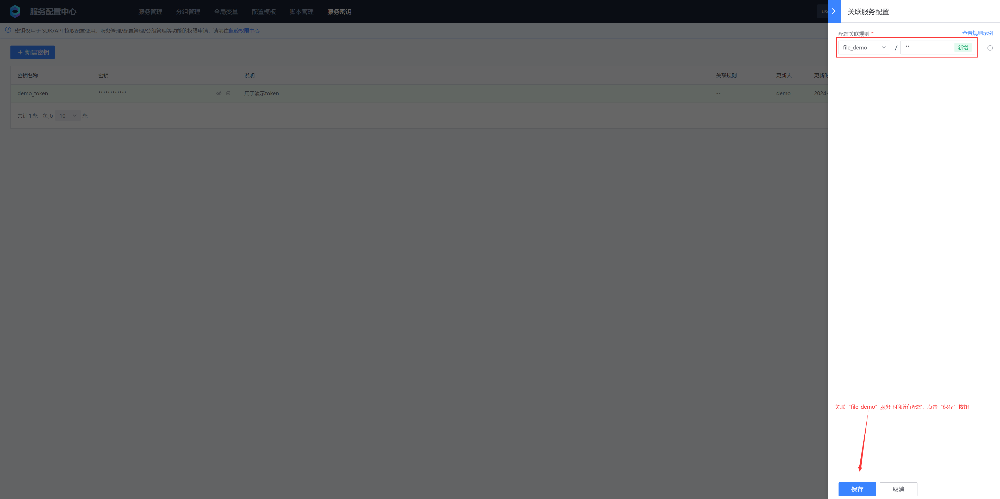
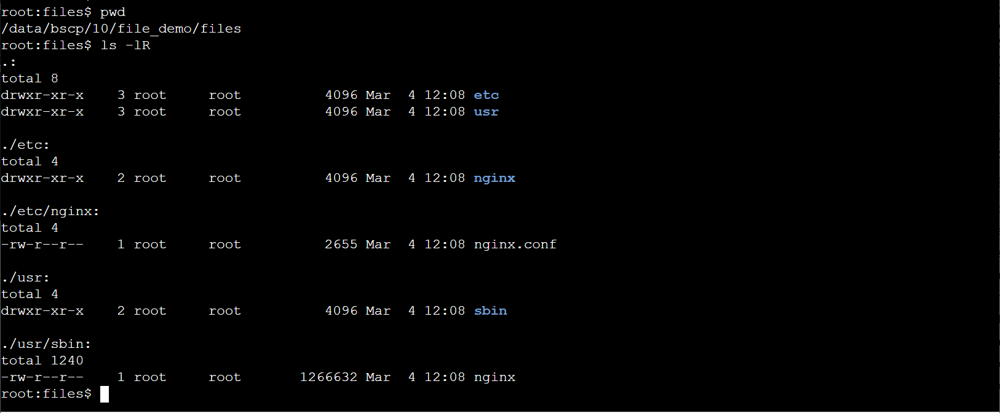

# File-based configuration
## 1. Create a service




## 2. Add configuration





## 3. Generate version


## 4. Online version




## 5. Create a service key








## 6. Configure Sidecar

```yaml
apiVersion: apps/v1
kind: Deployment
metadata:
  name: test-listener
  namespace: default
spec:
  selector:
    matchLabels:
      app: test-listener
  template:
    metadata:
      labels:
        app: test-listener
    spec:
      initContainers:
        # BSCP init container, responsible for pulling the configuration file to the specified directory for the first time
        - name: bscp-init
          image: ccr.ccs.tencentyun.com/blueking/bscp-init:latest
          env:
            # BSCP Service ID
            - name: biz
              value: "10"
            # BSCP Service Name
            - name: app
              value: "file_demo"
            # BSCP service subscription address, executed on the cluster deployed by BSCP background (by default, under the "BlueKing" project of the container platform), execute the following command to obtain:
            # kubectl get svc bk-bscp-feed-feedserver-nodeport -n bk-bscp
            # If the client is not connected to the cluster Node network, you can configure LoadBalancer for the feedserver yourself
            - name: feed_addrs
              value: "10.0.0.1:31510"
            # Service Key, fill in the service key created in the previous step
            - name: token
              value: "ABCDEFGHIJKLMNOPQRSTUVWXYZ1234"
            # Configure the temporary directory of the configuration file. The files will be sent to the {temp_dir}/files directory.
            - name: temp_dir
              value: '/data/bscp'
          # The temporary directory of the file needs to be mounted to the init container, sidecar container, and business container at the same time
          volumeMounts:
            - mountPath: /data/bscp
              name: bscp-temp-dir
      containers:
        # Business Container
        - name: test-listener
          image: alpine
          command:
          - "/bin/sh"
          - "-c"
          - |
            apk add --no-cache inotify-tools
            echo "start watch ..."
            while true; do
            # Listen for write events of /data/bscp/metadata.json
            inotifywait -m /data/bscp/metadata.json -e modify |
                while read path action file; do
                    # Recursively traverse all files in the /data/bscp/files directory and output their absolute paths
                    find /data/bscp/files
                done
            done
          resources:
            limits:
              memory: "128Mi"
              cpu: "500m"
          # The temporary directory of the file needs to be mounted to the init container, sidecar container, and business container at the same time
          volumeMounts:
            - mountPath: /data/bscp
              name: bscp-temp-dir
        # The BSCP sidecar container is responsible for monitoring the version change time, updating the configuration files in the temporary directory, and writing events to metadata.json after the update is completed.
        - name: bscp-sidecar
          image: ccr.ccs.tencentyun.com/blueking/bscp-sidecar:latest
          env:
            # The environment variable configuration of the bscp-sidecar container is exactly the same as that of the bscp-init container.
            - name: biz
              value: "10"
            - name: app
              value: "file_demo"
            - name: feed_addrs
              value: "10.0.0.1:31510"
            - name: token
              value: "ABCDEFGHIJKLMNOPQRSTUVWXYZ1234"
            - name: temp_dir
              value: '/data/bscp'
          resources:
            limits:
              memory: "128Mi"
              cpu: "500m"
          volumeMounts:
            - mountPath: /data/bscp
              name: bscp-temp-dir
      volumes:
        - name: bscp-temp-dir
          emptyDir: {}
```

## 7. Check whether the file is sent successfully

The bscp_sidecar container checks the configuration file pulled by the client

