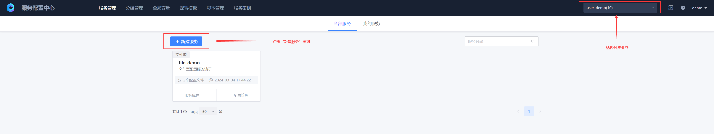
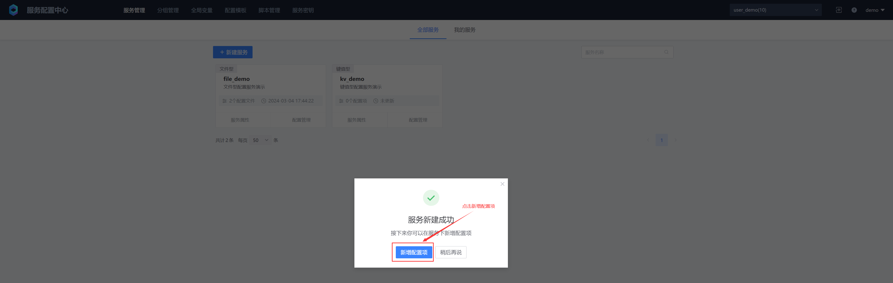
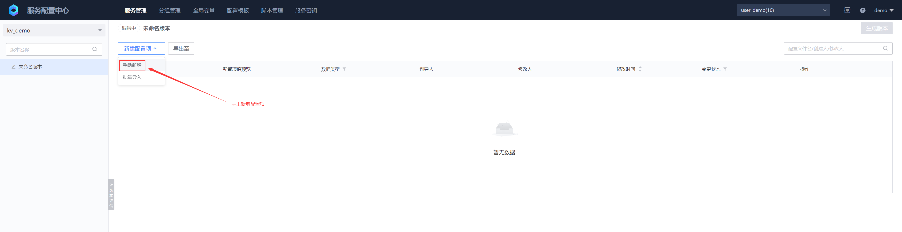
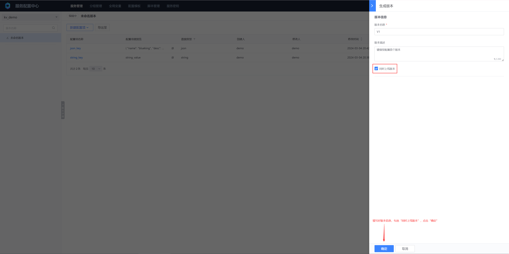
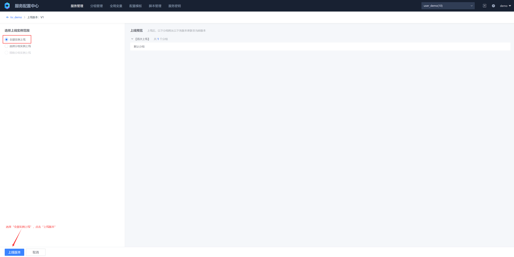
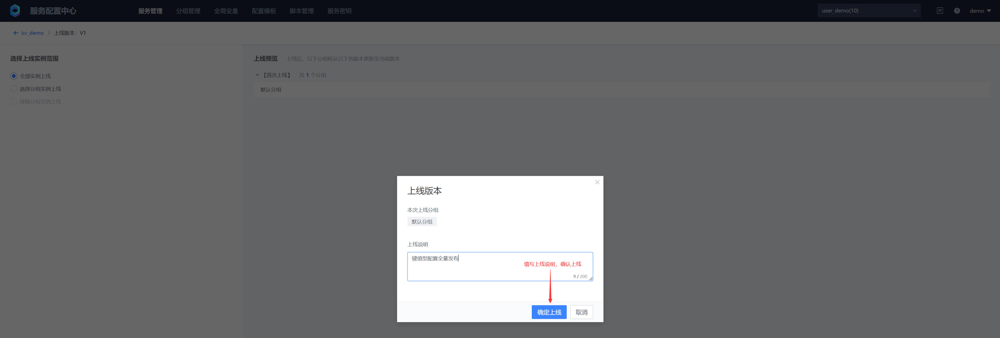
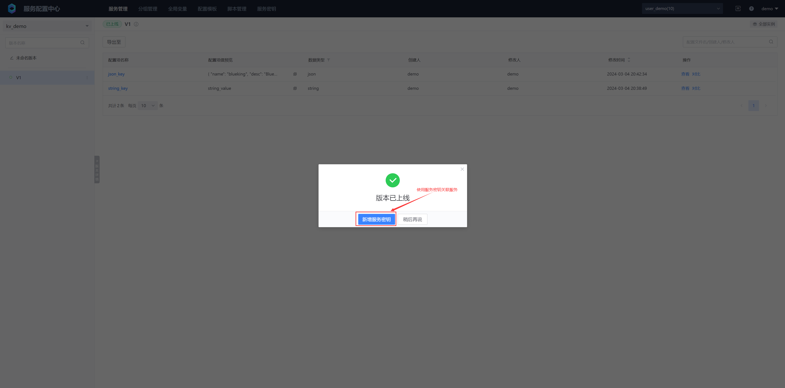
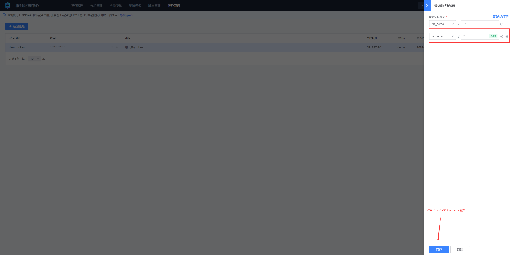

# Key-value configuration
## 1. Create a service





## 2. Add configuration




## 3. Generate version




## 4. Online version







## 5. Existing service key associated service configuration




## VI. Pulling key-value configuration items

### 1. Pulling command line configuration

https://github.com/TencentBlueKing/bscp-go/releases/

```bash
# Install bscp command line
go install github.com/TencentBlueKing/bscp-go/cmd/bscp@latest

# Download bscp command line, download the latest version
https://github.com/TencentBlueKing/bscp-go/releases/
```

Configure client parameters, save the content as a file bscp.yaml

```yaml
# BSCP service subscription address, execute on the cluster deployed by BSCP background (by default, under the "BlueKing" project of the container platform), execute the following command to obtain:
# kubectl get svc bk-bscp-feed-feedserver-nodeport -n bk-bscp
# If the client is not connected to the cluster Node network, you can configure LoadBalancer for the feedserver by yourself
feed_addr: "10.0.0.1:31510"

# Fill in the service key in the previous step
token: ABCDEFGHIJKLMNOPQRSTUVWXYZ1234

# Fill in the business ID
biz: 10
```

You can use environment variables to support the path

```bash
export BSCP_CONFIG=./bscp.yaml
```

命令行使用

```bash
# Load client configuration in the current environment
./bscp
bscp is a command line tool for blueking service config platform

Usage:
  bscp [command]

Available Commands:
  get         Display app or kv resources
  pull        pull file to temp-dir and exec hooks
  watch       watch release then pull file, exec hooks
  version     show version of the bscp-go cli.
  help        Help about any command

Flags:
  -c, --config string      config file path [env BSCP_CONFIG]
  -h, --help               help for bscp
      --log-level string   log filtering level, One of: debug|info|warn|error. (default info)

Use "bscp [command] --help" for more information about a command.

# Get bscp service list
./bscp get app
NAME CONFIG TYPE REVISER UPDATEAT
file_demo file demo 5 hours ago
kv_demo kv demo 2 hours ago

# If you need to format the output
./bscp get app -o json
[
    {
        "id": 205,
        "name": "file_demo",
        "config_type": "file",
        "revision": {
            "creator": "demo",
            "reviser": "demo",
            "create_at": "2024-03-04T09:33:44Z",
            "update_at": "2024-03-04T09:33:44Z"
        }
    },
    {
        "id": 206,
        "name": "kv_demo",
        "config_type": "kv",
        "revision": {
            "creator": "demo",
            "reviser": "demo",
            "create_at": "2024-03-04T12:23:42Z",
            "update_at": "2024-03-04T12:23:42Z"
        }
    }
]

# Get the kv list
./bscp get kv --app kv_demo
KEY          TYPE     REVISER   UPDATEAT   
string_key   string   demo      1 hour ago   
json_key     json     demo      1 hour ago

# Get the metadata of kv
./bscp get kv --app kv_demo string_key -o json
[
    {
        "id": 0,
        "key": "string_key",
        "kv_type": "string",
        "revision": {
            "creator": "demo",
            "reviser": "demo",
            "create_at": "2024-03-04T12:38:49Z",
            "update_at": "2024-03-04T12:38:49Z"
        },
        "kv_attachment": {
            "biz_id": 10,
            "app_id": 206
        }
    }
]
./bscp get kv --app kv_demo json_key -o json
[
    {
        "id": 0,
        "key": "json_key",
        "kv_type": "json",
        "revision": {
            "creator": "demo",
            "reviser": "demo",
            "create_at": "2024-03-04T12:42:34Z",
            "update_at": "2024-03-04T12:42:34Z"
        },
        "kv_attachment": {
            "biz_id": 10,
            "app_id": 206
        }
    }
]

# Get the value of kv
./bscp get kv --app kv_demo string_key -o value
string_value

./bscp get kv --app kv_demo json_key -o value
{
    "name": "blueking",
    "desc": "Blueking is an operation and maintenance platform"
}

```


### 2. GO SDK
https://github.com/TencentBlueKing/bscp-go

### 3. Java SDK
https://github.com/TencentBlueKing/bscp-java-sdk

### 4. Python SDK
https://github.com/TencentBlueKing/bscp-python-sdk

### 5. C++ SDK
https://github.com/TencentBlueKing/bscp-cpp-sdk