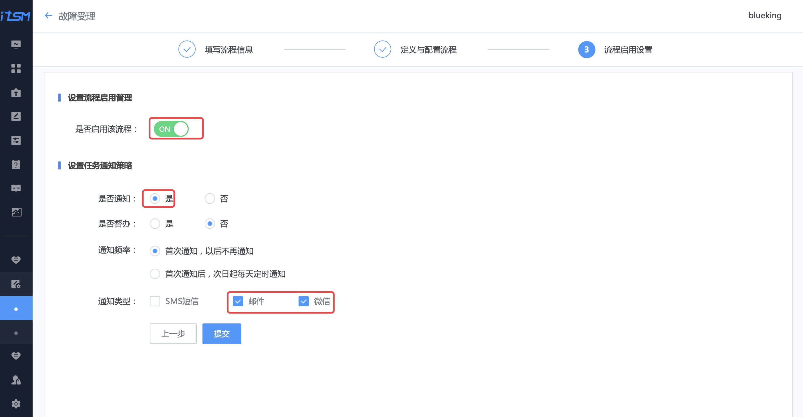
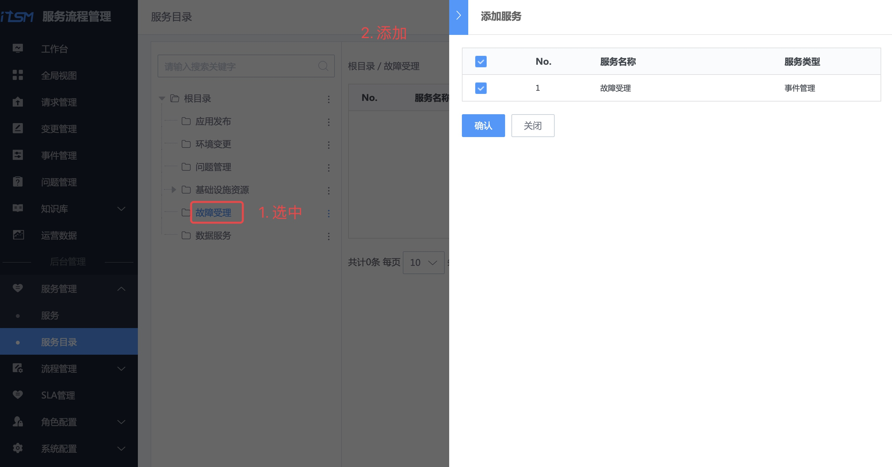
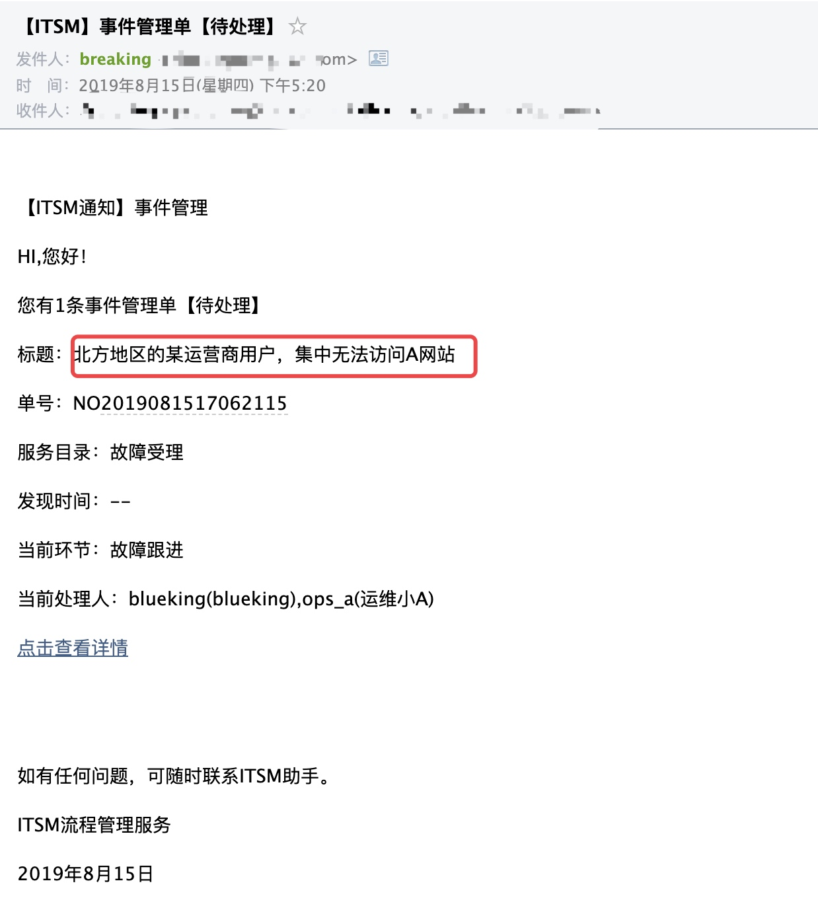

# 流程服务：故障提报流程线上化

## 情景

流程服务中的故障管理(Incident Management)帮企业构建了一套**应对故障的处理机制**，确保故障来临之时可以**高效有序的响应、处理以及回溯故障的表面和本质**，并将根源问题通过转单到**问题管理模块**，实现**故障的闭环**。

故障管理是蓝鲸流程服务内置的模块之一，接下来介绍在蓝鲸流程服务是如何应对**部分地区用户集中无法访问网站的投诉**。

## 前提条件

- 准备故障提报流程中 [多个角色](../../../PaaS平台/产品白皮书/产品功能/系统管理/UserManageEE.md) 的账号，包含`运维`、`QC`、`产品`，以及流程设计的`管理员`。

## 操作步骤

- 梳理故障提报流程
- 创建故障提报服务目录及流程
- 一次故障提报示例

### 梳理故障提报流程

从流程服务理论出发，梳理故障提报的流程图，包含客服 **提单**、运维 **故障跟进**、运维 **回溯总结故障**，以及最后质量保证(QC)对故障的 **评估管理**。

> 流程图中是一个实践案例，部分数据需要从周边系统获取，此处功能需要做二次开发，本教程专注流程本身。

### 创建故障提报服务目录及流程

先设计故障提报的**流程**，**流程依附在服务目录上对外提供服务**。

#### 角色设置

参照 [角色设置](./Release_Management.md) 完成对`运维`、`产品`和`QC`的授权。

#### 设计故障受理流程

##### 填写流程信息

选择菜单【流程设计】 ，点击【新增】按钮，按提示填写流程信息。

流程类型选择【事件】，需要【关联业务】，因为故障提报和业务相关，同时关联业务对应的角色：产品、运维。

点击【下一步】，进入【定义与配置流程】环节。

##### 定义与配置流程

点击上图【流程画布】中的【齿轮】，配置【提单】流程节点的字段。

一般是**客服**提故障单据，所以操作角色选择【通用角色表】-> 【客服】(客服角色授权详见给 **角色分配权限**）。

点击【新增字段】，参照 **梳理故障提报流程**，新增每个环节中需要的字段。

参照 **梳理故障提报流程**，完成整个故障受理流程的配置。

##### 启用流程

【启用流程】，选择适合的通知策略，点击【提交】完成流程设计。

##### 流程模板实例化

选择菜单【流程设计】，找到刚编辑的故障受理流程，点击【部署】，生成流程实例。

#### 在服务目录中新增"故障受理"服务，并绑定流程

选择菜单【服务】，点击【新增】按钮，新增"故障受理"服务，并**关联**刚生成的流程实例。

选择菜单【服务目录】，选中【根目录】，点击右侧【 **⋮** 】，点击【新增】，按提示新增一个名为**故障受理**的服务目录。

选中刚刚创建的服务目录【故障受理】，右侧会显示【添加】按钮，点击该按钮添加**故障受理**服务。

至此，流程设计和服务目录已新建好，接下来做一次故障提报演示。

### 一次故障提报示例

#### 客服提报故障单

用`客服`账号登录流程服务，选择【事件管理】菜单，点击【新增事件】，选择【故障受理】服务，点击【提交】。

在【新增事件】界面，填写**本次故障提报的关键信息**，包括故障标题、截图以及故障处理团队等。

点击【提交】，提报故障。

#### 运维跟进故障处理

运维收到一封**待处理**的**故障受理**邮件。

使用**运维**账号登录流程服务，在待办列表中，找到待处理的故障单。

点击链接，填写故障处理记录，点击【通过】，完成本环节流程。

#### 故障总结

处理完故障后，运维**复盘本次故障**，做故障总结。

#### QC 做故障评估

QC（质量保障）人员在工作台的待办列表中，找到本次故障的单据。

QC 依据本次故障的影响范围、原因以及处理情况，做出故障评估。

至此，一次**故障提报和处理的流程结束**。

