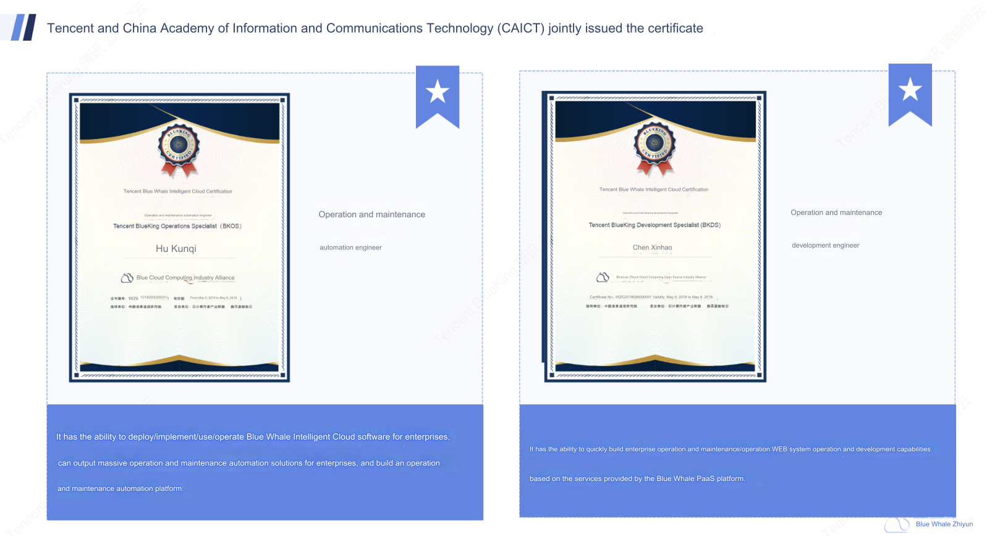

# Customer Service

Tencent BlueKing authorizes "partners" to provide services. It will provide resources every year to enhance the service capabilities of technical partners to ensure that customers receive timely and effective technical support. Customers are requested to actively obtain technical support from formal channels to ensure the quality of service.

- Service enterprise qualification inquiry

Tencent BlueKing official website will update the authorized enterprises at any time. You can go to [Official website inquiry](https://bk.tencent.com/cooperation_partner/) or email (contactus_bk@tencent.com) to consult the official website.

- Service staff qualification query

Tencent BlueKing improves the skills of engineers through the certification exam model. Customers can go to "[Certification Dynamics](https://bk.tencent.com/training_exam/)" to check the capabilities of service engineers, or actively ask engineers providing services to show their certificates.

Warm reminder: This certificate has a time limit. BlueKing is currently specifying the time limit statement based on the type of certified capabilities. Please pay attention to subsequent official notifications.

