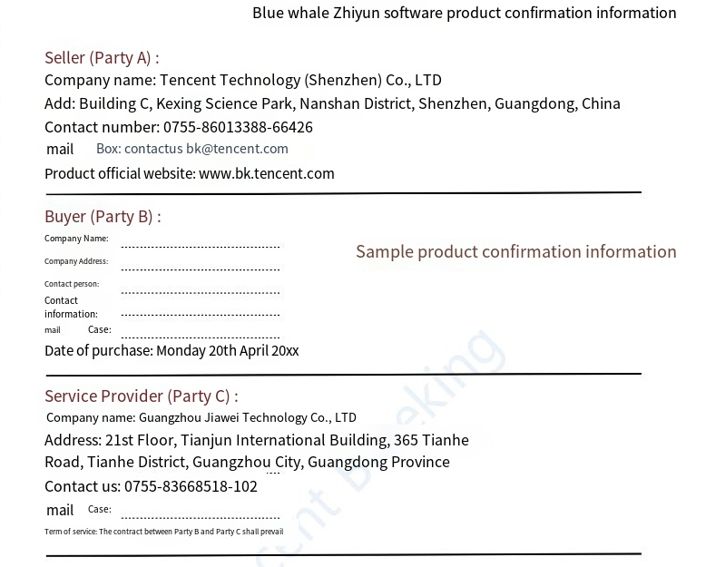

# Software Description

Software Description Tencent BlueKing does not directly provide software sales and technical support to enterprise customers. Services are provided by authorized "Enterprise Edition Technology Partners". For cooperation models, please refer to ["Tencent BlueKing Partner Guide"](https://bk.tencent.com/cooperation_partner/).

- Software Application

Initiated by the "Enterprise Edition Technology Partner", the valid software can be obtained only after confirmation by the enterprise customer interface person and approval by Tencent engineers.

- Software POC

Based on the version, time, company name and other valid information filled in by the initiator, apply for software that is only used for enterprise customer POC. The maximum validity period of the software does not exceed 1 year, and it is not recommended for customers to use it in production environments.

- Software Renewal

Based on the cooperation between the initiator and the customer, initiate a software renewal application. After review by Tencent engineers, the certificate file is delivered to the initiator to renew the customer's software.

- Software Certificate

When the customer purchases the BlueKing Enterprise Edition software, he will receive an authorization email from the designated mailbox (BKSoftWare@tencent.com), otherwise it will be invalid software.

The authorization template is as follows, which will be adjusted appropriately according to the specific situation.
