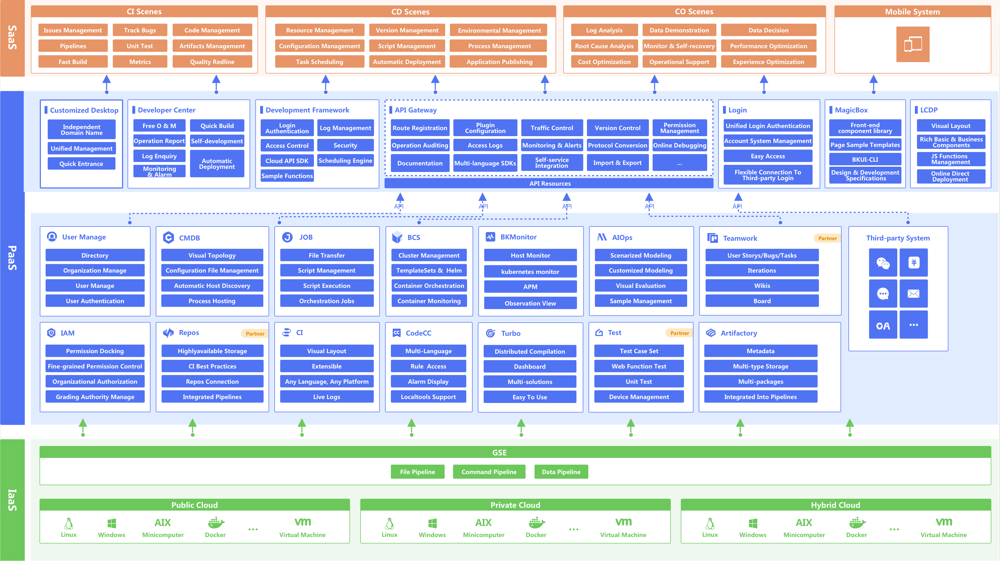

# System Architecture

Tencent BlueKing system consists of an atomic platform and general first-level SaaS services. The platform includes **control platform, configuration platform, operation platform, PaaS platform**, etc. General SaaS includes node management, standard operation and maintenance, log platform, monitoring platform, etc., providing one-stop technical operation solutions for users of various clouds (public cloud, private cloud, hybrid cloud) with different scenarios and different needs.

Tencent BlueKing System relies on enterprise-level SOA and integration concepts, and uses the most advanced cloud technologies such as Docker to build a new operation and maintenance model. It is committed to implementing DevOps in the form of "atomic service integration" and "low-cost tool construction", helping operation and maintenance to quickly achieve "unattended basic services" and "value-added services", and further achieve more comprehensive and sustainable efficiency improvements for enterprises through the implementation of DevOps.