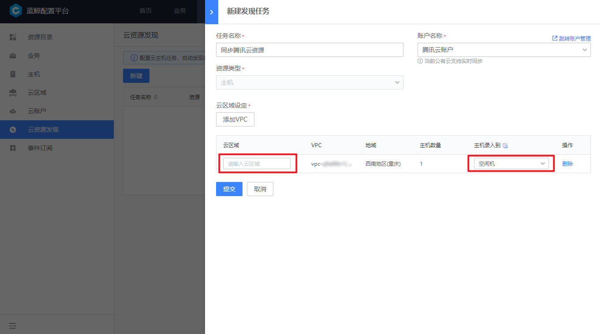

 # Cloud resources 

 The CMDB provided One set of Base cloud resources synchronization functions to solve problems such as untimely Manage Update of cloud resources and inaccurate information. 

 The specific step are as follows: 

 1. create a cloud account 
 2. create Cloud resources Discovery Task 
 3. Allocate cloud resources 

 ## 1. create a cloud account 

 user need to apply to create One set of "sub-accounts" that can access all resources in the public cloud.  Different public cloud apply methods are slightly different.  Currently CMDB supports Account synchronization between Tencent Cloud and AWS. For more information on how to apply for an account, please see the following The document: 

 - Tencent Cloud: [https://cloud.tencent.com/document/product/598/37140](https://cloud.tencent.com/document/product/598/37140) 
 - AWS：[https://docs.aws.amazon.com/IAM/latest/UserGuide/id_roles_providers_enable-console-custom-url.html](https://docs.aws.amazon.com/IAM/latest/UserGuide/id_roles_providers_enable-console-custom-url.html) 

 apply create an account, you need to record the access ID and KEY, and create an account in the CMDB. 

  

 After Fill In the ID and KEY, click the "Connectivity Test" button to ensure that the CMDB can access the public cloud interface address normal, and Check the availability of the ID and KEY. 

  

 After the account is created Success, you can create a cloud resources discovery Task. 

  

 ## 2. create Cloud resources Discovery Task 

 Enter the "Cloud resources Discovery" feature, click the "add" button, and select the Tencent Cloud account you just create. 

  

 Currently, you can synchronize Host resources at the granularity of VPC. You can find the VPC to be synchronized approve select the gateway of the public cloud. 

  

 Complete the Set in Cloud area Settings: 

 1. Add the name of the cloud region corresponding to the VPC: Host IP resources in a VPC of a public cloud are not duplicated, and they are in one-to-one correspondence with Cloud area in the CMDB.  The public cloud resources under this VPC will be synchronized to this VPC 
 2. Set the directory that the Host enters into the resources pool: When the CMDB finds One new Host, it will be preferentially placed in the directory of the resources pool. By default, it is in the "idle machine" directory.  user can also create One directory dedicated to Storage new Host resources by department or purpose 

  

 create created complete One synchronization Task will be Start Up immediately, and you can see the synchronization status in the list. 

  

 ## 3. Allocate cloud resources 

 Host resources on the public cloud will be synchronized to the configured directory of the resource pool and allocated to the actual Business Name Apply approve the "allocate to" function. 

 For more Operation, please see [Host and resources Pool Manage](./ResourcePool.md) 