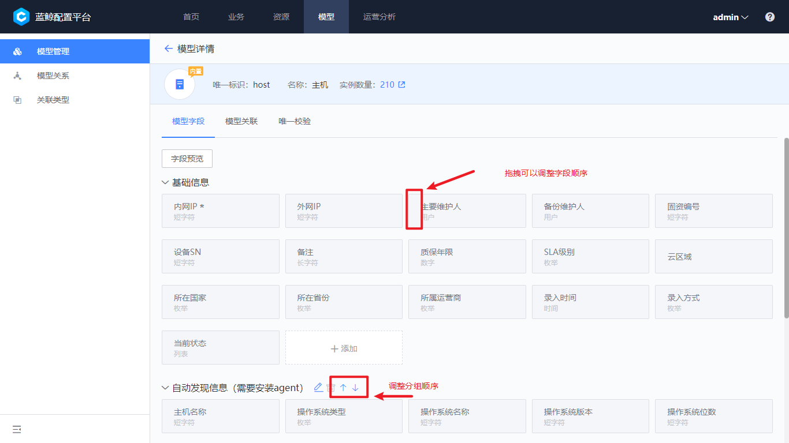

 # Manage 

 Information instances Manage in the CMDB are constructed based on model. 

 Currently, the built-in model include Business Name, Set, module, Host, process, and Cloud area. 

 If the built-in model cannot meet the requirements, you can new and edit the model approve customize to construct the enterprise-specific CMDB. 

 ## View Existing model 

 The Administrator can view all models existing in the current system approve "model-manage". 

  
 
Figure 1. Existing model view
 

 ## Group model 

 The system supports the group of model According to the functions used.  group type are "built-in" and "user". 

 1. Built-in grouping: Currently, it includes "Host Manage","Business Name Topology","Organization Structure" and "Network".  Built-in group cannot be Revise or delete 

 2. user grouping: You can add a group by approve the new button on the side.  To Revise an existing customize group, hover over the groupName and Click to modify button 

  
 
Figure 2. new group
 

  
 
Figure 3. edit/delete group
 

 ## Model create 

 In the new group panel, click "Create Now" to open One new model. 

 - grouping: the Manage group of the model, which can make the model Service Classification more clear and easy to Search. Later version will support setting permissions according to the group. 
 - Unique ID: the unique ID of a model in the system. It cannot be duplicated. It cannot be Revise after being add. It is mainly used for API Identify and calling. 
 - name: the visible name of the model in the view. It is recommended to name the model as simply and easily as possible 

  
 
Figure 4. new model
 

 After the model Create succeeded, Enter the view page of the model, and you can find that the current model has been created auto: 

 - Field group "default", which is One built-in group that cannot be delete and name can be Revise 
 - Instance Name is One isRequired field. In Scene where the system needs shorthand, CMDB will Display this field first so that user can quickly Identify the purpose or ownership of the current device 

 You can then add more Field approve click the append button. 

  
 
Figure 5. new Field
 

 The supported Type are as follows: 

 - Short characters: 256 English characters or 85 Chinese characters 
 - Long characters: 2000 English or 666 Chinese characters 
 - Number: positive and negative integer 
 - A number that can contain a decimal point. 
 - Enumeration: A list containing K-V structures 
 - date: Date format 
 - time: Time format 
 - Time zone: enumeration of international time zones 
 - user: you can Input the user entered in BlueKing 
 - Boolean: A Boolean type, often used for switches 
 - List: can be understood as an array type, containing only a list of values 

  
 
Figure 6. Type
 

 Different character type have corresponding setting options, meaning as follows: 

 - edit: The current Field can only be edited during initial create and import, and cannot be Revise in the system 
 - isRequired: The current Field Must be Fill In 
 - Regular Check: Regular Expression can be Fill In in type to ensure accurate data format, which is often used for email, mobile phone number and other content 
 - Maximum and Minimum: the number type can set the supported number range 
 - Enumeration Value: options are set in enumeration type. ID is not visible to user, and value is visible to users 
 - List Value: Set options in list type 
 - defaultValue: The default value is the enumeration and list type It is used to set which one is used as the default Input if the user does not Fill In. 
 - user tips: provided users with description tips, generally used to guide how to Fill In the current Field 

 ## Adjusting Field Layout 

 You can make the instance detail Query and edit page more user-friendly approve: 

 1. Adjust Field group order 
 2. Drag to move Field order 

  
 
Figure 7. Field Layout
 

 ## Uniqueness Check 

 To ensure that the instance data entered in the CMDB is correct and effective, unique Check can be protected before entry to avoid duplicate data. 

 ### Default Check 

 By default, customize model use Instance Name as the unique Check.  That is, if a duplicate instance name is Input, the system will refuse the entry and prompt the data slave service.  The default Check has the following characteristics: 

 1. Can not be delete 
 2. The default Check Must not be blank. Even if the current Field is not set as isRequired, it must be Fill In in during entry 

 You can Revise the default Check to Other character and type Field existing in the model, for example as Asset ID, Equipment SN, MAC address, etc.  It can also be Revise to combine field as the unique Check. Common Scene include: "gateway + Region Unique ID". 

  
 
Figure 8. Optional Check
 

 In addition to the default Check, you can create multiple sets of auxiliary verification rules to make instance entry more rigorous. If the auxiliary verification Field is not set as isRequired, it will not be verified if it is blank during entry.  If you want the auxiliary Check to be the same as the default verification, you need to set the field as isRequired in the Field attribute. 

 ## Delete Models 

 Delete Model: In the model detail page, you can completely delete the current model settings approve the "Delete" function in the upper right corner.  Note that to decreased accidental delete, the system will first Confirm that the corresponding instance has been reset when Delete Model Request. 

  
 
Figure 9. model delete
 

 ## Disable a Model 

 1. Disable model: if it is not Enable temporarily, you can use the Disable function in the upper right corner. Unlike delete, disabling will only Hide the Display of the system and the data will be retained 

 2. Enable model: After a model is Disable, you can switch to Has been discontinued label in manage to find the current disabled model. After re-enabling, the original instances and link relationships will restore again 

  
 
Figure 10. view Disable model
 