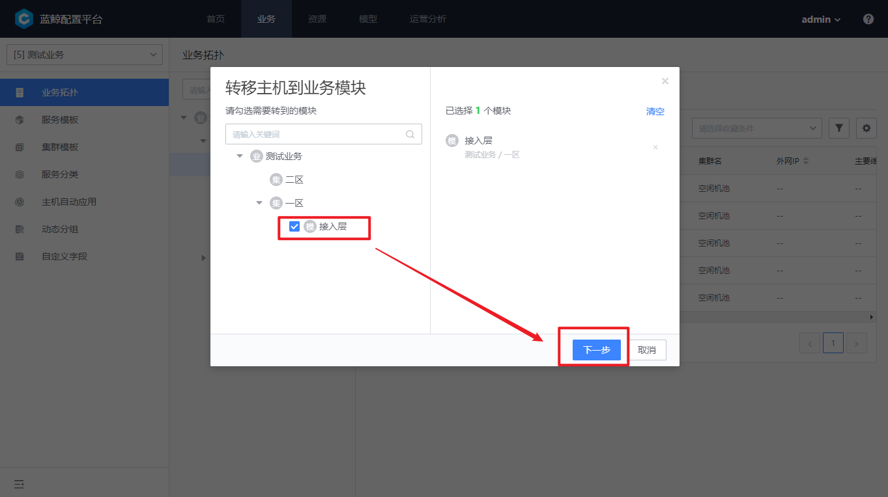

 # How CMDB Manage processes 

 ## Scenario 

 MariaDB is the Storage of the Apply. Register MariaDB in CMDB for process monitoring in the monitoring system. 

 ## Prerequisites 

 In the CMDB,[add Business Name](./case1.md) and Business Name topology. 

 ## step 

 1. create a service instance in CMDB and register the process and port 

 2. The monitoring system auto monitors the process port 

 ### 1. create a service instance in CMDB and register the process and port 

 When we transfer the Host from the idle machine to the Business Name module, we will be prompted whether to improve the process information 

  

  

  

 In the menu `Business Name resources`-`Processes`, select `add Process`. 

  

 #### Registration Process 

 - Process aliasName: Externally Display service name: `MariaDB`; 
 - Process Name: Two name of the program: `mysqld`; 

 When setting a feature name, use the command to Query the Two name of The program 

 ```bash 
 $ ps -ef | grep -i mysqld 
 mysql     7800     10 month 08 ?       00:00:00 /bin/sh /usr/bin/mysqld_safe --basedir=/usr 
 mysql     7800 on July 08.       00:01:55 /usr/libexec/mysqld --basedir=/usr --datadir=/var/lib/mysql --plugin-dir=/usr/lib64/mysql/plugin --log-error=/var/log/mariadb/mariadb.log --pid-file=/var/run/mariadb/mariadb.pid --socket=/var/lib/mysql/mysql.sock 
 ``` 

 > Note: The monitoring system generally `exactly match` the Two name. 
 >    How to get the Two name: `basename $(readlink -f /proc/7980/exe)` 

 #### Registering port 

 Query the IP and port that mysqld listens to 

 ```bash 
 $ netstat -antp | grep mysqld 
 tcp        0      0 10.0.4.29:3306          0.0.0.0:*               LISTEN      7980/mysqld 
 ``` 

 - Binding IP: MariaDB is a Storage layer and is generally bound to a private IP. Therefore,`First private IP` is selected. 
 - port: the port on which the process listens,`3306` 
 - Protocol: `TCP` 

 ### Monitoring system auto Monitors Process port 

 Wait One minutes, in the BlueKing's own monitoring system [Monitor](../../../Monitor/UserGuide/intro/README.md) you can see [Process Run](../../../Monitor/UserGuide/guide/process_monitor.md). 

  

 click the MariaDB icon to view the CPU, memory usage, number of file handles, and other resources metrics occupied by the process. 

  

 ## Extended Reading 

 ### Logic behind Processes in CMDB for monitoring system consumption 

 After a Host is assigned to a module, most CI attributes of the CVM will be auto Push to `/var/lib/gse/host/hostid`. 

 ```json 
 { 
  ..... 
     "process" : [ 
      { 
         "bind_ip" : "3", 
         "bind_modules" : [ 68 ], 
         "bk_func_id" : "", 
         "bk_func_name" :"mysqld", //corresponding function name 
         "bk_process_id" : 110, 
         "bk_process_name" :"MariaDB", //corresponding Process Name 
         "bk_start_param_regex" : "", 
         "port" : "3306", 
         "protocol" : "1" 
      } 
   ] 
 } 
 ``` 

 The built-in process monitoring Collections `processbeat` of BlueKing will read The file and write it into its own setting file `/usr/local/gse/plugins/etc/processbeat.conf` to monitor the process and port. 

 ```yaml 
 ...... 
 processbeat.processes: 
 - //Two name 
  displayname: MariaDB 
  protocol: tcp 
  ports: 
  - 3306 
  paramregex: "" 
  bindip: 10.0.4.29 
 ``` 

 ### How The setting the Two name of java 

 For example, the Two of ZooKeeper and Hadoop is `java`, which can be distinguished by process Start Up Parameter. 

 The function name of the process is `java`. Input `zookeeper` and `kafka` respectively in `Start Up Parameter match Rules`. 

```bash
$ ps -ef | grep -i zookeeper

root      5897     1  0 Nov14 ?        01:49:00 /data/bkee/service/java/bin/java -Dzookeeper.log.dir=/data/bkee/logs/zk/ -Dzookeeper.root.logger=INFO,ROLLINGFILE -Dzookeeper.DigestAuthenticationProvider.superDigest=bkadmin:1bF5dHUwvnyrhMDaPLkHwFS1JOg= -cp /data/bkee/service/zk/bin/../build/classes:/data/bkee/service/zk/bin/../build/lib/*.jar:/data/bkee/service/zk/bin/../lib/slf4j-log4j12-1.6.1.jar:/data/bkee/service/zk/bin/../lib/slf4j-api-1.6.1.jar:/data/bkee/service/zk/bin/../lib/netty-3.10.5.Final.jar:/data/bkee/service/zk/bin/../lib/log4j-1.2.16.jar:/data/bkee/service/zk/bin/../lib/jline-0.9.94.jar:/data/bkee/service/zk/bin/../zookeeper-3.4.10.jar:/data/bkee/service/zk/bin/../src/java/lib/*.jar:/data/bkee/etc:/data/bkee/service/zk/conf:/data/bkee/service/java/lib: -Dcom.sun.management.jmxremote -Dcom.sun.management.jmxremote.local.only=false org.apache.zookeeper.server.quorum.QuorumPeerMain /data/bkee/etc/zoo.cfg
root     10220     1  2 Nov14 ?        13:17:41 /data/bkee/service/java/bin/java -Xmx1G -Xms1G -server -XX:+UseG1GC -XX:MaxGCPauseMillis=20 -XX:InitiatingHeapOccupancyPercent=35 -XX:+DisableExplicitGC -Djava.awt.headless=true -Xloggc:/data/bkee/logs/kafka/kafkaServer-gc.log -verbose:gc -XX:+PrintGCDetails -XX:+PrintGCDateStamps -XX:+PrintGCTimeStamps -Dcom.sun.management.jmxremote -Dcom.sun.management.jmxremote.authenticate=false -Dcom.sun.management.jmxremote.ssl=false -Dkafka.logs.dir=/data/bkee/logs/kafka -Dlog4j.configuration=file:./../config/log4j.properties -cp /data/bkee/service/java/lib::/data/bkee/service/kafka/bin/../libs/aopalliance-repackaged-2.5.0-b05.jar:/data/bkee/service/kafka/bin/../libs/argparse4j-0.7.0.jar:/data/bkee/service/kafka/bin/../libs/connect-api-0.10.2.0.jar:/data/bkee/service/kafka/bin/../libs/connect-file-0.10.2.0.jar:/data/bkee/service/kafka/bin/../libs/connect-json-0.10.2.0.jar:/data/bkee/service/kafka/bin/../libs/connect-runtime-0.10.2.0.jar:/data/bkee/service/kafka/bin/../libs/connect-transforms-0.10.2.0.jar:/data/bkee/service/kafka/bin/../libs/guava-18.0.jar:/data/bkee/service/kafka/bin/../libs/hk2-api-2.5.0-b05.jar:/data/bkee/service/kafka/bin/../libs/hk2-locator-2.5.0-b05.jar:/data/bkee/service/kafka/bin/../libs/hk2-utils-2.5.0-b05.jar:/data/bkee/service/kafka/bin/../libs/jackson-annotations-2.8.0.jar:/data/bkee/service/kafka/bin/../libs/jackson-annotations-2.8.5.jar:/data/bkee/service/kafka/bin/../libs/jackson-core-2.8.5.jar:/data/bkee/service/kafka/bin/../libs/jackson-databind-2.8.5.jar:/data/bkee/service/kafka/bin/../libs/jackson-jaxrs-base-2.8.5.jar:/data/bkee/service/kafka/bin/../libs/jackson-jaxrs-json-provider-2.8.5.jar:/data/bkee/service/kafka/bin/../libs/jackson-module-jaxb-annotations-2.8.5.jar:/data/bkee/service/kafka/bin/../libs/javassist-3.20.0-GA.jar:/data/bkee/service/kafka/bin/../libs/javax.annotation-api-1.2.jar:/data/bkee/service/kafka/bin/../libs/javax.inject-1.jar:/data/bkee/service/kafka/bin/../libs/javax.inject-2.5.0-b05.jar:/data/bkee/service/kafka/bin/../libs/javax.servlet-api-3.1.0.jar:/data/bkee/service/kafka/bin/../libs/javax.ws.rs-api-2.0.1.jar:/data/bkee/service/kafka/bin/../libs/jersey-client-2.24.jar:/data/bkee/service/kafka/bin/../libs/jersey-common-2.24.jar:/data/bkee/service/kafka/bin/../libs/jersey-container-servlet-2.24.jar:/data/bkee/service/kafka/bin/../libs/jersey-container-servlet-core-2.24.jar:/data/bkee/service/kafka/bin/../libs/jersey-guava-2.24.jar:/data/bkee/service/kafka/bin/../libs/jersey-media-jaxb-2.24.jar:/data/bkee/service/kafka/bin/../libs/jersey-server-2.24.jar:/data/bkee/service/kafka/bin/../libs/jetty-continuation-9.2.15.v20160210.jar:/data/bkee/service/kafka/bin/../libs/jetty-http-9.2.15.v20160210.jar:/data/bkee/service/kafka/bin/../libs/jetty-io-9.2.15.v20160210.jar:/data/bkee/service/kafka/bin/../libs/jetty-security-9.2.15.v20160210.jar:/data/bkee/service/kafka/bin/../libs/jetty-server-9.2.15.v20160210.jar:/data/bkee/service/kafka/bin/../libs/jetty-servlet-9.2.15.v20160210.jar:/data/bkee/service/kafka/bin/../libs/jetty-servlets-9.2.15.v20160210.jar:/data/bkee/service/kafka/bin/../libs/jetty-util-9.2.15.v20160210.jar:/data/bkee/service/kafka/bin/../libs/jopt-simple-5.0.3.jar:/data/bkee/service/kafka/bin/../libs/kafka_2.12-0.10.2.0.jar:/data/bkee/service/kafka/bin/../libs/kafka_2.12-0.10.2.0-sources.jar:/data/bkee/service/kafka/bin/../libs/kafka_2.12-0.10.2.0-test-sources.jar:/data/bkee/service/kafka/bin/../libs/kafka-clients-0.10.2.0.jar:/data/bkee/service/kafka/bin/../libs/kafka-log4j-appender-0.10.2.0.jar:/data/bkee/service/kafka/bin/../libs/kafka-streams-0.10.2.0.jar:/data/bkee/service/kafka/bin/../libs/kafka-streams-examples-0.10.2.0.jar:/data/bkee/service/kafka/bin/../libs/kafka-tools-0.10.2.0.jar:/data/bkee/service/kafka/bin/../libs/log4j-1.2.17.jar:/data/bkee/service/kafka/bin/../libs/lz4-1.3.0.jar:/data/bkee/service/kafka/bin/../libs/metrics-core-2.2.0.jar:/data/bkee/service/kafka/bin/../libs/osgi-resource-locator-1.0.1.jar:/data/bkee/service/kafka/bin/../libs/reflections-0.9.10.jar:/data/bkee/service/kafka/bin/../libs/rocksdbjni-5.0.1.jar:/data/bkee/service/kafka/bin/../libs/scala-library-2.12.1.jar:/data/bkee/service/kafka/bin/../libs/scala-parser-combinators_2.12-1.0.4.jar:/data/bkee/service/kafka/bin/../libs/slf4j-api-1.7.21.jar:/data/bkee/service/kafka/bin/../libs/slf4j-log4j12-1.7.21.jar:/data/bkee/service/kafka/bin/../libs/snappy-java-1.1.2.6.jar:/data/bkee/service/kafka/bin/../libs/validation-api-1.1.0.Final.jar:/data/bkee/service/kafka/bin/../libs/zkclient-0.10.jar:/data/bkee/service/kafka/bin/../libs/zookeeper-3.4.9.jar kafka.Kafka ../config/server.properties


ps -ef | grep -i kafka
root     10220     1  2 Nov14 ?        13:17:44 /data/bkee/service/java/bin/java -Xmx1G -Xms1G -server -XX:+UseG1GC -XX:MaxGCPauseMillis=20 -XX:InitiatingHeapOccupancyPercent=35 -XX:+DisableExplicitGC -Djava.awt.headless=true -Xloggc:/data/bkee/logs/kafka/kafkaServer-gc.log -verbose:gc -XX:+PrintGCDetails -XX:+PrintGCDateStamps -XX:+PrintGCTimeStamps -Dcom.sun.management.jmxremote -Dcom.sun.management.jmxremote.authenticate=false -Dcom.sun.management.jmxremote.ssl=false -Dkafka.logs.dir=/data/bkee/logs/kafka -Dlog4j.configuration=file:./../config/log4j.properties -cp /data/bkee/service/java/lib::/data/bkee/service/kafka/bin/../libs/aopalliance-repackaged-2.5.0-b05.jar:/data/bkee/service/kafka/bin/../libs/argparse4j-0.7.0.jar:/data/bkee/service/kafka/bin/../libs/connect-api-0.10.2.0.jar:/data/bkee/service/kafka/bin/../libs/connect-file-0.10.2.0.jar:/data/bkee/service/kafka/bin/../libs/connect-json-0.10.2.0.jar:/data/bkee/service/kafka/bin/../libs/connect-runtime-0.10.2.0.jar:/data/bkee/service/kafka/bin/../libs/connect-transforms-0.10.2.0.jar:/data/bkee/service/kafka/bin/../libs/guava-18.0.jar:/data/bkee/service/kafka/bin/../libs/hk2-api-2.5.0-b05.jar:/data/bkee/service/kafka/bin/../libs/hk2-locator-2.5.0-b05.jar:/data/bkee/service/kafka/bin/../libs/hk2-utils-2.5.0-b05.jar:/data/bkee/service/kafka/bin/../libs/jackson-annotations-2.8.0.jar:/data/bkee/service/kafka/bin/../libs/jackson-annotations-2.8.5.jar:/data/bkee/service/kafka/bin/../libs/jackson-core-2.8.5.jar:/data/bkee/service/kafka/bin/../libs/jackson-databind-2.8.5.jar:/data/bkee/service/kafka/bin/../libs/jackson-jaxrs-base-2.8.5.jar:/data/bkee/service/kafka/bin/../libs/jackson-jaxrs-json-provider-2.8.5.jar:/data/bkee/service/kafka/bin/../libs/jackson-module-jaxb-annotations-2.8.5.jar:/data/bkee/service/kafka/bin/../libs/javassist-3.20.0-GA.jar:/data/bkee/service/kafka/bin/../libs/javax.annotation-api-1.2.jar:/data/bkee/service/kafka/bin/../libs/javax.inject-1.jar:/data/bkee/service/kafka/bin/../libs/javax.inject-2.5.0-b05.jar:/data/bkee/service/kafka/bin/../libs/javax.servlet-api-3.1.0.jar:/data/bkee/service/kafka/bin/../libs/javax.ws.rs-api-2.0.1.jar:/data/bkee/service/kafka/bin/../libs/jersey-client-2.24.jar:/data/bkee/service/kafka/bin/../libs/jersey-common-2.24.jar:/data/bkee/service/kafka/bin/../libs/jersey-container-servlet-2.24.jar:/data/bkee/service/kafka/bin/../libs/jersey-container-servlet-core-2.24.jar:/data/bkee/service/kafka/bin/../libs/jersey-guava-2.24.jar:/data/bkee/service/kafka/bin/../libs/jersey-media-jaxb-2.24.jar:/data/bkee/service/kafka/bin/../libs/jersey-server-2.24.jar:/data/bkee/service/kafka/bin/../libs/jetty-continuation-9.2.15.v20160210.jar:/data/bkee/service/kafka/bin/../libs/jetty-http-9.2.15.v20160210.jar:/data/bkee/service/kafka/bin/../libs/jetty-io-9.2.15.v20160210.jar:/data/bkee/service/kafka/bin/../libs/jetty-security-9.2.15.v20160210.jar:/data/bkee/service/kafka/bin/../libs/jetty-server-9.2.15.v20160210.jar:/data/bkee/service/kafka/bin/../libs/jetty-servlet-9.2.15.v20160210.jar:/data/bkee/service/kafka/bin/../libs/jetty-servlets-9.2.15.v20160210.jar:/data/bkee/service/kafka/bin/../libs/jetty-util-9.2.15.v20160210.jar:/data/bkee/service/kafka/bin/../libs/jopt-simple-5.0.3.jar:/data/bkee/service/kafka/bin/../libs/kafka_2.12-0.10.2.0.jar:/data/bkee/service/kafka/bin/../libs/kafka_2.12-0.10.2.0-sources.jar:/data/bkee/service/kafka/bin/../libs/kafka_2.12-0.10.2.0-test-sources.jar:/data/bkee/service/kafka/bin/../libs/kafka-clients-0.10.2.0.jar:/data/bkee/service/kafka/bin/../libs/kafka-log4j-appender-0.10.2.0.jar:/data/bkee/service/kafka/bin/../libs/kafka-streams-0.10.2.0.jar:/data/bkee/service/kafka/bin/../libs/kafka-streams-examples-0.10.2.0.jar:/data/bkee/service/kafka/bin/../libs/kafka-tools-0.10.2.0.jar:/data/bkee/service/kafka/bin/../libs/log4j-1.2.17.jar:/data/bkee/service/kafka/bin/../libs/lz4-1.3.0.jar:/data/bkee/service/kafka/bin/../libs/metrics-core-2.2.0.jar:/data/bkee/service/kafka/bin/../libs/osgi-resource-locator-1.0.1.jar:/data/bkee/service/kafka/bin/../libs/reflections-0.9.10.jar:/data/bkee/service/kafka/bin/../libs/rocksdbjni-5.0.1.jar:/data/bkee/service/kafka/bin/../libs/scala-library-2.12.1.jar:/data/bkee/service/kafka/bin/../libs/scala-parser-combinators_2.12-1.0.4.jar:/data/bkee/service/kafka/bin/../libs/slf4j-api-1.7.21.jar:/data/bkee/service/kafka/bin/../libs/slf4j-log4j12-1.7.21.jar:/data/bkee/service/kafka/bin/../libs/snappy-java-1.1.2.6.jar:/data/bkee/service/kafka/bin/../libs/validation-api-1.1.0.Final.jar:/data/bkee/service/kafka/bin/../libs/zkclient-0.10.jar:/data/bkee/service/kafka/bin/../libs/zookeeper-3.4.9.jar kafka.Kafka ../config/server.properties
```
