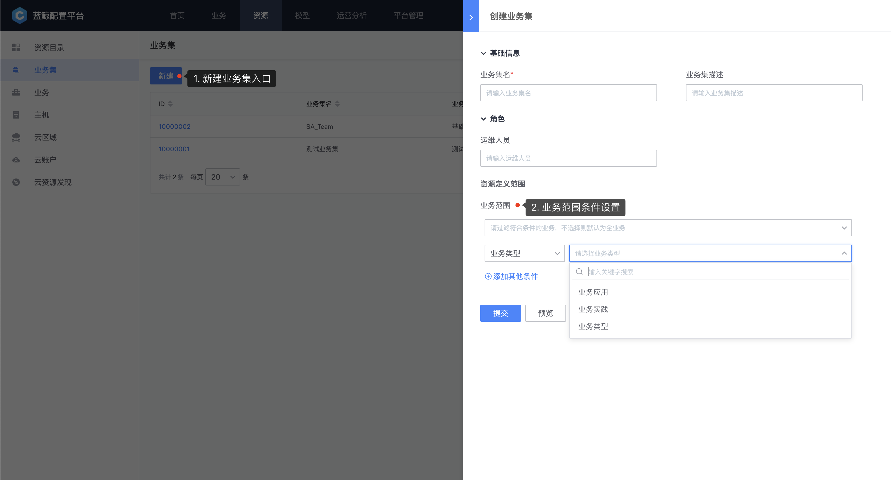
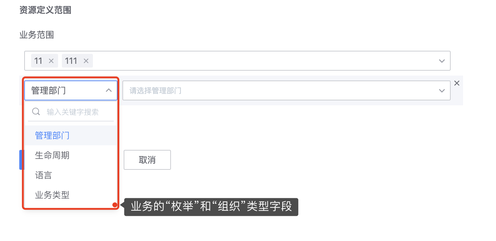
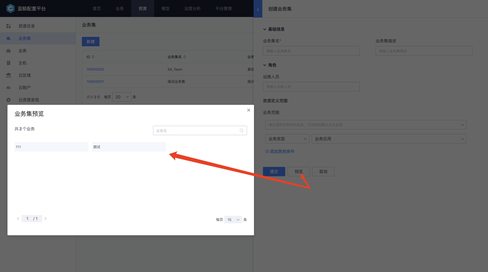

 # Business Set 

 "Business Set" is a resources space composed of One or more Businesses, and it has a direct relationship with Business. Common Manage Scene are mostly public platform functional teams, such as Database OPS team, middleware OPS team, Base OPS team, etc.; These functional teams are Manage Scene above the Business layer, and consume Host in businesses that Meets The attribute conditions across business Dimension approve "business sets". 

 ## Model 

  

 page path: `model` - `manage` - `Business Set` 

 "Business Set" is a built-in model and is in the model group of `Host Manage` by default. After initialization, there are Three field: `Business Set Name` `Business Set description` and `OPS Personnel`. user can append corresponding Field configuration in The model as needed. 

 ## Model Instance 

  

 page path: `resources` - `Business Set` 

 - Business Set name 

  name of the Business Set 

 - Business Set description 

  It is used to Fill In the information describing the background and purpose of the Business Set 

 - Operation and maintenance personnel 

  List of personnel responsible for operation and maintenance of The Business Set 

 - Business Scope 

  The business scope included in The Business Set. All by default (dynamic, i.e., all the newly new businesses will be included) 
	
  You can also manual check the list of specified Business (multiple choices) 
	
   
	
  Or it can be obtained dynamic by approve the conditions of the `Organization` and `Enumeration` Field of the Business 
	
   
	

 - Preview

  During the create process or list, you can approve `Preview` to view the list of businesses included in a Business Set, as follows: 
   

 ## Manage Spaces 

  

 page path: `Business` - `Select Business/Business Set` 

 "Business Set" and business are also under the One Navigation of "Business", provided the same topology and Host view capabilities as business (but not edit); 

 - Business Set topology 

  provided the topology Collection of the services included in the Business Set, and can view the Host and service instances under All or each topology node 

 - Other 

  In addition, the Business Set also provided the same Manage space as the business in the Job System. user can enjoy the same ability to control more Host across businesses under the business set. 