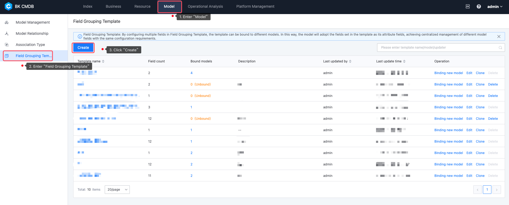
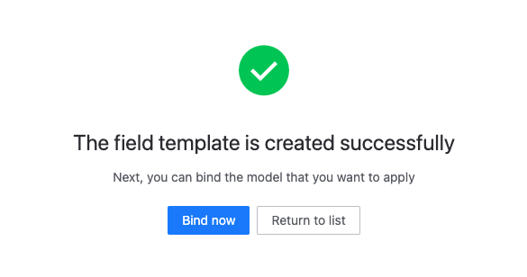
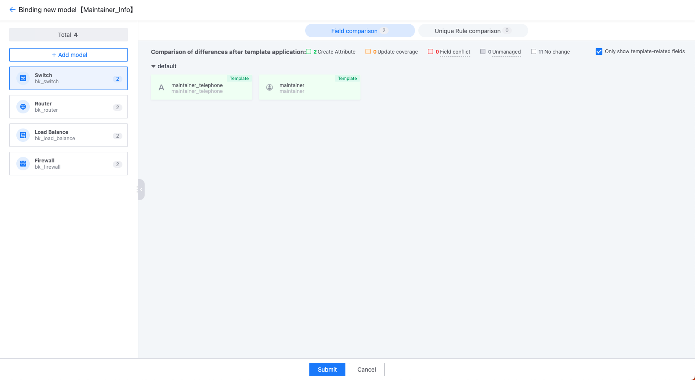
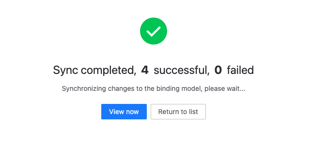

# Field Grouping Template

## Feature Description

Field Grouping Template is a feature for batch management of fields and Unique Rules in models, suitable for managing the same fields in different models. It can set multiple fields and Unique Rules in the template and apply them in batch to the models.

## Create Field Grouping Template

1. Enter the "Field Grouping Template" page and click "Create";

   

2. Fill in the basic information of the template;

   

3. Add fields or Unique Rules in the template. You can choose to "manually add" or "import directly from the fields in the model";

   

   

4. After saving successfully, you can directly bind the template to the model;

   

## Bind Model

1. Select the model to be bound. After selection, the system will compare the settings of the template and the model. If there is a "conflict", it means that the current template's field or unique validation settings are incompatible with the model, and you need to confirm how to modify it. Conflicts include:

   - Field conflict:
     - The template field has the same ID type as the model field, but has been bound by other templates
     - The template field has the same ID as the model field, but the field type is different
     - The template field has the same field name as the model field, but the field ID is different
   - Unique Rule conflict:
     - The Unique Rules set by the template conflict with the existing rules in the model (for more information about Unique Rules, please click [here](https://github.com/TencentBlueKing/bk-cmdb/issues/5240))

   

2. After clicking submit, the system will execute the binding task in the background. After the binding is successful, the model you selected will have the fields and rules set in the template;

   

## Precautions

- You cannot delete fields and unique validation rules added by the field combination template in the model. If you do not need these fields, you can remove them by "unbinding the template", but this operation will remove all fields and unique validations from the model;
- When there are multiple fields or unique validation rules in the template, you cannot bind only one field or rule to the model, as this will bring trouble to your future management;
- After modifying the fields in the template and saving, the system will immediately apply the changes to all bound models, because in the template scenario, not applying in time will only increase management complexity;
- When you delete a field or unique validation rule in the template, the system will not delete the field and rule on the bound model, and these fields and rules will be managed uniformly in the model later.