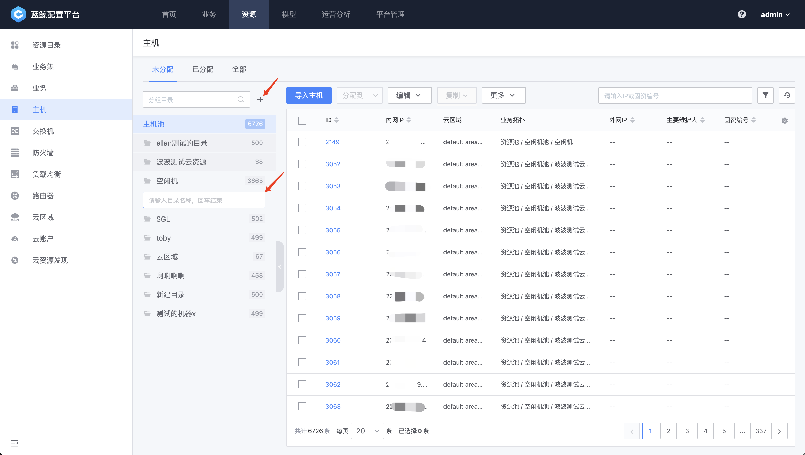
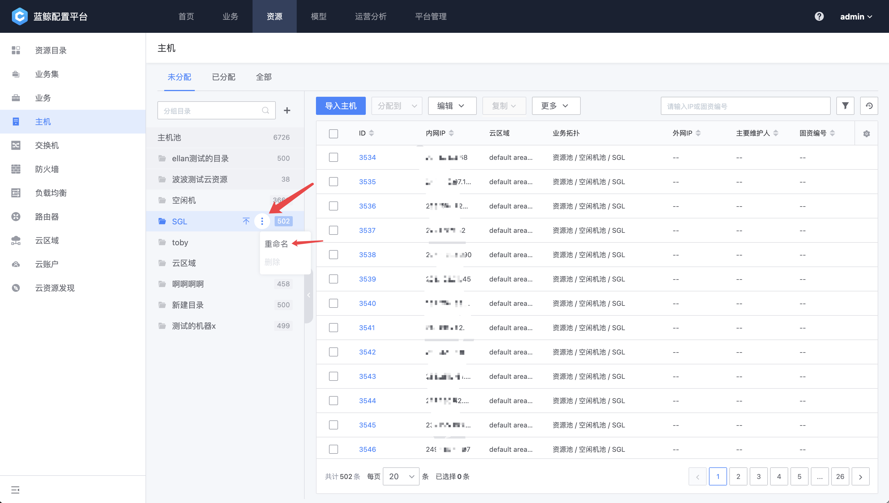

 # Host and resources pools 

 Host instance is One of the more important Object in CMDB. The system has built-in "resources pool", that is, CVM not assigned to Business.  The import new Host is Enter to the resources pool by default. 

  
 
Figure 1. Host resources Pool
 

 ## Host Entry 

 Currently, there are two ways to enter the Host in the CMDB: 

 1. import in Excel in CMDB 

 2. When RUNNING in NodeMan, Host are auto synchronized to the CMDB 

 ### import as Excel in the CMDB 

 click import Host and download the Host Excel Import template: 

  
 
Figure 2. download Template
 

 When you open an Excel The document, the first Three rows are system identifiers, and each row after the Four row is One record. 

 - Field Label red are isRequired, Other fields can be left blank 
 - The Other Field are arranged according to the order of the fields in the model 

 >Note: Entering the same private IP is an Operation of attribute Overwrite. You can use this feature to update the Host attributes in batches. 

  
 
Figure 3. Excel Field Description
 

 ###After RUNNING in the NodeMan, the Host will be auto synchronized to the CMDB 

 For details of NodeMan Agent Install Flow, see: [Agent Install](../../../NodeMan/UserGuide/Feature/Agent.md) 

 ##Allocating resources to Business 

  

 Select the Host to be assigned, click Assign To, and then select a Business to complete CVM resources. By default, the CVM is assigned to the idle CVM pool of the business. 

 ## resources Pool Directory Manage 

 Different departments in the company may have different Manage of Host resources. We can isolate the resources of different teams approve create resource pool directories to avoid mixing them. 

 ### create a resources Pool Directory 

 click the create Directory button, Input the resources pool name and press Enter complete the creation. Note that the directory name of the resource pool is its unique ID and Allow duplicated. 

  

 ### resources Pool Directory Manage 

 delete can edit a directory of a resources pool approve click the more button. Note that you can delete the directory only when there are no resources in the resource pool. 

  

 ### Importing resources pool directories import Host 

 There are two ways to import a Host into the directory of a resources pool: Direct import and staging approve the resources pool directory. 

 #### Direct import 

 When import Host, you can select whether to import instance link in Excel at the same time. 

  

 #### Transferring approve resources Pool Directory 

 You can also transfer Host resources from Other resources pool directory to the current directory.  After selecting the resources to be Operation, select Assign to-Resource Pool Other Directory to transfer the current selected resource to the current directory. 

  